# KOAssistant

[](https://github.com/zeeyado/koassistant.koplugin/releases/latest)
[](LICENSE)
[](https://hosted.weblate.org/engage/koassistant/)
[](https://hosted.weblate.org/engage/koassistant/)

**Powerful, customizable AI assistant for KOReader.**

> **New to KOAssistant?** The [Wiki](https://github.com/zeeyado/koassistant.koplugin/wiki) has short getting-started guides. [Help expand it.](https://github.com/zeeyado/koassistant.koplugin/wiki/Contributing-to-this-Wiki)

Note: This README is the main documentation for now, and is being migrated to the [Wiki](https://github.com/zeeyado/koassistant.koplugin/wiki). It was substantially refreshed in August 2026 to match the current code; if you spot anything out of date, or want to help with the wiki migration and docs cleanup, contributions are appreciated. **The README currently tracks the main branch. This means that some features may not yet be in the latest release, and you have to use the latest code from main branch to get it.**

<p align="center">
  <a href="screenshots/ELI5highlightchat.png">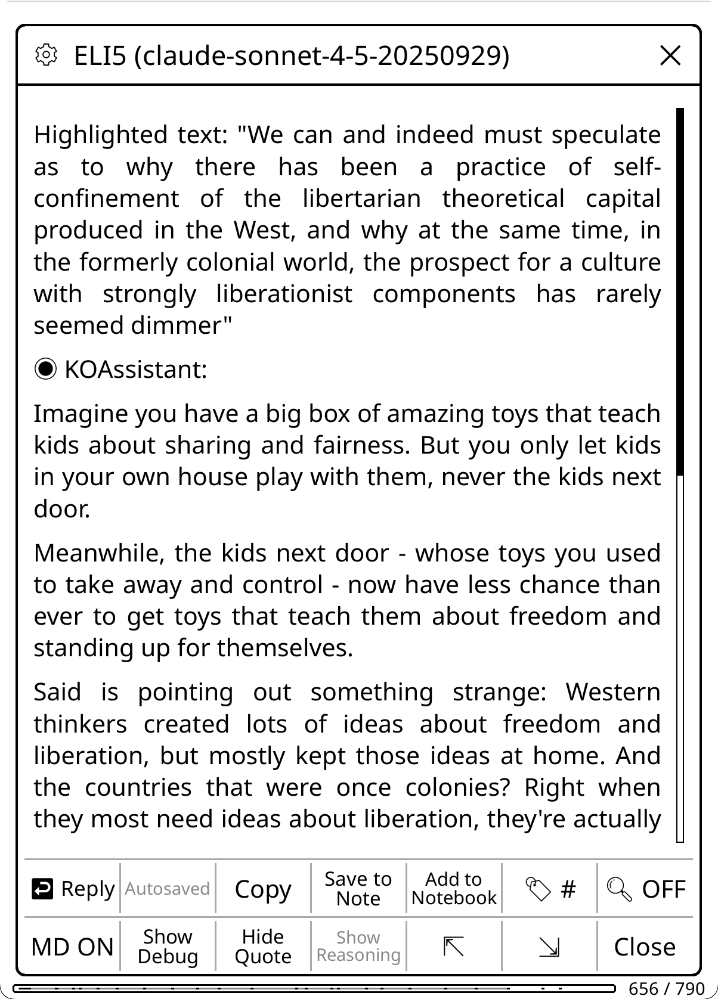</a>
  <a href="screenshots/Xraybrowser.png">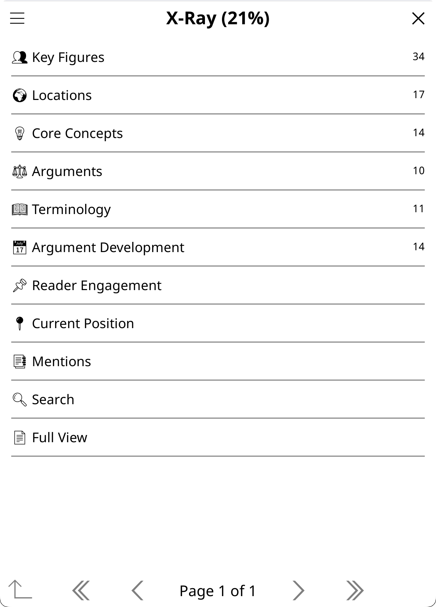</a>
  <a href="screenshots/compactdict.png">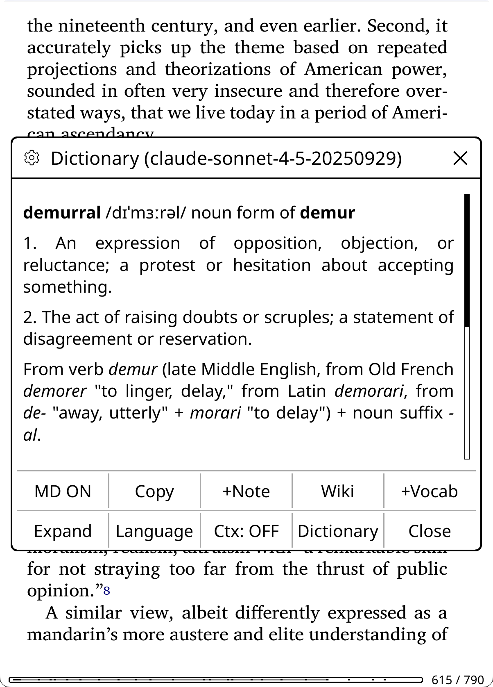</a>
  <a href="screenshots/settingsui.png">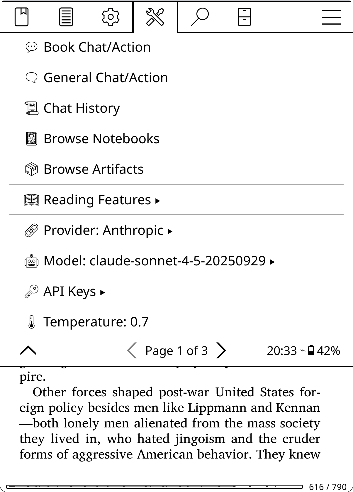</a>
</p>

- **Highlight text** → translate, explain, define words, analyze passages, connect ideas, save content directly to KOReader's highlight notes/annotations
- **Minimal popup** → short answers (Translate, Quick Define, Quick Explain by default) land in a small chrome-less popup anchored at your selection instead of the full-screen viewer, when they fit; tap it to expand into the full chat
- **Quick answer presets** → One click to run Quick Mode to stop model reasoning, web search, and other things that make the response slower
- **While reading** → reference guides (summaries, browsable X-Ray with character tracking, cross-references, chapter distribution, Section X-Rays for focused chapter/part analysis, AI Wiki for per-item encyclopedia entries, local (offline) X-Ray lookup, X-Ray (Simple) prose overview from AI knowledge, recap, book info, notes analysis), analyze your highlights/annotations, explore the book/document (author, context, arguments, similar works), generate discussion questions
- **X-Ray that keeps up** → optional **Automatic X-Ray** (per-book or global: background auto-update as you read, auto-create early in a book), **checkpoints** (pre-build spoiler-safe X-Ray versions for the whole book, snapped to chapter ends, silently swapped in as you read), and **version history** (browse, restore, or delete earlier X-Ray snapshots, with a keep-count setting)
- **X-Ray in the text** → known entity names get dotted underlines as you read; tap one for a compact identification card (footnote panel or anchored popup), tap through for the full entry; selecting or dictionary-looking-up an exact name opens its entry directly; a Mentions view maps appearances over your table of contents and jumps into the book at any occurrence; new X-Rays can be narrowed to just people / places / ideas / terms / events
- **Book Groups** → track a series or project as a named, **ordered** list of books; series metadata detection offers to find the rest in a folder or collection; X-Ray knowledge can merge, fold, and carry forward along the group so later books recognize what earlier ones introduced
- **Book Hub** → one full-screen page per book gathering everything: artifacts, chat, chat history, notebook, group, and book settings (file-browser long-press, main menu, Quick Actions, or gesture)
- **Session controls (chips)** → a configurable chip row in the input dialog — Domain, Web search, AI Book Tools, Quick Answer (one tap for a fast, brief reply; preset configurable), Scope (attach a text range; shows as Ctx on highlights), Attach, and Spoiler Protection — each tap-toggles for the current chat and hold-opens its defaults; choose which chips appear via the input gear menu
- **See its sources** → a **Show Sources** viewer (web URLs, search queries, and book-tool lookups) alongside **Show Reasoning**, plus per-message "searched the web" and "searched the book" indicators
- **Research Mode** → automatic academic enhancements for papers with DOI: discipline-agnostic academic X-Ray (7 research categories), web search override, research-aware system prompts. Zero configuration, DOI detection triggers everything
- **Notebooks** → per-book markdown notebooks for curating AI insights and personal notes (including one-tap "Add to Notebook" from the highlight menu and other selection popups), with Obsidian vault integration (three save locations: alongside book, central folder, or custom folder like an Obsidian vault)
- **Library** → scan-based actions (what to read next, reading patterns, discover new books), multi-book comparison, collection analysis, with an end-of-book suggestion popup
- **General chat** → AI without book/document context
- **Web search** → AI can search the web for current information (Anthropic, Gemini, OpenAI, OpenAI Subscription, xAI, Perplexity, OpenRouter, Z.AI, Qwen), with an effort dial (light / standard / thorough)
- **AI Book Tools** → let the AI search and read the open book on demand to ground its answers (gather-then-generate by default, or an interactive agentic loop)
- **Multilingual** → chat in any of 47 languages the AI understands, and use the KOAssistant UI in 26 languages
- **Generate images** → turn a highlight into an image using OpenAI, xAI, or Gemini image models; generated images are kept on-device in a browsable **Generated Images** gallery (tap to view, hold to delete) and associated with the book they came from

[29 built-in providers](#supported-providers--settings) (Anthropic, OpenAI, Gemini, Ollama, and more) plus custom OpenAI-compatible providers. OpenAI can also be used without an API key by signing in with your ChatGPT plan (OpenAI Subscription). Fully configurable: custom actions, behaviors, domains, per-action model overrides. Reasoning/thinking is configured per model (stance dial + per-model overrides). **One-tap auto-update** keeps the plugin current. Personal reading data (highlights, annotations, notebooks) is opt-in, not sent to the AI unless you enable it.

**Status:** Active development. [issues](https://github.com/zeeyado/koassistant.koplugin/issues), [discussions](https://github.com/zeeyado/koassistant.koplugin/discussions), and [translations](https://hosted.weblate.org/engage/koassistant/) welcome. If you are somewhat technical and don't want to wait for tested releases, you can run off main branch to get the latest features. Breakage may happen. Also see [Assistant Plugin](https://github.com/omer-faruq/assistant.koplugin); both can run side by side.

---

## Table of Contents

- [User Essentials](#user-essentials)
- [Quick Setup](#quick-setup)
- [Recommended Setup](#recommended-setup)
  - [Configure Quick Access Gestures](#configure-quick-access-gestures)
- [Testing Your Setup](#testing-your-setup)
- [Privacy & Data](#privacy--data): (Read this) Some features require opt-in
  - [Privacy Controls](#privacy-controls)
  - [Text Extraction and Double-gating](#text-extraction-and-double-gating): Enable document content analysis (off by default)
- [How to Use KOAssistant](#how-to-use-koassistant): Contexts & Built-in Actions
  - [Highlight Mode](#highlight-mode)
  - [Book/Document Mode](#bookdocument-mode)
    - [Research Mode](#research-mode): Automatic academic enhancements for papers with DOI
    - [Reading Analysis Actions](#reading-analysis-actions): X-Ray, X-Ray (Simple), Recap, Document Summary, Document Analysis, About, Analyze Notes
  - [Library Mode](#library-mode)
  - [General Chat](#general-chat)
  - [Input Dialog Actions](#managing-the-input-dialog): Per-context action sorting, gear menu
  - [Session Controls (Chips)](#session-controls-chips): Domain, Web, Tools, Quick, Scope, Attach, Spoiler
  - [Minimal Popup](#minimal-popup): Short answers in a small popup anchored at your selection
  - [Spoiler Protection](#spoiler-protection): Prevent AI from revealing events beyond your reading position (on by default)
  - [Save to Note](#save-to-note)
- [Image Generation](#image-generation): Turn a highlight into an image
- [How the AI Prompt Works](#how-the-ai-prompt-works): Behavior + Domain + Language system
- [Actions](#actions)
  - [Managing Actions](#managing-actions)
  - [Tuning Built-in Actions](#tuning-built-in-actions)
  - [Creating Actions](#creating-actions): Wizard + template variables
  - [Template Variables](#template-variables): 35+ placeholders for dynamic content
    - [Utility Placeholders](#utility-placeholders): Reusable prompt fragments (conciseness, hallucination nudges)
  - [Highlight Menu Actions](#highlight-menu-actions)
- [Dictionary Integration](#dictionary-integration): Compact view, on demand context mode
  - [Dictionary Bypass](#dictionary-bypass)
  - [Dictionary View Modes](#dictionary-view-modes)
  - [Translate View](#translate-view)
- [Bypass Modes](#bypass-modes): Skip menus, direct AI actions
  - [Highlight Bypass](#highlight-bypass)
  - [Bypass Action Selection](#bypass-action-selection)
  - [Gesture Toggles](#gesture-toggles)
  - [Custom Action Gestures](#custom-action-gestures)
  - [Available Gesture Actions](#available-gesture-actions)
    - [Translate Page](#translate-page)
- [Behaviors](#behaviors): Customize AI personality
  - [Built-in Behaviors](#built-in-behaviors)
  - [Sample Behaviors](#sample-behaviors)
  - [Custom Behaviors](#custom-behaviors)
- [Domains](#domains): Add subject expertise to prompts
  - [Creating Domains](#creating-domains)
- [Book Settings](#book-settings): Per-book overrides (domain, background, research, spoiler protection, privacy, X-Ray, book info, AI title/author, quiz, languages)
- [Book Groups](#book-groups): Ordered groups for series and projects, with cross-book X-Ray knowledge
- [Book Hub](#book-hub): One page for everything about a book
- [Managing Conversations](#managing-conversations): History, export, notebooks
  - [Auto-Save](#auto-save)
  - [Chat History](#chat-history)
  - [Export & Save to File](#export--save-to-file): Clipboard, file, multiple formats
  - [Notebooks (Per-Book Notes)](#notebooks-per-book-notes): Markdown notebooks with Obsidian vault integration
  - [Chat Storage & File Moves](#chat-storage--file-moves)
  - [Tags](#tags)
  - [Starring & Pinning](#starring--pinning): Star conversations for quick access, pin responses as artifacts
- [Settings Reference](#settings-reference) ↓ includes [Menus & Buttons](#menus--buttons)
- [Updating the Plugin](#updating-the-plugin): Auto-update and manual methods
  - [Automatic Update (One-Tap)](#automatic-update-one-tap)
  - [Manual Update](#manual-update)
- [Update Checking](#update-checking)
- [Advanced Configuration](#advanced-configuration)
- [Backup & Restore](#backup--restore)
- [Technical Features](#technical-features)
  - [Streaming Responses](#streaming-responses)
  - [AI Book Tools (Experimental)](#ai-book-tools-experimental): Let the AI (Gemini/Claude/OpenAI or Subscription/OpenRouter/Ollama, plus DeepSeek/Mistral/Groq/xAI/Fireworks/Qwen/Kimi) search & read the open book on demand (off by default)
  - [Prompt Caching](#prompt-caching)
  - [Document Artifacts](#document-artifacts): 13 cacheable artifacts, AI Wiki, pinned, → Chat, incremental caching
  - [Response Provenance (Show Sources)](#web-search): Web URLs, search queries, and book-tool lookups
  - [Reasoning/Thinking](#reasoningthinking)
  - [Web Search](#web-search): AI searches the web for current information (Anthropic, Gemini, OpenAI, OpenAI Subscription, xAI, Perplexity, OpenRouter, Z.AI, Qwen)
- [Supported Providers + Settings](#supported-providers--settings) - Choose your model, etc
  - [Free Tier Providers](#free-tier-providers)
  - [Using a Subscription Instead of API Credits](#using-a-subscription-instead-of-api-credits): ChatGPT-plan login available now; coding-plan subscriptions planned
  - [Adding Custom Providers](#adding-custom-providers): Local provider presets (LM Studio, llama.cpp, Jan, vLLM, KoboldCpp, LocalAI)
  - [Adding Custom Models](#adding-custom-models)
  - [Setting Default Models](#setting-default-models)
- [Tips & Advanced Usage](#tips--advanced-usage)
  - [View Modes: Markdown vs Plain Text](#view-modes-markdown-vs-plain-text)
  - [Reply Draft Saving](#reply-draft-saving)
  - [Adding Extra Instructions to Actions](#adding-extra-instructions-to-actions)
- [KOReader Tips](#koreader-tips)
- [Troubleshooting](#troubleshooting)
  - [Features Not Working / Empty Data](#features-not-working--empty-data): Privacy settings for opt-in features
  - [Text Extraction Not Working](#text-extraction-not-working)
  - [Emoji Font Setup](#emoji-font-setup): How to get emoji icons working
  - [Font Issues (Arabic/RTL Languages)](#font-issues-arabicrtl-languages)
  - [Settings Reset](#settings-reset)
  - [Debug Mode](#debug-mode)
- [Requirements](#requirements)
- [Contributing](#contributing)
  - [Community & Feedback](#community--feedback)
- [Credits](#credits)
- [AI Assistance](#ai-assistance)

---

## User Essentials

**New to KOAssistant?** Start here for the fastest path to productivity:

1. **[Quick Setup](#quick-setup)**: Install, add API key, restart (5 minutes)
2. **[Privacy Settings](#privacy--data)**: Some features require opt-in; configure what data you share
3. **[Recommended Setup](#recommended-setup)**: Configure gestures and explore key features (10 minutes)
4. **[Free Tiers](#free-tier-providers)**: Don't want to pay? See free provider options

**Want to go deeper?** The rest of this README covers all features in detail.

**Note:** The README is intentionally verbose and somewhat repetitive to ensure you see all features and their nuances. Use the table of contents to jump to specific topics. A more concise structured documentation system is planned (contributions welcome).

**Prefer a minimal footprint?** KOAssistant is designed to stay out of your way. The main menu is tucked under Tools (page 2), and all default integrations (file browser buttons, highlight menu items, dictionary popup, gesture actions) can be disabled via **[Settings → Menus & Buttons](#menus--buttons)**. Use only what you need.

---

## Quick Setup

**Get started in 3 steps:**

### 1. Install the Plugin

Download `koassistant.koplugin.zip` from the latest [Release](https://github.com/zeeyado/koassistant.koplugin/releases) → Assets, or to run the latest from main branch: Code -> Download Zip, or clone the repo:
```bash
git clone https://github.com/zeeyado/koassistant.koplugin
```

Extract or copy the `koassistant.koplugin` folder to your KOReader plugins directory:
```
Kobo:         /mnt/onboard/.adds/koreader/plugins/koassistant.koplugin/
Kindle:       /mnt/us/koreader/plugins/koassistant.koplugin/
Android:      /sdcard/koreader/plugins/koassistant.koplugin/
macOS:        ~/Library/Application Support/koreader/plugins/koassistant.koplugin/
Linux:        ~/.config/koreader/plugins/koassistant.koplugin/
```

For the plugin to be installed correctly, the file structure should look like this (no nested folder, and foldername must be `koassistant.koplugin` exactly; remove "-main" or similar if you downloaded the zip from head):
```
koreader
└── plugins
    └── koassistant.koplugin
        ├── _meta.lua
        ├── main.lua
        └── ...
```

> **Tip**: Delete unnecessary folders like `screenshots/` and `tests/` to save space if installing manually. These extra folders are not part of release zips.

> **This is the only time you need to install manually.** After this, KOAssistant updates itself: when a new version is available, you'll see release notes with an "Update Now" button. One tap and it handles everything (download, install, preserve your settings). See [Updating the Plugin](#updating-the-plugin) for details.

**Alternative:** You can also install KOAssistant directly from within KOReader using the [App Store plugin](https://github.com/omer-faruq/appstore.koplugin), which lets you browse, install, and update KOReader plugins without a computer. It can install from releases or from the latest main branch code.

### 2. Add Your API Key

**Option A: Via Settings**

1. Go to **Tools → KOAssistant → API Keys & Auth**
2. Tap any provider to enter your API key
3. Keys are shown semi-blurred in your settings

**Option B: Via Configuration File**

Make a copy of apikeys.lua.sample and name it apikeys.lua

```bash
cp apikeys.lua.sample apikeys.lua
```

Edit `apikeys.lua` and add your API key(s):
```lua
return {
    anthropic = "your-key-here",  -- console.anthropic.com
    openai = "",                  -- platform.openai.com
    -- See apikeys.lua.sample for all 29 providers
}
```

> **Note:** GUI-entered keys take priority over file-based keys. The API Keys menu shows `[set]` for GUI keys and `(file)` for keys from apikeys.lua. Provider pickers only list providers that have a key configured (plus local/no-key providers like Ollama), so the menus stay short. You can also keep several keys for one provider (for example a free and a paid one) and switch between them -- see [API Keys](#api-keys).

**Option C: OpenAI Subscription (device login)**

Works with any ChatGPT account that has Codex access -- **including free accounts** (verified August 2026; free-account limits are undocumented, expect them to be modest). Device code access must be enabled for your ChatGPT account -- the verification page at `https://auth.openai.com/codex/device` shows instructions for enabling it if it isn't yet. Go to **KOAssistant Settings → API Keys & Auth → OpenAI Subscription** and tap **Connect**. KOAssistant displays an OpenAI verification URL and one-time code; it never tries to open a browser on the e-reader. Open the URL on another device, enter the code, then return to KOReader and tap **Check authorization**. This is separate from the OpenAI API-key provider and does not use API credits.

KOAssistant stores the OAuth access/refresh tokens in its settings and never displays or logs them. They are excluded from ordinary backups; enabling **Include API keys** includes them, and **Reset API Keys** disconnects the subscription. Subscription access depends on OpenAI's Codex backend and eligible ChatGPT account entitlements, so available models and service behavior may change.

See [Supported Providers](#supported-providers--settings) for full list with links to get API keys.

> **Free Options Available:** Don't want to pay? Groq, Gemini, and Ollama offer free tiers, and a **free ChatGPT account** works via OpenAI Subscription (device login, experimental). See [Free Tier Providers](#free-tier-providers). Already paying for ChatGPT? Use it here instead of API credits (Option C above) -- see [Using a Subscription Instead of API Credits](#using-a-subscription-instead-of-api-credits).

### 3. Restart KOReader

Find KOAssistant Settings in: **Tools → Page 2 → KOAssistant** and follow the Setup Wizard.

### 4. Configure Privacy Settings (Optional)

Some features require opt-in to work. Go to **Settings → Privacy & Data** to configure. See [Privacy & Data](#privacy--data) for details.

> **Quick option:** Use **Preset: Full** to enable all data sharing at once. Text extraction is enabled separately.

---

## Recommended Setup

### Setup Wizard

On first launch, KOAssistant walks you through a 5-step setup wizard:

1. **Welcome**: Brief introduction
2. **Language Setup**: Detects your KOReader UI language and asks if you want to use it as your AI language. For non-English users, it confirms the detected language (e.g., "Use Français?"). For English users, it offers to keep English or choose a different language. You can also pick from the full list of 47 supported languages. This sets your primary interaction language for all AI responses, translations, and dictionary lookups.
3. **Emoji Display Test**: Shows emoji icons used throughout the plugin. If they render correctly on your device, tap "Yes, enable" to turn on all emoji features (menu icons, panel icons, data access indicators). If you see blank boxes or question marks, tap "No, skip". See the [Emoji Font Setup](#emoji-font-setup) section for instructions on enabling emoji support in KOReader.
4. **Gesture Setup**: Offers to assign Quick Settings and Quick Actions panels to tap bottom-right corner (or shows a tip if the gesture slot is already taken)
5. **Getting Started Tips**: Pointers to privacy settings and action management

The wizard runs once and won't appear again. If you re-run the wizard (by resetting the setup flag), it skips the language step if you've already configured a language. You can always change language, emoji, and gesture settings later in Settings.

### Getting Started Checklist

After the setup wizard, complete these steps for the best experience:

- [ ] **Configure privacy settings**: Enable data sharing for features you want (Settings → Privacy & Data). See [Privacy & Data](#privacy--data)
- [ ] **Set up gestures** (if you skipped the wizard). See [Configure Quick Access Gestures](#configure-quick-access-gestures)
- [ ] **Explore the highlight menu**: 8 actions included by default (Translate, Look up in X-Ray, Explain, Quick Explain, Summarize, Quick Define, Dictionary, Generate Image); add more (ELI5, Elaborate, Connect, Fact Check, AI Wiki, Counterpoint, and others) via Manage Actions → hold action → "+ Highlight Menu", or via Settings → Menus & Buttons → Highlight Menu Actions
- [ ] **Try Dictionary Bypass**: Single-word selections go straight to AI dictionary (Settings → Dictionary Settings → Bypass KOReader Dictionary)
- [ ] **Try Highlight Bypass**: Multi-word selections trigger instant translation (Settings → Highlight Settings → Enable Highlight Bypass)
- [ ] **Set your languages** (if you skipped the wizard): KOAssistant auto-detects from your KOReader UI language, but you can configure additional languages or change your primary (Settings → AI Language Settings)
- [ ] **Add custom actions to gestures**: Any book/general action can become a gesture (Manage Actions → hold → "+ Gesture Menu", requires restart)
- [ ] **Pin actions to file browser**: Add frequently-used book actions directly to the long-press menu (Manage Actions → hold → "+ File Browser")
- [ ] **Try Generate Image**: Turn a highlighted passage into an AI-generated illustration (highlight menu → Generate Image; requires an OpenAI, xAI, or Gemini image model). See [Image Generation](#image-generation)

> **Tip**: Edit built-in actions to always use the provider/model of your choice (regardless of your main settings); e.g. Dictionary actions benefit from a lighter model for speed.

### Configure Quick Access Gestures

**Automatic setup:** The setup wizard offers to assign both panels to **tap bottom-right corner**: Quick Settings in the file browser and Quick Actions in the reader. Accept to set up both gestures automatically (requires KOReader restart). If the bottom-right corner is already assigned to another action, you'll get an informational tip instead.

**Manual setup** (same gesture, two contexts):

1. **In File Browser**: Go to gear → Taps and gestures → Gesture manager, pick a gesture (e.g., tap bottom-right corner), select **KOAssistant: Quick Settings**
2. **In Reader** (open any book or document): Go to gear → Taps and gestures → Gesture manager, pick the **same gesture**, select **KOAssistant: Quick Actions**

Now the same tap gives you Quick Settings in the file browser and Quick Actions while reading. Both panels include most functions you need, plus buttons to open Settings and other features. In reader mode, each panel has a button to switch to the other.

**Recommended: Two Quick Access Panels**

KOAssistant provides two distinct quick-access panels for different purposes:

**1. Quick Settings** (available everywhere)

<a href="screenshots/QSpanel.png">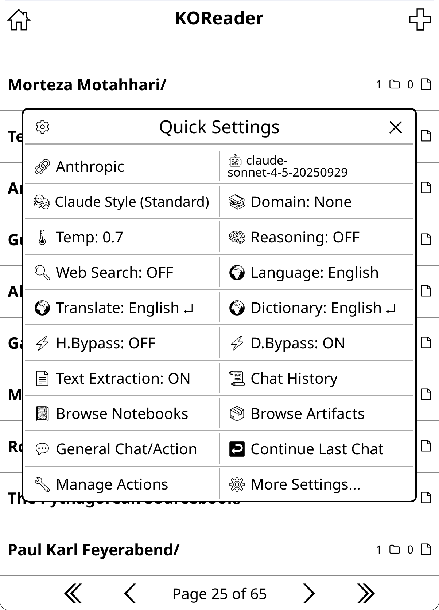</a>

Assign "KOAssistant: Quick Settings" to a gesture for one-tap access to a two-column settings panel with commonly used options:
- **Provider & Model**: Quick switching between AI providers and models
- **Behavior & Domain**: Change communication style, knowledge context, and Research Mode
- **Reasoning**: Set the reasoning stance (Minimal/Default/Maximum) or override the current model's reasoning (reasoning is per-model — the stance is a global preference each model honors as far as it can). Temperature is no longer a tile; it lives in Settings → Advanced
- **Web Search**: Toggle AI web search on or off (this sets the global default; per-chat control lives in the input dialog's Web chip). Annotated "N/A" when the active provider can't search
- **Book Tools**: Turn AI Book Tools on or off for the current book or globally (off by default), so the AI can look things up in the book to answer
- **Language**: Set the primary response language
- **Translate & Dictionary**: Translation and dictionary language settings
- **Highlight Bypass & Dictionary Bypass**: Toggle bypass modes on/off
- **Text Extraction**: Toggle book text extraction on/off (must be enabled once via Settings → Privacy & Data first)
- **Chat History, Browse Notebooks & Browse Artifacts**: Quick access to saved chats, notebooks, and cached artifacts
- **Library Chat/Action**: Launch library actions by selecting books from your reading history
- **General Chat/Action**: Start a context-free conversation or run a general action
- **Continue Last Chat**: Resume your most recent conversation
- **Manage Actions**: Edit and configure your actions
- **Quick Answer**: Toggle the Quick Answer posture for the next chat; hold for its preset settings
- **Spoiler Protection**: Toggle it globally; hold for the per-book / global picker
- **Minimal Popup**: Turn the chrome-less anchored response popup on or off; hold for its mode and action list
- **Groups**: Open the Book Groups manager
- **More Settings...**: Open the full settings menu

In reader mode, one additional button appears (items naturally shift to accommodate):
- **Quick Actions...**: Switch to the Quick Actions panel for reading features. Book Chat/Action lives there as a utility; it is no longer a Quick Settings tile

The panel has a **gear icon** (top-left) that opens a small menu with **Sort Items** (reorder and show/hide the tiles) and **Align Buttons** (left-align vs. centered). The same tile manager is also reachable via **Settings → Menus & Buttons → Quick panels → Quick Settings Items**.

**2. Quick Actions** (reader mode only)

<a href="screenshots/QApanelmore.png">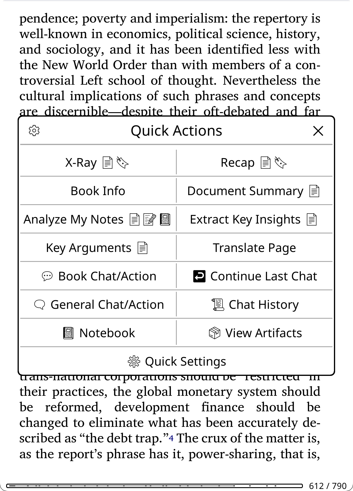</a>

Assign "KOAssistant: Quick Actions" to a gesture for fast access to reading-related actions:
- **Default actions**: X-Ray, Recap, About, Document Summary, Analyze Notes, Extract Key Insights, Key Arguments, Discussion Questions, Quiz, Suggest from Library
- **Artifact button**: "View Artifacts" appears when any artifacts exist, opening a picker showing each cached artifact with progress % and age (e.g., "X-Ray (100%, 3d ago)"). The picker aggregates the twelve per-action artifacts (X-Ray, X-Ray (Simple), Summary, Analysis, Recap, About, Notes Analysis, Key Arguments, Discussion Questions, Quiz, Key Insights, Reading Guide) plus any section-scoped groups, any pinned artifacts, a **Generated Images** entry (opens the per-book image gallery), and a **Previous X-Ray Versions** entry (archived X-Ray snapshots) when those exist
- **Utilities**: Translate Page, Book Chat/Action, Continue Last Chat, General Chat/Action, Chat History, Notebook, View Artifacts, Group (when the book is in one), Book Hub, Book Settings, Quick Settings

You can add any book action to Quick Actions via **Action Manager → hold action → "+ Quick Actions"**. The panel has a **gear icon** (top-left) that lets you choose between managing **Panel Actions** (reorder/remove actions) or **Panel Utilities** (show/hide/reorder utility buttons). These managers are also reachable via the hamburger menu in **Manage Actions** and via **Settings → Menus & Buttons → Quick panels**. Defaults can also be removed.

> **Tip**: For quick access, assign Quick Settings and Quick Actions to their own gestures (e.g. corner tap). This gives you one-tap access to these panels from anywhere. Alternatively, you can add them to a KOReader QuickMenu alongside other actions (see below).

**Alternative: Build a KOReader QuickMenu**
For full customization, assign multiple KOAssistant actions to one gesture and enable **"Show as QuickMenu"** to get a selection menu with any actions you want, in any order, mixed with non-KOAssistant actions:
- Chat History, Continue Last Chat, General Chat/Action, Book Chat/Action
- Toggle Dictionary Bypass, Toggle Highlight Bypass
- Translate Page, Settings, etc.

Unlike KOAssistant's built-in panels (Quick Settings, Quick Actions) which show two buttons per row, KOReader's QuickMenu shows one button per row but allows mixing KOAssistant actions with any other KOReader actions.

**Direct gesture assignments**
You can also assign individual actions directly to their own gestures for instant one-tap access:
- "Translate Page" on a multiswipe for instant page translation
- "Toggle Dictionary Bypass" on a tap corner if you frequently switch modes
- "Continue Last Chat" for quickly resuming conversations

**Add your own actions to gestures**
Any book or general action (built-in or custom) can be added to the gesture menu. See [Custom Action Gestures](#custom-action-gestures) for details.

> **Important: KOReader has two separate gesture configurations:**
> - **File Browser gestures**: Configure from the file browser (gear → Taps and gestures → Gesture manager)
> - **Reader gestures**: Configure while a book or document is open (same path)
> - KOAssistant's own **Settings → Menus & Buttons → Gestures → Shortcuts** screen lists its actions with their current bindings and writes to whichever context you are in
>
> You must set up gestures in **both places** if you want access from both contexts. Reader-only gestures (like Quick Actions, Translate Page, Book Chat/Action) will appear grayed out if you try to add them to File Browser gestures. This is expected. General gestures (like Quick Settings, Chat History) work in both contexts and can be added to either or both.

### Key Features to Explore

After basic setup, explore these features to get the most out of KOAssistant:

| Feature | What it does | Where to configure |
|---------|--------------|-------------------|
| **[Session Chips](#session-controls-chips)** | The row above the input field controls *this chat only*: Domain, Web, Tools, Quick, Scope/Ctx, Attach, Spoiler. Tap changes it for the chat, long-press opens the per-book/global default behind it | Input dialog gear icon → Toolbar Buttons… (choose which chips show) |
| **[Quick Answer](#session-controls-chips)** ⚡ | One tap for a fast, brief reply: brevity nudge on, reasoning off, web search and book tools off. Every part of the bundle is configurable (nudge strength, behavior, model tier, skipping the domain lens) | ⚡ chip (tap = this chat, long-press = default + preset), Settings → Chat & Export Settings → Quick Answer Preset |
| **[Minimal Popup](#minimal-popup)** | Short answers (Translate, Quick Define, Quick Explain by default) land in a small chrome-less popup anchored at your selection instead of the full-screen viewer; tap it to expand | Settings → Minimal Popup |
| **[Behaviors](#behaviors)** | Control response style (concise, detailed, custom) | Settings → Actions & Prompts → Manage Behaviors |
| **[Domains](#domains)** | Add project-like context to conversations | Settings → Actions & Prompts → Manage Domains |
| **[Actions](#actions)** | Create your own prompts and workflows | Settings → Actions & Prompts → Manage Actions |
| **Quick Actions** | Fast access to reading actions while in a book or document | Gesture → "KOAssistant: Quick Actions" |
| **[Highlight Menu](#highlight-menu-actions)** | Actions in highlight popup (8 defaults including Translate, Explain, Quick Explain) | Settings → Menus & Buttons → Highlight Menu Actions |
| **[Dictionary Integration](#dictionary-integration)** | AI-powered word lookups when selecting single words | Settings → Dictionary Settings |
| **[Bypass Modes](#bypass-modes)** | Instant AI actions without menus | Settings → Dictionary/Highlight Settings |
| **[X-Ray Browser](#reading-analysis-actions)** | Browsable reference guide with Section X-Rays, AI Wiki, checkpoints and version history, chapter appearances | Quick Actions → X-Ray |
| **[X-Ray in the Text](#reading-analysis-actions)** | Entity names get a dotted underline as you read; tap for a compact identification card, tap through for the full entry. Selecting or looking up an exact name opens its entry instead of the dictionary | X-Ray popup → "Marking & lookup…", Settings → Reading & Library → X-Ray, or per book |
| **[Spoiler Protection](#spoiler-protection)** | On by default: replies and X-Ray checkpoint installs stay clamped to your reading position | Spoiler chip in the input dialog, Book Settings per book, or Settings → Chat & Export |
| **[Chapter Quiz](#chapter-quiz)** | Comprehension quiz offered when you finish a chapter, or run manually with a scope picker | Settings → Reading & Library → Chapter Quiz |
| **[Research Mode](#research-mode)** | Automatic academic enhancements when DOI detected (academic X-Ray, web search, research prompts) | Automatic, no configuration needed |
| **[AI Book Tools](#ai-book-tools-experimental)** | Let the AI search and read the open book on demand instead of sending the whole text (off by default) | Tools chip in the input dialog, or Settings → Advanced |
| **[Web Search](#web-search)** | Let the AI search the web for current information, with a light/standard/thorough effort dial | Web chip in the input dialog, or Settings → Advanced |
| **[Book Hub](#book-hub)** | One page for everything about the current book: artifacts, chat, history, notebook, group, settings | File browser long-press → Book Hub, Quick Actions, or a gesture |
| **[Book Groups](#book-groups)** | Track a series or project as an ordered list of books; carry X-Ray knowledge forward | Main menu → Groups, or Book Settings → Group |
| **[Book Settings](#book-settings)** | Per-book overrides for nearly everything: domain, background note, research, spoiler protection, X-Ray, privacy, quiz, languages | Input dialog gear icon → Book Settings, or Book Hub → Book Settings |
| **[Image Generation](#image-generation)** | Turn a highlighted passage into an AI-generated illustration | Highlight menu → Generate Image |
| **[Notebooks](#notebooks-per-book-notes)** | Per-book markdown notes with Obsidian vault support | Settings → Notebook Settings |
| **Reasoning/Thinking** | Per-model reasoning depth, via a global stance (Minimal/Default/Maximum) or per-model overrides | Settings → Advanced → Reasoning |
| **Languages** | Configure multilingual responses (native script pickers) | Settings → AI Language Settings |
| **Backup & Reset** | Backup settings, restore, and reset options | Settings → Backup & Reset |

See detailed sections below for each feature.

### Tips for Better Results

- **Good document metadata** improves AI responses. Use Calibre or similar tools to ensure titles, authors, and identifiers (including DOI for academic papers) are correct. DOI triggers [Research Mode](#research-mode) with academic X-Ray categories and web-enriched analysis.
- **Shorter tap duration** makes text selection in KOReader easier: Settings → Taps and Gestures → Long-press interval
- **Choose models wisely**: Fast models (like Haiku 4.5, Gemini 3.5-flash) for quick queries; powerful models (like Sonnet 5, Opus 4.8) for deeper analysis. You can set different models for different actions, see [Tuning Built-in Actions](#tuning-built-in-actions).
- **Try different behavior styles**: 24 built-in behaviors include provider-inspired styles (Claude, GPT, Gemini, Grok, DeepSeek, Perplexity), all work with any provider. Change via Quick Settings or Settings → Actions & Prompts → Manage Behaviors.
- **Combine behaviors with domains**: Behavior controls *how* the AI communicates; Domain provides *what* context. Try Perplexity Style + a research domain for source-focused academic analysis.

---

## Testing Your Setup

The test suite includes an interactive web inspector that lets you test and experiment with KOAssistant without launching KOReader:

**What you can do:**
- **Test API keys** (Verify your credentials work before using on e-reader)
- **Experiment with settings** (Try different behaviors, domains, temperature, reasoning)
- **Preview request structure** (See exactly what's sent to each provider)
- **Actually call APIs** (Send real requests and see responses in real-time)
- **Simulate all contexts** (Highlight text, book metadata, library selections)
- **Try custom actions** (Test your action prompts before using them on your device)
- **Load your actual domains** (The inspector reads from your `domains/` folder)
- **Send multi-turn conversations** with a **full chat interface** and conversation history

**Requirements:**
- Lua 5.3 or newer with LuaSocket, LuaSec, and dkjson
- **Clone from GitHub** (tests are excluded from release zips to keep downloads small)
- See [tests/README.md](tests/README.md) for full setup instructions

**Quick Start:**
```bash
cd /path/to/koassistant.koplugin

# Put the rocks on Lua's path first, matching your `lua -v`.
# Without this the web UI fails at startup with a setoption error.
eval "$(luarocks --lua-version 5.5 path)"

lua tests/inspect.lua --web
# Then open http://localhost:8080 in a browser
```

The command-line modes need no browser and are the quickest way to see what a change does to a request:

```bash
lua tests/inspect.lua --list                 # providers available for inspection
lua tests/inspect.lua --inspect anthropic    # the request for one provider
lua tests/inspect.lua --compare openai gemini
lua tests/inspect.lua --export anthropic     # the same thing as JSON
```

**Tip:** The web inspector reads from your actual KOAssistant settings (`koassistant_settings.lua`), so run KOReader on the same device/computer first to load your full configuration (languages, behavior, temperature, etc.).

**Why use it:**
- Test actions and prompts comfortably on a computer before deploying to your e-reader
- Have actual chats with your desired setup to see how it performs
- Experiment with expensive reasoning models without UI overhead
- Debug why a prompt isn't working as expected
- Learn how different settings affect request structure
- Validate custom providers and models
- Compare model and provider performance

---

## Privacy & Data

> ⚠️ **Some features are opt-in.** To protect your privacy, personal reading data (highlights, annotations, notebook) is NOT sent to AI providers by default. You must enable sharing in **Settings → Privacy & Data** if you want features like Analyze Notes or Connect with Notes to work fully. See [Privacy Controls](#privacy-controls) below.

KOAssistant sends data to AI providers to generate responses. This section explains what's shared and how to control it. This is not privacy theater: the "threat model" is simply users including sensitive data (annotations, notes, content) by accident. You are already being permissive by using online AIs at all, and this plugin encourages AI analysis of your reading material — and the available placeholders/template variables can carry a substantial amount of sensitive data. Advanced Stats (opt-in, off by default) accesses KOReader's Statistics plugin locally to derive reading engagement groups; see [Design Choices](#design-choices) for what this means and why it's opt-in. Best practice is to pick providers thoughtfully, and the very best practice is to use local or self-hosted solutions, e.g. Ollama.

### What Gets Sent

**Always sent (cannot be disabled):**
- Your question/prompt
- Selected text (for highlight actions)

**Sent by default: (for Actions using it)**
- Document metadata like title, author, identifiers (you can disable this in Action management by unchecking "Include book info")
- Enabled system content, like user languages, domain, behavior, etc
- Basic stats: reading progress (percentage), chapter title, chapters read count, time since last opened
- The data used to calculate this (exact date you opened the document last, etc.) is local only
- Per-book Background: if you've written a standing note about a book in Book Settings (what you're reading it for, how to treat it), it is sent with every request for that book alongside behavior and domain. There is no separate privacy toggle: writing it is the consent, and it stays empty otherwise

**Opt-in (disabled by default):**
- Highlights: your highlighted text passages (separate from annotations)
- Annotations: your highlighted text with personal notes attached, and the dates they were made
- Notebook entries: your KOAssistant notebook for the book, with dates
- Book text content: actual text from the document (for X-Ray, Recap, etc.)
- Library catalog: book metadata from scanned folders: title, author, series, reading status, progress percentage, last read date. Only sent by library actions when library scanning is enabled with folders configured
- Advanced stats: reading engagement data derived from KOReader's Statistics plugin: curated groups based on reading time and completion patterns (e.g. books read extensively, stalled reads, briefly started). Raw statistics (hours, session counts, pages per hour) are computed locally and **never** sent, only human-readable group labels reach the AI. Only used by library scan actions

### Privacy Controls

**Settings → Privacy & Data** provides three quick presets:

| Preset | What it does |
|--------|--------------|
| **Default** | Basic stats (progress, chapter info) shared for context-aware features. Personal content (highlights, annotations, notebook) stays private. Advanced stats off. |
| **Minimal** | Maximum privacy. Only your question and book metadata are sent. All stats (including basic stats), library scanning, and personal content disabled. |
| **Full** | All data sharing enabled for full functionality, including advanced stats. Does not automatically enable text extraction (see below). |

**Individual toggles** (under Data Sharing Controls):
- **Allow Annotation Notes**: Your personal notes attached to highlights (default: OFF). Automatically enables Allow Highlights. Actions requesting annotations degrade gracefully: when this is off but Allow Highlights is on, they receive highlights-only data (labeled "My highlights so far:" instead of "My annotations:").
- **Allow Highlights**: Your highlighted text passages (default: OFF). Used by Recap, Analyze Notes, and actions with `{highlights}` placeholders. (It also unlocks the local "Your highlights (N)…" list on X-Ray entity pages, which is read from the book and not sent anywhere until you chat about that entry.) Does not include personal notes. Grayed out when annotations is enabled (annotations implies highlights).
- **Allow Notebook**: Notebook entries for the book (default: OFF)
- **Allow Basic Stats**: Reading progress percentage, chapter title, chapters read count, time since last opened (default: ON). Used by X-Ray, Recap, and other context-aware features.
- **Allow Advanced Stats**: Reading engagement data derived from KOReader's Statistics plugin (default: OFF). Shares curated groups based on reading time and completion patterns with library scan actions. Raw statistics never leave the device, only human-readable labels like "read extensively" or "started briefly" reach the AI. See [Design Choices](#design-choices) for details.

**Library Settings** (in Reading & Library):
- **Allow Library Scanning**: Allow scanning configured folders for book metadata (default: OFF). Required for scan-based library actions (Next Read, Discover New, Analyze Library, Challenge My Taste) and the Suggest from Library book action
- **Permanent Scan Folders**: Folders always scanned for library actions. You can also pick folders on the fly in the input dialog
- The global toggle is an absolute gate: all library scanning (including on-the-fly folders picked in the input dialog) requires it to be enabled. Per-action `use_library` flag provides the second gate

**Trusted Providers:** Mark providers you fully trust (e.g., local Ollama) to bypass all data sharing controls AND text extraction AND the library scanning toggle. Trust is evaluated against the provider a request actually goes to — your active provider, or an action's own pinned provider if it has one — so pinning an action to a different provider never inherits trust it shouldn't. When that provider is trusted, all data types (highlights, annotations, notebook, reading progress, book text, and library catalog) are available without toggling individual settings. Trusted providers still require at least one folder (permanent or on-the-fly) for library scanning. Trust also satisfies the consent check that background features (such as [Automatic X-Ray](#x-ray-auto-update)) run against — those can then extract text in the background without a per-request tap.

**Per-book overrides:** every sharing toggle above (highlights, annotations, notebook, text extraction) can also be set per book in **Book Settings → Privacy**: follow the global setting, allow for this book, or deny for this book. A per-book **deny always wins**, even over Trusted Providers; a per-book allow only satisfies the global gate (per-action flags still apply). This lets you keep sharing off globally but allow it for specific books, or keep it on and fence off a sensitive one.

**Graceful degradation:** When you disable a data type, actions adapt automatically. Section placeholders like `{highlights_section}` simply disappear from prompts, so you don't need to modify your actions. For text extraction, most actions fall back to AI training knowledge; see [Text Extraction and Double-gating](#text-extraction-and-double-gating) for details. Attaching your Notebook via the Attach chip in a chat is gated the same way as the `{notebook}` placeholder: it will not attach if the underlying data isn't allowed to be shared.

**Visibility tip:** If your device supports emoji fonts, enable **[Emoji Data Access Indicators](#display-settings)** (Settings → Display Settings → Emoji) to see at a glance what data each action accesses: 📄 document text, 🔖 highlights, 📝 annotations, 📓 notebook, 📚 library, 📊 advanced stats, 🌐 web search, directly on action names throughout the UI.

### Text Extraction and Double-gating

> ⚠️ **Text extraction is OFF by default.** To use features like X-Ray, Recap, and context-aware highlight actions with actual book content (rather than AI's training knowledge), you must enable it in **Settings → Privacy & Data → Text Extraction → Allow Text Extraction**.

Text extraction sends actual book/document content to the AI, enabling features like X-Ray, Recap, Document Summary/Analysis, and highlight actions like "Explain in Context" to analyze what you've read. Without it enabled, most actions gracefully fall back to the AI's training knowledge: the AI is explicitly told no document text was provided and asked to use what it knows about the work (or say so honestly if it doesn't recognize it). This works reasonably for well-known titles but will be inaccurate for obscure works, and basically unusable for research papers and articles the AI hasn't seen. **Exception:** X-Ray requires text extraction and blocks generation without it; use X-Ray (Simple) for a prose overview from AI knowledge.

**Background features:** this same consent covers background runs you opt into separately — [Automatic X-Ray](#x-ray-auto-update) and [X-Ray checkpoint builds](#x-ray-version-ladder) extract text and spend tokens **without a per-request confirmation**. They re-check consent at fire time (revoking it stops them), their size is bounded by their own guards (the progress-gap window; incremental checkpoint steps), and the interactive truncation/size warnings don't apply: an oversized background extraction aborts the run instead of asking.

> **Tip:** If you enable text extraction but don't want to send the *whole* document, you have finer-grained options: choose "Document summary" or a specific section in an action's source-selection popup, attach a text range with the **Scope** session chip on a freeform chat, or let **AI Book Tools** retrieve only the relevant passages (see [AI Book Tools](#ai-book-tools-experimental)). Hidden Flows also exclude front matter, appendices, etc. from extraction.

**Why it's off by default:**

1. **Token costs and context window** (primary reasons, and also why it is not automatically enabled by Privacy presets, even Full): Extracting book text uses significantly more context than you might expect. A full book can consume 60k+ tokens per request, which adds up quickly with paid APIs. Users should consciously opt into this cost. Large contexts also significantly degrade response quality, especially for follow up questions. That's why actions with source selection let you choose "Document summary" as an alternative: run your queries on a previously generated summary (~2-8K tokens) rather than the full document text.

2. **Content awareness** (See double-gating below): For most users reading mainstream books, the text itself isn't privacy-sensitive. However, if you're reading something non-standard, subversive, controversial, or otherwise sensitive, you should be aware that the actual content is being sent to cloud AI providers. This is a secondary consideration for most users but important for some.

**How to enable:**
1. Go to **Settings → Privacy & Data → Text Extraction**
2. Enable **"Allow Text Extraction"** (the master toggle)
3. Built-in actions (X-Ray, Recap, Explain in Context, Analyze in Context) already have the per-action flag enabled

**Double-gating for custom actions:** When you create a custom action from scratch, sensitive data requires both a global privacy setting AND a per-action permission flag. This prevents accidental data leakage if you use sensitive placeholders/template variables: enabling a global setting doesn't automatically expose that data in all your custom actions.

> **For built-in actions:** You only need to enable the global setting. Built-in actions already have the appropriate per-action flags set. When you copy a built-in action, it inherits those flags.

The table below documents which flags are required for each data type (relevant when creating custom actions from scratch):

| Data Type | Global Setting | Per-Action Flag |
|-----------|----------------|-----------------|
| Book text | Allow Text Extraction | "Allow text extraction" checked |
| X-Ray analysis cache | Allow Text Extraction if cache was built with text (+ Allow Highlights if cache was built with highlights) | "Allow text extraction" (if cache used text) and "Allow highlight use" (if cache used highlights) checked |
| Analyze/Summary caches | Allow Text Extraction if cache was built with text | "Allow text extraction" (if cache used text) checked |
| Highlights | Allow Highlights (or Allow Annotation Notes) | "Allow highlight use" checked |
| Annotations | Allow Annotation Notes (degrades to highlights when off but Allow Highlights is on) | "Allow annotation use (notes)" checked |
| Notebook | Allow Notebook | "Allow notebook use" checked |
| Library catalog | Enable Library Scanning + folders configured | "Allow library use" checked |
| Advanced stats | Allow Advanced Stats | "Allow advanced stats" checked |
| Surrounding context* | None (hard-capped 2000 chars) | Field `use_surrounding_context` (no in-app checkbox): nil/omitted = follow the global Surrounding Context setting (the default for custom actions), `true` = always on (also auto-set when your prompt contains `{surrounding_context}`), `false` = never |
| Per-book overrides | Book Settings → Privacy (tri-state per book; deny beats everything incl. trusted providers) | Same per-action flags as above |
| Page text* | None (single current page, exempt) | Auto-inferred from a `{page_text}` placeholder |

\* **Surrounding context** is the text around a highlight (more than you actually selected). It has no global privacy gate because it is hard-capped at 2000 characters, but it is *off by default*: it only rides along when the global **Surrounding Context** mode (Settings → Highlight Settings → Surrounding Context, or per-book in Book Settings, or the **Ctx** session chip) is set to Sentence / Paragraph(s) / Characters rather than "None". Per-action this is a tri-state value in the action's Lua definition (not an editor checkbox): leave `use_surrounding_context` unset to follow that setting, or set it to `true`/`false` in a custom action to pin it always-on or never. **Page text** is the single currently visible page and is likewise exempt from the global gate; it is included only when an action's prompt uses the `{page_text}` placeholder.

> **Tip:** Enable **[Emoji Data Access Indicators](#display-settings)** to see which flags each action has directly on its name, no need to inspect action settings manually.

**Privacy compromise for Recap:** Recap uses highlights (not annotations). If you want it to see your highlighted passages but not personal notes, enable **Allow Highlights** only (leave **Allow Annotation Notes** off); with both off it analyzes the book text alone. **X-Ray does not read your highlights at all** — it works from book text only, and X-Ray (Simple) from AI knowledge only, so neither setting changes what they send.

**Cache permission inheritance:** When caches are built, they record what data was used. Actions that later reference cache placeholders inherit requirements based on what the cache actually contains:
- Cache built **without text extraction** → No "Allow Text Extraction" needed (AI used training knowledge only)
- Cache built **with text extraction** → "Allow Text Extraction" needed
- Recap cache built **without highlights** → No "Allow Highlights" needed
- Recap cache built **with highlights** → "Allow Highlights" (or "Allow Annotation Notes") also required
- Older X-Ray caches built before X-Ray stopped reading highlights carry the same requirement until they are rebuilt

The artifact viewer shows "Based on AI training data knowledge" or "Based on extracted document text" so you always know what a cache contains. If you change privacy settings after building a cache (e.g., disable text extraction), actions may render the cache placeholder empty. To fix: either re-enable the required permissions, or regenerate the cache with your current settings.

**Two text extraction types** (determined by placeholder in your action prompt):
- `{book_text_section}`: Extracts from start to your current reading position (used by X-Ray, Recap)
- `{full_document_section}`: Extracts the entire document regardless of position (used by most text extraction actions including Explain in Context, Analyze in Context, Summarize, Document Analysis, and more)

See [Troubleshooting → Text Extraction Not Working](#text-extraction-not-working) if you're having issues.

### Local Processing

For maximum privacy, **Ollama** can run AI models entirely on your device(s):
- Data never leaves your hardware
- Works offline after model download
- See [Ollama's official docs](https://github.com/ollama/ollama) for installation and [FAQ](https://github.com/ollama/ollama/blob/main/docs/faq.md) for network setup (hosting on another machine)
- Quick start: Install Ollama → `ollama pull qwen2.5:0.5b` → Select "Ollama" as provider in KOAssistant settings
- For network hosting, open **Settings → Model: … → Ollama → Server: …** and add the machine's root URL (e.g., `http://192.168.1.100:11434`). Tap a server to switch to it, hold to rename or remove it

**Other local options:** LM Studio, llama.cpp, Jan, vLLM, KoboldCpp, and LocalAI all have **one-tap presets**: go to **Settings → Model: … → Quick setup: Local provider**, pick your engine, and the name and URL are pre-filled. Just change `localhost` to your server's IP if it's on another machine. See [Adding Custom Providers](#adding-custom-providers) for details.

Anyone using local LLMs is encouraged to open Issues/Feature Requests/Discussions to help enhance support for local, privacy-focused usage.

### Provider Policies

Cloud providers have their own data handling practices. Check their policies on data retention and model training. Remember that API policies are often different from web interface ones.

The **OpenAI Subscription** provider authenticates with your consumer ChatGPT account rather than the API platform. Consumer data-handling and model-training policies differ from API-platform ones, so review your ChatGPT account's data settings if you use it.

### Design Choices

**Library scanning** is opt-in. When enabled (Settings → Reading & Library), KOAssistant scans configured folders for book metadata (title, author, series, reading status, progress, last read date) to power library-aware features like "What to read next?" and reading pattern analysis. Only catalog metadata is sent, **not** book content, highlights, or annotations. Library scanning is triple-gated: (1) global `enable_library_scanning` toggle, (2) at least one folder configured, and (3) per-action `use_library` flag. Trusted providers bypass the global toggle but still require configured folders.

**Reading engagement data (Advanced Stats):** KOReader's Statistics plugin collects extensive local data (reading time, pages per session, reading speed, session history, daily patterns). With **Allow Advanced Stats** enabled (Settings → Privacy & Data, default: OFF), KOAssistant queries this database **locally** to compute engagement groups: curated categories like "books read extensively" (complete + significant reading time), "stalled reads" (started but inactive for weeks), "briefly started" (opened but barely read), and "recently finished". These groups are exposed as template variables (`{deep_reads_section}`, `{stalled_section}`, etc.) for library scan actions to compose.

**What reaches the AI:** Only human-readable book lists, e.g., `"The Brothers Karamazov" by Fyodor Dostoevsky (47 hours)`. Raw statistics (exact timestamps, pages per session, reading speed, session logs) are used for local computation only and **never** leave the device. The AI sees categorized book lists, not behavioral data.

**Why opt-in:** Reading patterns over time create a surprisingly detailed personal profile. Even the curated groups reveal information about reading habits: which books were abandoned, which consumed obsessively, which ignored for months. This warrants conscious opt-in rather than a default-on toggle.

---

## How to Use KOAssistant

KOAssistant works in **4 contexts**, each with its own set of built-in actions (12 library actions shown as 4 scan-based + 7 selection-based + 1 book-context action that uses library data):

| Context | Built-in Actions |
|---------|------------------|
| **Highlight** | Explain, Quick Explain, ELI5, Summarize, Elaborate, Connect, Connect (With Notes), Explain in Context, Analyze in Context, Thematic Connection, Fact Check*, Counterpoint, Current Context*, Translate, AI Wiki, Grammar, Dictionary, Quick Define, Deep Analysis, Look up in X-Ray††, Generate Image |
| **Book** | About, Find Similar, Suggest from Library†, About Author, Historical Context, Related Thinkers, Reviews*, X-Ray, X-Ray (Simple), Recap, Analyze Notes, Key Arguments, Counterarguments, Discussion Questions, Quiz, Reading Guide, Document Analysis, Document Summary, Extract Key Insights |
| **Library** | Next Read‡, Discover New‡, Analyze Library‡, Challenge My Taste‡, Compare§, Find Common Themes§, Analyze Collection§, Quick Summaries§, Reading Order§, Recommend§, Analyze Notes§ⁿ |
| **General** | News Update* |

*Requires web search (Anthropic, Gemini, OpenAI, OpenAI Subscription, xAI, Perplexity, OpenRouter, Z.AI). News Update is available in gesture menu by default but not in the general input dialog. See [Web Search](#web-search) and [General Chat](#general-chat) for details.

†Book-context action that also appears in end-of-book suggestion popup. Requires library scanning.

‡Scan-based library action, requires library scanning enabled with folders configured. Available immediately in the library dialog without selecting books.

§Selection-based library action, requires 2+ books selected via presets or history browser.

ⁿRequires Allow Highlights or Allow Annotation Notes. Reads per-book sidecar data (highlights, annotations, notes) across selected books.

††Local action, searches cached X-Ray data instantly, no AI call or network required. Only appears when the book has an X-Ray cache.

> **Note:** **Generate Image** is a highlight action like the others (last in the highlight menu by default), but it dispatches to an image provider instead of the chat pipeline, and it only shows when a configured provider can generate images.

You can customize these, create your own, or disable ones you don't use. See [Actions](#actions) for details.

### Highlight Mode

<a href="screenshots/highlightmenu.png">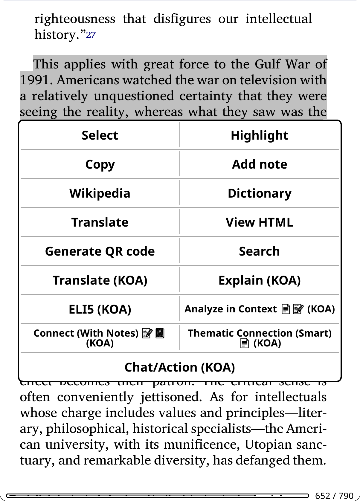</a>

**Access**: Highlight text in a document → tap "KOAssistant"

**Quick Actions**: You can add frequently-used actions directly to KOReader's highlight popup menu for faster access. Instead of going through the KOAssistant dialog, actions like "Explain (KOA)" or "Translate (KOA)" appear as separate buttons. See [Highlight Menu Actions](#highlight-menu-actions) below.

**Bypass Mode**: Skip the highlight menu entirely and trigger your chosen action immediately when selecting text. See [Highlight Bypass](#highlight-bypass) below.

**Built-in Actions**:
| Action | Description |
|--------|-------------|
| **Explain** | Detailed explanation of the passage |
| **Quick Explain** | A short explanation meant to land in the [minimal popup](#minimal-popup) rather than the full viewer. In the highlight menu by default |
| **ELI5** | Explain Like I'm 5 - simplified explanation |
| **Summarize** | Concise summary of the text |
| **Elaborate** | Expand on concepts, provide additional context and details |
| **Connect** | Draw connections to other works, thinkers, and broader context |
| **Connect (With Notes)** | Connect passage to your personal reading journey ⚠️ *Requires: Allow Annotation Notes, Allow Notebook* |
| **Explain in Context** | Comprehension-focused: what the passage means, what leads up to it, and what it builds on. Source selection: full text, summary, AI knowledge, or Smart retrieval (AI searches the book) |
| **Analyze in Context** | Reader-focused: connects the passage to your highlights, annotations, and the threads you've been tracking. Source selection: full text, summary, AI knowledge, or Smart retrieval (AI searches the book) ⚠️ *Requires: Allow Annotation Notes, Allow Notebook* |
| **Thematic Connection** | Craft-focused: examines the author's technique (language, structure, imagery) and how the passage fits into the work's thematic architecture. Source selection: full text, summary, or AI knowledge |
| **Fact Check** | Verify claims using web search ⚠️ *Requires: Web Search* |
| **Counterpoint** | Argues against the selected passage in good faith and at full strength: the strongest objections to its claim, reasoning, and framing, and who would disagree. (Fact Check verifies accuracy; Counterpoint challenges the argument.) |
| **Current Context** | Get latest information about a topic using web search ⚠️ *Requires: Web Search* |
| **Translate** | Translate to your configured language |
| **AI Wiki** | Wikipedia-style encyclopedia entry about the selected text, using AI knowledge. Cached as an artifact (same as X-Ray browser wiki entries). Uses web search if enabled globally. Available in dictionary popup by default |
| **Dictionary** | Full dictionary entry: definition, etymology, synonyms, usage (also accessible via dictionary popup) |
| **Quick Define** | Minimal lookup: brief definition only, no etymology or synonyms |
| **Grammar** | Plain-language grammar breakdown of the selected text: how the clauses fit together, the role of each significant word or phrase, and anything irregular (with the technical term in parentheses, and the native grammatical tradition's terms for languages that have one). Not placed in any menu by default; add it via the action managers |
| **Deep Analysis** | Linguistic deep-dive: morphology, word family, cognates, etymology path |
| **Look up in X-Ray** | `[Local]` Instant search of cached X-Ray data for selected text, no AI call, works offline. Searches by name and alias across all X-Rays (main + sections). An exact name or alias match opens that entry directly (or a compact [entity card](#reading-analysis-actions) first); several entries sharing the same name give a short chooser; partial matches open a results list grouped by X-Ray. Available in highlight menu and dictionary popup. Only appears when the book has an X-Ray cache. |

**Generate Image**: A separate **Generate Image (KOA)** button in the highlight popup turns the selected text into an image via an image-generation provider (OpenAI, xAI, or Gemini). It uses its own provider/model and settings (independent of your chat provider) and appears only when image generation is enabled and the effective provider supports it. Generated images are kept on device in `data_dir/koassistant_images` and collected in a **Generated Images** gallery (tap to view, hold to delete, or delete all), with a per-book association so each book's images also appear on its "View Artifacts" list and in the cross-book artifact browser. You control whether (and where) the button appears from the Highlight Menu manager, like any other highlight action. See [Image Generation](#image-generation) for details.

**Source selection:**

Several actions let you choose which document source the AI uses when you trigger them. A unified popup combines **scope** (what part of the book) and **source** (what data to send) in a single dialog:

**Scope** (rows shown depend on the action, whether the book has a table of contents, and your reading position):
- **Full document**: Use the entire document. For "up to current position" actions (like Recap), whose extraction already stops at your reading position, this row is labeled **Up to current position (NN%)** instead.
- **Up to current position (NN%)**: For whole-document actions, limits scope to what you've read so far (spoiler-safe).
- **Pick section…**: Focus on a specific chapter or part via a hierarchical TOC picker. The selected section name appears below the scope buttons. Section results are stored as independent artifacts (e.g., "Section Key Arguments: Chapter 5")
- **From section… (to current position)**: From a chosen section up to your current reading position.
- **Pick section range…**: A start section and an end section.
- **Current chapter** / **Current chapter so far**: Quiz only.

**Source:**
- **Extract text**: Sends the actual document text to the AI. Most accurate, but uses more tokens. Requires text extraction to be enabled. When scoped to a section, only that section's text is extracted.
- **Use summary**: Uses a pre-generated summary (~2-8K tokens) instead of raw text. Much cheaper for repeated use or follow-up conversations. Requires generating the summary first via the Document Summary action. When scoped to a section, uses the section summary if available (or offers to generate one). If no summary exists, this option shows a "(generate first / enable text extraction first)" hint.
- **Smart retrieval (AI searches the book)**: Offered on **Explain in Context** and **Analyze in Context** in tools-capable sessions. Instead of extracting a fixed span, the AI uses the local book tools to gather the passages it decides are relevant, and those replace full-text extraction. Works with the "Full document" or "Up to current position" scope (the scope pick bounds what the tools may read); section scopes turn it off. Requires text-extraction consent (or a trusted provider); shown disabled with the reason otherwise. See [AI Book Tools](#ai-book-tools-experimental).
- **AI knowledge only**: No document data sent. The AI uses its training knowledge of the work. Free and fast, but less accurate for obscure works.

Actions with source selection: Explain in Context, Analyze in Context, Thematic Connection, Key Arguments, Counterarguments, Discussion Questions, Quiz, Reading Guide, Extract Key Insights, Document Summary, Document Analysis, Recap. For highlight-context actions (Explain in Context, Analyze in Context, Thematic Connection), the scope controls the text extraction range around the highlighted passage; they get the same scope rows as book actions (up to current position, from a section, a section range). Document Summary and Document Analysis require text extraction (other sources are grayed out). Recap can't be pointed at an arbitrary section (a catch-up is always up to where you are), but "From section… (to current position)" is offered.

**Spoiler protection in the scope popup:** while [spoiler protection](#spoiler-protection) is on for the book, the popup pre-selects **Up to current position** instead of Full document whenever that row exists, and running a scope that covers text you haven't read yet asks once ("This covers parts you haven't read yet") before it sends.

**When to use each source:**
- **Full text**: Short to medium documents, one-off queries, when you need the AI to work from the actual text
- **Summary**: Longer documents, repeated queries, extended conversations, when token cost matters
- **Smart retrieval**: Long documents where you want targeted passages instead of one big extraction, and the AI to decide what's relevant to your question
- **AI knowledge**: Well-known works where the AI has good training data, quick queries, where nuance and bias may not matter as much

**How sources affect AI behavior:**

These aren't just quality tiers; they change *how the AI thinks*. When you provide actual text, the AI shifts from recall mode to analytical mode. Instead of (only) reconstructing a work from memory (filtered through whatever patterns, emphasis, and blind spots its training absorbed), it's doing direct analysis on the material in front of it, parsing structure, tracing arguments, finding patterns in what's actually written. Training-era biases and editorial slant matter less (but still matter) when the AI is working from your text rather than its pre-trained impressions of it.

With AI knowledge only, the AI is essentially giving you its "remembered take" on a work, shaped by which reviews, summaries, and discussions dominated its training data. For canonical works, this is often good enough. But for anything where framing matters (political texts, contested histories, philosophical arguments, novel research), the difference between "analyze this passage" and "tell me about this work" can be substantial.

**In short:** Text extraction gives the AI a job to do on specific material. AI knowledge asks it what it thinks it knows.

**Accessing summaries:**
- **Quick Actions** → Document Summary (shows View/Redo popup if summary exists, generates if not)
- **File browser** → Long-press a book → "View Artifacts (KOA)" → pick any cached artifact. X-Ray opens in a browsable category menu; all others open in the text viewer.
- **Gesture** → Add artifact actions to gesture menu via Action Manager (hold action → **+ Gesture Menu**)
- **Coverage**: The viewer title shows coverage percentage if document was truncated (e.g., "Summary (78%)")

> **Tip**: For documents you'll query multiple times, generate the summary proactively via the Document Summary action. All artifact actions produce viewable reference guides that are also browsable via "View Artifacts". See [Document Artifacts](#document-artifacts).

**What the AI sees**: Your highlighted text, plus document metadata (title, author). Actions like "Explain in Context" and "Analyze in Context" also use extracted document text to understand the surrounding content. Custom actions can access reading progress, chapter info, your highlights/annotations, notebook, and extracted book text, depending on action settings and [privacy preferences](#privacy--data). See [Template Variables](#template-variables) for details.

**Surrounding context** (Settings → Highlight Settings → Surrounding Context, default None) sends a bounded window of text around your selection: a sentence, paragraph(s), or a character count, hard-capped at 2000 characters. Paragraph mode trims to a sentence boundary rather than mid-word. **Context Direction** can limit it to the text before your selection, and while spoiler protection is on, **Context Under Spoiler Protection** clamps how much text after the selection rides along (default: one paragraph). All of it is overridable per book (Book Settings), and per chat from the **Ctx** chip, which can also attach a book text range via "Also send book text…".

**Save to Note**: After getting an AI response, tap the **Save to Note** button to save it directly as a KOReader highlight note attached to your selected text. See [Save to Note](#save-to-note) for details.

> **Tip**: Add frequently-used actions to the highlight menu (Action Manager → hold action → **+ Highlight Menu**) for quick access. Other enabled highlight actions remain available from the main "KOAssistant" entry in the highlight popup. From that input window, you can also add extra instructions to any action (e.g., "esp. the economic implications" or "in simple terms").

### Book/Document Mode

<a href="screenshots/bookinfowmetadata.png"></a>

**Access**: Long-press a book in File Browser → "Chat/Action (KOA)" or while reading, use gesture or menu

Some actions work from the file browser (using only document metadata like title/author), while others require reading mode (using document state like progress, highlights, or extracted text). Reading-only actions are automatically hidden in file browser. You can pin frequently-used file browser actions directly to the long-press menu via **Action Manager → hold action → + File Browser**, so they appear as one-tap buttons without opening the action selector. All file browser buttons (utilities + pinned actions + Chat/Action) are distributed across rows of up to 4 buttons each. Long-press any pinned action button to see its description.

**Book Hub** is a full-screen page for one book: every artifact it has, its X-Ray rows with live status, Chat/Action, Chat History, Notebook, Group, and Book Settings in one place. Open it from a file-browser long-press ("Book Hub (KOA)"), the main menu, the Quick Actions panel, a gesture, or the "Book Hub…" row on any View Artifacts list. Its menu can refresh the artifact index, export all artifacts, browse all books, or delete everything for that book. See [Book Hub](#book-hub).

**Built-in Actions**:
| Action | Description |
|--------|-------------|
| **About** | Overview, significance, and why to read it |
| **Find Similar** | Recommendations for similar works. When library scanning is enabled, notes which you already own |
| **About Author** | Author biography and writing style |
| **Historical Context** | When written and historical significance. Adapts to work type (novel, manifesto, religious text, research paper) |
| **Related Thinkers** | Intellectual landscape: influences, contemporaries, and connected thinkers |
| **Reviews** | Find critical and reader reviews, awards, and reception ⚠️ *Requires: Web Search* |
| **X-Ray** | Browsable reference guide: characters (with aliases and connections), locations, themes, lexicon, timeline. Opens in a structured menu with search (including cross-section search across all X-Rays), chapter/book mention tracking, per-item chapter distribution, AI Wiki per-item encyclopedia, Section X-Rays for focused chapter/part analysis, linkable cross-references, local lookup, and highlight integration. Supports Automatic X-Ray (background upkeep), checkpoints, and version history. ⚠️ *Requires: Allow Text Extraction* |
| **X-Ray (Simple)** | Prose companion guide from AI knowledge: characters, themes, settings, key terms. No text extraction needed. Uses reading progress to avoid spoilers. |
| **Recap** | "Previously on..." style summary to help you resume reading. Source selection: extracted text (with incremental updates) or AI knowledge. Use Hidden Flows to limit scope ⚠️ *Best with: Allow Text Extraction* |
| **Analyze Notes** | Discover patterns and connections in your notes and highlights ⚠️ *Requires: Allow Annotation Notes* |
| **Key Arguments** | Thesis, evidence, assumptions, and counterarguments. Source selection: full text, summary, or AI knowledge. Supports section scope |
| **Counterarguments** | Prosecutes the case against the work: steelmanned opposing positions, the argument's weakest links, what would falsify it, and who disagrees and why. (Key Arguments maps the argument; this one argues back.) Source selection: full text, summary, or AI knowledge. Saved as an artifact |
| **Discussion Questions** | Comprehension, analytical, and interpretive prompts. Source selection: full text, summary, or AI knowledge. Supports section scope |
| **Quiz** | Interactive comprehension quiz, one question at a time with answer selection, scoring, and review. Multiple choice (auto-graded), short answer and discussion (self-graded). Triggered automatically at chapter ends (configurable) or manually from Quick Actions with scope picker. Question types, count, and difficulty configurable in Settings. Result saved as artifact. Source selection: full text, summary, or AI knowledge. Supports section scope |
| **Reading Guide** | Spoiler-free guide to what's ahead: threads in motion, patterns to notice, helpful background, how to approach the rest. Uses reading position to stay safe. Source selection: full text, summary, or AI knowledge. Supports section scope |
| **Document Analysis** | Deep analysis: thesis, structure, key insights, audience. Saved as an Analysis artifact. Supports section scope. ⚠️ *Requires: Allow Text Extraction* |
| **Document Summary** | Comprehensive summary. Saved as a Summary artifact, which other actions can use as their document source. Supports section scope. ⚠️ *Requires: Allow Text Extraction* |
| **Extract Key Insights** | Distills the most important takeaways: ideas worth remembering, novel perspectives, actionable conclusions. Source selection: full text, summary, or AI knowledge. Supports section scope |
| **Suggest from Library** | Suggests what to read next from your own library, based on the current book and your reading patterns. Also triggers in the end-of-book popup. ⚠️ *Requires: Library scanning enabled* |

**What the AI sees**: Document metadata (title, author, DOI when detected). For Analyze Notes: your annotations. For full document actions: entire document text. For Suggest from Library: your library catalog (title, author, series, status, progress, last read date). For library scan actions with Advanced Stats enabled: curated engagement groups (book lists categorized by reading patterns, see [Privacy & Data](#privacy--data)).

<a id="research-mode"></a>

#### Research Mode

**Research Mode** adapts KOAssistant's prompts, X-Ray schema, and web search behavior for academic and research texts. It can activate automatically via DOI detection or be turned on manually for any book.

**Triggering Research Mode:**

| Trigger | How it works |
|---------|-------------|
| **DOI auto-detection** | When KOAssistant detects a DOI (Digital Object Identifier) in your document, Research Mode activates automatically |
| **Per-book toggle** | Set manually via the Domain & Research picker, persists in the book's sidecar |
| **Global setting** | Enable in Domain & Research picker (global target) or Settings, applies to all books without a per-book override |
| **Per-action override** | Actions can force Research Mode on or off regardless of other settings |

**Resolution order:** Action override > per-book setting > DOI auto-detection > global setting. Per-book "Off" explicitly suppresses Research Mode even if a DOI is detected.

**What changes with Research Mode:**

| Enhancement | What it does |
|-------------|-------------|
| **Academic X-Ray** | Replaces fiction/non-fiction categories with 7 research-appropriate categories: Key Concepts, Foundations (intellectual lineage, paradigms), Methodology, Findings, Referenced Works (with aliases and connections), Technical Terms, Figures & Data |
| **Academic Prompt Tracks** | About, Find Similar, and X-Ray (Simple) switch to research-oriented prompts (research context, methodology, cited works instead of characters/themes). Recap, Key Arguments, Discussion Questions, Quiz, Reading Guide, and Analyze Notes include expanded academic adaptation (methodology, evidence evaluation, field positioning) |
| **Research Nudge** | System prompt addition guiding the AI to ground analysis in the provided text, verify claims via web search, and contextualize within the paper's field |
| **Web Search Override** | Actions that normally have web search disabled (X-Ray, Summarize, etc.) follow your global web search setting instead: if web search is on globally, research texts get web-enriched analysis |
| **DOI in Prompts** | When a DOI is detected, every book-context prompt includes it, helping the AI identify the exact paper and its citation context |

**How to enable Research Mode:**

The toggle is inside the **Domain & Research** picker (the Domain button in the chat input dialog, or the Domain item in Quick Settings). Below the domain list, a "Research Mode" section appears:

- **Book target:** Follow global (<value>) / On / Off, saved per-book
- **Global target:** Off / On, applies to all books without a per-book override

This shares the same book/global target toggle as domain selection. Research Mode for the current book can also be set from [Book Settings](#book-settings).

**How DOI detection works:**
1. **Cached result**, instant (checked first)
2. **Document metadata**, EPUB identifiers, PDF description/keywords
3. **First-page text scan**, extracts page 1 text, finds DOI pattern, discards text (most reliable for PDFs)

DOI detection runs independently of the Research Mode toggle: the DOI is always available for `{doi_clause}` in prompts. The toggle only controls whether Research Mode *behavior* (nudge, prompt swaps, web override) activates.

The DOI is a public identifier (like a URL). Only the DOI string enters metadata: no document content leaves the device beyond what you've already opted into via privacy settings.

**Academic X-Ray categories** are discipline-agnostic: the prompt tells the AI to adapt categorization to the field (a physics paper has different natural categories than a sociology study or a philosophy paper). The browsable X-Ray browser works identically: category navigation, search, chapter appearances, AI Wiki, linkable cross-references, and all other features carry over. Academic X-Rays use the same two-track design (incremental vs complete) and support Section X-Rays.

**Cache track consistency:** When updating an existing artifact (e.g., "Update X-Ray to 50%"), the update respects the track the cache was originally built with: a non-fiction X-Ray stays non-fiction even if Research Mode is now on, and vice versa. "Redo" regenerates from scratch using the current Research Mode setting.

> **Tip: Good metadata matters.** DOI detection works best when your documents have clean metadata. Use Calibre or your reference manager (Zotero, Mendeley) to ensure the DOI is in the document's identifier or description fields. For PDFs without metadata DOI, the first-page text scan catches most academic papers since publishers print the DOI on page 1. After the first action run, the detected DOI is cached: subsequent actions (including from the file browser) use the cached result instantly.
>
> **Tip: Research Mode without DOI.** For academic books, textbooks, or research-adjacent texts that don't have a DOI, enable Research Mode manually via the Domain & Research picker. This gives you the academic X-Ray schema, research nudge, and web search override: everything except the DOI-specific prompt enrichment.

#### Reading Analysis Actions

These actions analyze your actual reading content. They require specific privacy settings to be enabled:

| Action | What it analyzes | Privacy setting required |
|--------|------------------|--------------------------|
| **X-Ray** | Book text up to current position | Allow Text Extraction (required). Allow Highlights only adds the local highlights list on entity pages; nothing extra is sent |
| **X-Ray (Simple)** | AI training knowledge + reading progress | None |
| **Recap** | Book text or AI knowledge (user choice) + highlights up to current position | Allow Text Extraction (for extracted text), Allow Highlights |
| **Analyze Notes** | Your highlights and annotations | Allow Annotation Notes |
| **Key Arguments** | Full text, summary, or AI knowledge (user choice) | Allow Text Extraction (for full text/summary) |
| **Discussion Questions** | Full text, summary, or AI knowledge (user choice) | Allow Text Extraction (for full text/summary) |
| **Quiz** | Full text, summary, or AI knowledge (user choice) | Allow Text Extraction (for full text/summary) |
| **Document Analysis** | Entire document or section (user choice) | Allow Text Extraction |
| **Document Summary** | Entire document or section (user choice) | Allow Text Extraction |
| **Extract Key Insights** | Full text, summary, or AI knowledge (user choice) | Allow Text Extraction (for full text/summary) |
| **Reading Guide** | Full text, summary, or AI knowledge (user choice) + reading progress | Allow Text Extraction (for full text/summary) |
| **About** | AI training knowledge (+ optional web search) | None (web search optional) |
| **Suggest from Library** | Library catalog + current book + reading progress | Enable Library Scanning + folders configured |
| **Next Read** | Library catalog + engagement groups (recently finished, stalled, briefly started) | Enable Library Scanning + folders configured; Allow Advanced Stats (optional, enhances with engagement data) |
| **Discover New** | Library catalog + engagement groups (deep reads, recently finished) | Enable Library Scanning + folders configured; Allow Advanced Stats (optional) |
| **Analyze Library** | Library catalog + all engagement groups | Enable Library Scanning + folders configured; Allow Advanced Stats (optional) |
| **Challenge My Taste** | Library catalog + all engagement groups | Enable Library Scanning + folders configured; Allow Advanced Stats (optional) |

> ⚠️ **Privacy settings required:** These actions won't have access to your reading data unless you enable the corresponding setting in **Settings → Privacy & Data**. Without text extraction enabled, actions with source selection show "AI knowledge only" as the available option. For other actions, the AI gracefully falls back to its training knowledge, with a "*Response generated without: ...*" notice in the chat. **Exception:** X-Ray requires text extraction and blocks generation without it: use X-Ray (Simple) for a prose overview from AI knowledge.

> **Tip:** Highlight actions can also use text extraction. "Explain in Context" and "Analyze in Context" send the full document text (`{full_document_section}`) to understand your highlighted passage within the complete work. See [Highlight Mode](#highlight-mode) for details.

**X-Ray**, **Document Summary**, and **Document Analysis** require text extraction enabled (Settings → Privacy & Data → Text Extraction). Without it, generation is blocked with a message directing you to enable text extraction (or use X-Ray (Simple) as an alternative for X-Ray). If you've already generated a cached result and later disable text extraction, you can still view it but cannot regenerate or redo it.

<p align="center">
  <a href="screenshots/Xraybrowser.png"></a>
  <a href="screenshots/xrayarg.png"></a>
  <a href="screenshots/xrayappearance.png">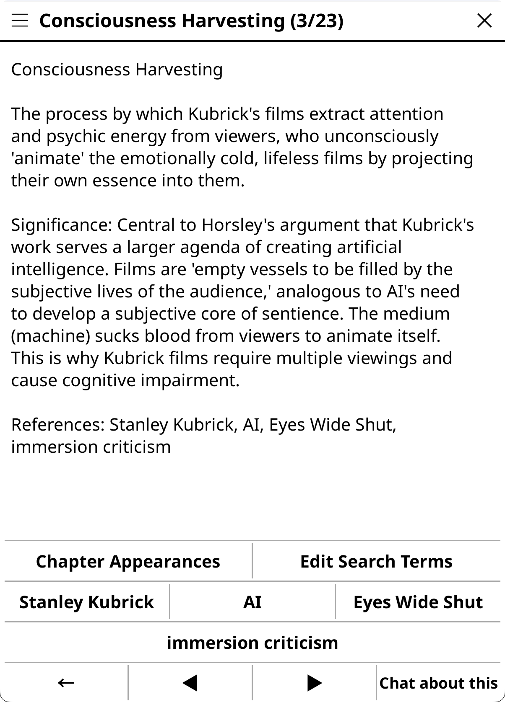</a>
  <a href="screenshots/xrayapps.png">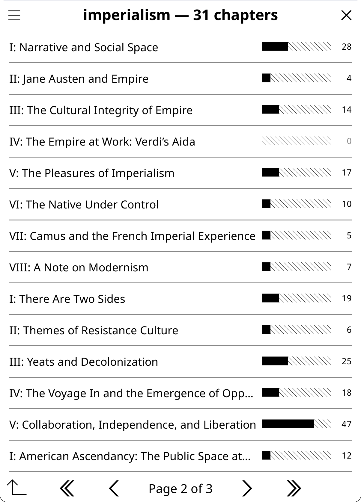</a>
</p>

The X-Ray action produces a structured JSON analysis that opens in a **browsable category menu** rather than a plain text document. The initial browsable menu concept was inspired by [X-Ray Plugin for KOReader by 0zd3m1r](https://github.com/0zd3m1r/koreader-xray-plugin). Chapter distribution, linkable connections, and local lookup features were informed by [Dynamic X-Ray by smartscripts-nl](https://github.com/smartscripts-nl/dynamic-xray), a comprehensive manual X-Ray system with curated character databases, live page markers, and a custom histogram widget. Our approach differs: KOAssistant uses AI generation instead of manual curation, and menu-based navigation instead of custom widgets, but DX demonstrated the value of per-item chapter tracking and cross-reference linking. The browser provides:

- **Category navigation**: Cast, World, Ideas, Lexicon, Story Arc, Current State/Conclusion (fiction) or Key Figures, Locations, Core Concepts, Arguments, Terminology, Argument Development, Current Position/Conclusion (non-fiction) or Key Concepts, Foundations, Methodology, Findings, Referenced Works, Technical Terms, Figures & Data, Current Position/Conclusion (academic, see [Research Mode](#research-mode)), with item counts. Current State/Current Position appears for incremental (spoiler-free) X-Rays; Conclusion appears for complete (entire document) X-Rays, see [two-track design](#x-ray-modes) below.
- **Item detail**: descriptions, AI-provided aliases (e.g., "Lizzy", "Miss Bennet", shown for all categories), connection buttons, and an **AI Wiki** button. Everything else lives behind the page's **More…** popup: the full connection list, "Your highlights (N)…" for the passages mentioning this item, custom search terms, "History through checkpoints…", and the rename / merge / link operations
- **Linkable references**: character connections and cross-category references (locations → characters, themes → characters, etc.) are tappable buttons that navigate directly to the referenced item's detail view. References are resolved across all categories using name, alias, and substring matching. The number of boxes is capped by **Settings → Reading & Library → X-Ray → Connection Buttons per Entry** (default 9, range 0-30): past the cap the last box becomes an **"All connections (N)…"** overflow row, and at or under it the full list is also in the entry's More… popup. Repeated links to the same entity are always collapsed.
- **Mentions**: unified chapter-navigable text matching. Opens showing every entry's mentions up to your position (**"To p. N"**), with comparison bars, counts, and category tags; a chapter picker at the top narrows the scope to any chapter or part (KOReader-style hierarchical TOC with expand/collapse, current chapter bolded). Includes an **"Entire document (to p. N)"** aggregate that scans from page 1 to your coverage boundary, plus **"Entire document"**, which reveals the whole book behind one confirmation. Chapters beyond the greater of X-Ray coverage and reading position are dimmed with tap-to-reveal spoiler protection, and a chapter that crosses your position is clipped at it ("up to p. N"). For complete X-Rays, all chapters are available with no spoiler gating. Books without a TOC fall back to page-range chunks. Excludes event-based categories (timeline, argument development) whose descriptive names produce misleading matches. Uses word-boundary matching against names and aliases.
- **Chapter Appearances**: from any item's detail view, the book's whole table of contents as a tree (expand/collapse arrows on parent rows, the current chapter bold), with mention counts and comparison bars at every level. Counts use union semantics: all match spans from the item's name and aliases are collected, overlapping spans merged, and unique matches counted, matching KOReader's text search behavior. Chapters beyond the greater of your X-Ray coverage and reading position are dimmed with tap-to-reveal spoiler protection (per chapter, or **"Reveal all chapters"** in one step); the chapter crossing your position counts only up to it. For complete X-Rays, all chapters are visible with no spoiler gating. **"All appearances"** opens the entry's full mention list. Tap a chapter with mentions to jump into the book and launch a text search for the item's name and aliases (regex OR for multi-term matching); a floating **"← X-Ray"** button brings you back to your reading position and the view you came from. Uses TOC-aware chapter boundaries with page-range fallback for books without TOC.
- **Edit Search Terms**: from any item's detail view, add custom search terms (alternate spellings, transliterations, nicknames) or ignore AI-generated aliases that produce false matches. Custom terms are stored per-book in a sidecar file that survives X-Ray regeneration. Added terms contribute to Chapter Appearances counts and KOReader text search patterns. Ignored terms are hidden from the item's alias list and excluded from counting. All operations (add, remove, ignore, restore) are accessible from a single "Edit Search Terms" button.
- **Search X-Ray**: find any entry across all categories by name, alias, or description. When multiple X-Rays exist (main + sections), a "Search other X-Rays" button at the bottom lets you extend the search to all other X-Rays with grouped results by section
- **Local X-Ray Lookup**: select text while reading → instantly look it up in cached X-Ray data. No AI call, no network, instant results. Searches by name and alias (not descriptions, to avoid false matches like "Swift" hitting unrelated entries). When multiple X-Rays exist, searches all of them: single match goes directly to detail, multiple matches in one X-Ray show results with a bold header identifying which X-Ray, matches across multiple X-Rays show a grouped cross-section results view. Smart fallback for single X-Ray: prefers section covering current page, falls back to main, uses sole section out of range, or shows picker. Available in highlight menu and dictionary popup when any X-Ray cache exists (main or section). See "Look up in X-Ray" in [Highlight Mode](#highlight-mode).
- **Full View**: rendered markdown view in the chat viewer (with export)
- **Chat about this**: from any detail view, launch a chat with the entry as context to ask follow-up questions. Opens with a curated set of actions (Explain, Elaborate, ELI5, Fact Check, Connect by default) since the context is AI-generated analysis. Actions requiring document text (Explain in Context, Thematic Connection) are excluded when no book is open. The entry text is prefixed with a note clarifying it's from an analysis, not the work itself. Customize which actions appear via the gear icon → "Choose and Sort Actions". An **"X-Ray chats (N)"** row at the browser root lists the chats you started from this book's X-Ray entries.
- **Manage an entry**: from any entry's **More…** popup, rename it (the old name becomes an alias so matching keeps working), merge it with another entry, link it to a group member's entry across books, or walk **"History through checkpoints…"** to see how that one entry changed across the versions you have built.
- **Find duplicate entities**: a mechanical scan (browser ☰ menu) for the same entity under two names, offering merge (alias absorb), merge keeping both texts, an AI-combined description, or "never merge these two". Committed merges are replayed into checkpoints you have already built.
- **AI Wiki**: from any item's detail view (same categories as Chapter Appearances), generate a Wikipedia-style encyclopedia entry about the item using AI knowledge. The button passes only the item's name to the AI, with the X-Ray description provided as disambiguation context, so "Jim" is understood as "Jim Hawkins from Treasure Island" without biasing the output. Entries are cached per-item and per-category in the existing cache file. Button shows "AI Wiki" when no entry exists, "View AI Wiki" when cached. The viewer provides Delete and Regenerate options. Cached wiki entries are automatically cleared when the X-Ray cache is deleted.
- **Text selection**: hold to select text in detail views. One word on a short hold opens the dictionary; anything else opens a popup with Copy, Dictionary, Wikipedia, Translate, Look up in X-Ray, and Add to notebook
- **Options menu** (☰): info (model, progress, date, work type, checkpoint provenance), **Extend… / Rebuild…**, the version rows (install a built checkpoint, switch to the complete version, switch back to your position), **All versions (N)…** (main X-Ray only, see [X-Ray version history](#x-ray-version-history) below), merges (section X-Rays, another book's X-Ray, duplicate entities), a **→ Group** row when the book is in a group, archive or delete, close

**X-Ray in the book text** (all on by default, per-book overridable via the X-Ray popup's "Marking & lookup…" or Book Settings → X-Ray):

- **Passive marking**: words on the page that match an X-Ray entity's name or alias get a discreet dotted gray underline as you read (EPUB page mode; drawn shortly after the page settles, entirely on device). Tap a marked word to open its entry. Density is configurable (every occurrence, once per page, only after 10 or 25 unseen pages, or once per book; default: after 10 unseen pages), as is which categories are marked (everything, people only, or people + places).
- **Entity cards**: an exact hit opens a compact card first: name, category and role, plus a one-line identification, with the full entry one tap away. The card can be a footnote panel at the bottom of the screen or a small popup anchored at the tapped word. Turn the card off to open the full entry directly.
- **Matching selections**: selecting text or dictionary-looking-up a word that exactly matches an entity's name or alias opens its entry instead of the dictionary. Anything that doesn't match falls through to your normal dictionary or highlight menu, and a very long press always gets you the plain menus. Entities that first appear beyond your installed coverage (recognized from a checkpoint built ahead of you) mark as short dashes and identify with a spoiler warning; their full entry stays behind a confirmation. Turn the "Upcoming entities" peek off (globally or per book) to keep marking and lookup strictly at your installed coverage.

> **Model selection for X-Ray:** X-Ray generates detailed structured JSON (for the X-Ray browser to work) that can be large (10K-30K+ tokens of output), and it is a complex task for the AI. The action requests up to 64K output tokens to avoid truncation. Weaker models can struggle to follow these instructions, and even if they manage it, will produce low quality content for the actual analysis, and models with low output caps (e.g., some Groq models at 8K) will produce shorter, potentially truncated results, so use larger models with higher output limits for best results. If you find a model that produces great X-Rays, you can lock it in for this action while keeping your global model for everything else, see the tip below.

> **Tip: Per-action model overrides.** You don't have to use the same model for every action. If you discover that a particular model excels at X-Ray (or any other action), you can assign it permanently to just that action:
> 1. Go to **Settings → Actions & Prompts → Manage Actions**
> 2. Long-press the action (e.g., X-Ray) → **"Edit Settings"**
> 3. Scroll to **Advanced** → set **Provider** and **Model**
>
> Your global model continues to be used for all other actions. This is useful for mixing cost and quality: for example, use a fast model (Gemini 3.5 Flash, Haiku, small Mistral models, etc.) as your global default for quick lookups and chat, while assigning a more capable model (Gemini 3.1 Pro, Sonnet, large Mistral models, etc.) specifically to X-Ray or Deep Analysis where quality matters most. See [Tuning Built-in Actions](#tuning-built-in-actions) for more examples. You can of course also momentarily change you global model to run an action and then change back if you don't want to tie an action to a model. 

> **Tip:** If your device supports emoji fonts, enable **Emoji Menu Icons** in Settings → Display Settings → Emoji for visual category icons in the X-Ray browser (e.g., characters, locations, themes). See [Emoji Menu Icons](#display-settings).

> **Custom TOC support:** Chapter-based features (Mentions, Chapter Appearances) automatically use KOReader's active TOC, including custom/handmade TOCs. If your book has no chapters or a single chapter, the fallback is page-range chunks (~20 pages each). For better results, create a custom TOC in KOReader (long-press the TOC icon → "Set custom TOC from pages") and the X-Ray browser will use it.

<a id="hidden-flows-support"></a>

> **Hidden flows support:** When KOReader's hidden flows feature is active (hiding endnotes, translator introductions, or separate books in collected works), KOAssistant automatically adapts:
> - **Text extraction** skips hidden content: only visible pages are sent to the AI
> - **Reading progress** reports your position within visible content only (e.g., page 42 of 70 visible pages = 60%, not 42%)
> - **TOC-based features** (Mentions, Chapter Appearances) filter out chapters from hidden flows
> - **Cache staleness** detects when your hidden flow configuration changes and notifies you
>
> This works for both EPUB and PDF. Useful for collected works where you want to analyze just one book, or for editions with long endnotes/apparatus you want excluded from AI analysis. The hidden content is simply invisible to KOAssistant: extraction, progress tracking, and chapter features all operate on visible pages only.
>
> **Tip:** Hidden Flows is one of the best ways to save tokens and improve AI results. By hiding front matter, introductions, appendices, bibliography, indices, references, and other non-narrative content, you send only the parts that matter: what remains becomes the "whole book" from KOAssistant's perspective. All actions (X-Ray, Summary, Analysis, etc.) operate on this trimmed scope. For collected works or anthologies, use Hidden Flows to isolate individual volumes: a "Complete X-Ray" treats the visible content as the entire document. Hidden Flows and [Section X-Rays](#section-x-rays) are complementary: use Hidden Flows to permanently trim away content you never want analyzed, then use Section X-Rays for focused analysis of specific chapters within the trimmed document. See KOReader's documentation for how to set up Hidden Flows.

> **Highlights in X-Ray:** X-Ray never sends your highlights to the AI. When [Allow Highlights](#privacy-controls) is on, the browser matches them locally and offers them on each entity page as "Your highlights (N)…" in the More… popup; they are only transmitted if you then chat about that entry.

> **Note:** X-Ray ships with reasoning pinned **off** at the action level, and an action's own setting outranks every stance. To let the settings below reach it, go to Manage Actions → hold **X-Ray** → Edit Settings → Advanced → Reasoning and set it to **Global (use setting)**. Analyze (Full Document) has no such pin.
>
> **Tip: Reasoning for complex tasks.** For short, dense works (research papers, academic chapters, technical documents under ~100 pages), more **reasoning** can significantly improve X-Ray quality and depth. The additional processing time is worthwhile when the text is concentrated: the AI produces more thorough entries and fewer omissions. Set the global reasoning **stance to Maximum**, or override your current model's reasoning to a high level (Settings → Advanced → Reasoning, or the Quick Settings Reasoning tile). This also applies to Document Analysis and other complex one-off tasks. See [Reasoning/Thinking](#reasoningthinking).

<a id="x-ray-modes"></a>

**X-Ray** requires text extraction to generate: it blocks with a message directing you to enable text extraction or use X-Ray (Simple) instead. If you've already cached an X-Ray and later disable text extraction, you can still view the cached result but cannot update or redo it.

**X-Ray (Simple)** is a separate action that produces a prose overview (Characters, Themes, Setting, Key Terms, Where Things Stand) from the AI's training knowledge, no text extraction needed. Uses your reading progress for spoiler gating. Saved as its own artifact (not in the Quick Actions panel by default; add it from the Quick Actions manager if you want it one tap away). Every generation is fresh (no incremental updates). Best for well-known books when you don't want to enable text extraction. For obscure works or research papers, results will be limited since the AI may not recognize the title.

**Recap** works with source selection: choose between extracted text (recommended, with incremental updates as you read) or AI knowledge only. Use KOReader's Hidden Flows to limit scope to specific chapters or parts of the book.
- **With text extraction** (recommended): AI analyzes actual book content. Produces accurate, book-specific results. Results are cached and labeled "Based on extracted document text."
- **Without text extraction** (default): AI uses only the title/author and its training knowledge. Works reasonably for well-known titles but produces generic results. Results are labeled "Based on AI training data knowledge."

> **Tip:** Enable **Recap Reminder** in Settings → Reading & Library to get a prompt to run Recap when you open a book you haven't read in a while (off by default).

**Two-track X-Ray:** When generating a new X-Ray, you choose between two tracks:

- **Incremental** (default): Spoiler-free: extracts text only up to your current reading position. Produces a **Current State** (fiction) or **Current Position** (non-fiction) section capturing active conflicts, open questions, and narrative momentum. Supports incremental updates as you read further: only new content is sent, and the AI's additions are diff-merged into the existing analysis. Updates are fast and cheap (~200-500 output tokens vs 2000-4000 for full regeneration). You can also extend the incremental X-Ray to the end of the book using the same spoiler-free prompt (**Extend…** → "The whole book"). For a new X-Ray, **"Create X-Ray…"** asks how far it should cover (up to your position / the whole book / to the end of a section) and how to build it (one request now / in checkpoints / automatically as you read); an existing one gets the **Extend… / Rebuild…** pair. The incremental track is also the only one that supports [Automatic X-Ray](#x-ray-auto-update) and [checkpoints](#x-ray-version-ladder).
- **Complete** (entire document): Holistic: extracts and analyzes the entire document in one pass. Produces a **Conclusion** section with resolutions, themes resolved (fiction) or key findings, implications (non-fiction). Always generates fresh: no incremental updates, no diff-merging. Best for articles, research papers, short works, or finished books where spoiler-free scoping isn't needed. Reached via **"Create X-Ray…"** → "The whole book" → "In one request now (analyzed as a whole)".

The track is chosen at initial generation and cannot be converted. To switch tracks, delete the cache and regenerate. Both tracks use the same browsable category menu, the same JSON structure for all shared categories (characters, locations, themes, etc.), and the same privacy gates. The only structural difference is the final status section (Current State/Current Position vs Conclusion).

**Choosing categories:** a new X-Ray can track everything or a narrower pick: people, places, ideas, terms, events. Three presets sit above the per-category toggles: **Full (all categories)**, **Light (characters and story arc)** (people + events), and **Character tracking (people only)**. The creation form has a **"Change X-Ray categories (…)…"** button whenever the pick starts a new lineage (create or rebuild); the default for new X-Rays is set globally in **Settings → Reading & Library → X-Ray → Categories for New X-Rays**, and per book in Book Settings → X-Ray. "Character tracking" (people only) makes a much cheaper X-Ray for long novels. A plain extend keeps the categories the X-Ray was built with.

Tapping X-Ray always opens its popup, whatever the coverage: it leads with **View** when a cache exists, and the Extend…/Rebuild… rows, version rows (install a checkpoint, switch to complete, switch back), section rows, merges, and "Marking & lookup…" sit under it.

> **Spoiler safety:** By default, X-Ray and Recap use the **incremental** track, which limits extraction to your current reading position (`{book_text_section}`). Choosing the whole-book one-request build uses the **complete** track, which sends the full document (`{full_document_section}`). Other text-extraction actions default to the full document, but their scope popup offers "Up to current position", "From section…" and section ranges too, and pre-selects "Up to current position" while [spoiler protection](#spoiler-protection) is on for the book (running a scope that covers unread text asks once first). If you need a spoiler-free variant of a custom action, use `{book_text_section}` instead of `{full_document_section}`.

> **Note:** Marking a book "finished" in KOReader stands [spoiler protection](#spoiler-protection) down for that book (chat reminders and checkpoint installs stop following your position), but it does not change text extraction: an incremental X-Ray or Recap still extracts up to your actual page position, not 100%. So you can jump back into a finished book and still get an analysis up to that point. For a full analysis of a finished book, use "Create X-Ray…" → "The whole book" → "In one request now" to get the complete track with Conclusion.

> ⚠️ **To enable text extraction:** Go to Settings → Privacy & Data → Text Extraction → Allow Text Extraction. This is OFF by default to avoid unexpected token costs.

<a id="x-ray-version-history"></a>

**X-Ray version history:** Every time an X-Ray is updated or redone, the version it replaces is archived automatically, so an update or a full regeneration never silently destroys your previous analysis. To browse the archive:

- From the **X-Ray popup** (open book or file browser) or the X-Ray browser's **☰ menu**, tap **"All versions (N)…"** (main X-Ray only, sections have no history). The list holds both archived *previous* versions and any [checkpoint](#x-ray-version-ladder) versions — which can sit *ahead* of your reading position, hence "All".
- The list is split into **"— Archived versions —"** and **"— Prepared checkpoints —"**, newest first within each. A row carries its coverage, when it was **built** ("built 3 days ago"), and where relevant "archived …", "edited", "· checkpoint", and a **(current)** or **(ahead)** marker.
- For each archived version: **View** it (opens read-only in the full X-Ray browser, titled "X-Ray Version"), **Restore** it (swaps it back in as the live X-Ray; the version it replaces takes the freed archive slot, so a restore never grows the archive), or **Delete** it.
- Archived versions also appear as a **"Previous X-Ray Versions (N)"** group on every View Artifacts surface (Quick Actions, file browser long-press, the input dialog's Artifacts button, the Book Hub, the cross-book Artifact Browser, and chat/artifact viewers), inserted right under the main X-Ray row (titled **"Archived X-Ray Versions (N)"** when no live X-Ray remains).

How many versions are kept per book is set by **Settings → Reading & Library → X-Ray → X-Ray Versions to Keep** (default 5, range 0-20; the versions covering the least of the book are dropped first, oldest first among equally covering ones). Setting it to 0 stops archiving *new* versions; already-archived ones stay until you delete them or delete the X-Ray itself (deleting an X-Ray that has archived versions asks first: **"Archive X-Ray (keep N versions)"** keeps them reachable under "Archived X-Ray Versions", **"Delete X-Ray and N versions"** takes them with it. AI Wiki entries and prepared checkpoints go either way).

> **Re-reader shortcut:** If you jump back in a book so your live X-Ray covers more than you've re-read, the X-Ray popup offers a **"View earlier version (NN% · …)"** row that opens the nearest archived version at or below your current position, and the version list marks that entry "(latest before your position)". This handles the one case where a live, ahead-of-you X-Ray could otherwise spoil a re-read.

<a id="x-ray-auto-update"></a>

**Automatic X-Ray (opt-in):** KOAssistant can quietly keep a book's X-Ray up to your reading position in the background as you read, so you never face one giant catch-up extraction on a long book. Everything is **off by default**, and there are two ways to opt in:

- **Per book:** set **Automatic X-Ray: On** for the book — from its X-Ray popup or [Book Settings](#book-settings). A per-book **On** is self-contained: it auto-creates the first X-Ray if the book has none (while you're still early in the book), then keeps it updated as you read — no global setting needed. A per-book **Off** always wins.
- **Globally:** enable **Settings → Reading & Library → X-Ray → Automatic X-Ray (all books)** to make every book behave that way by default (books with no X-Ray additionally need the **Also Start X-Rays Automatically** sub-toggle to get their first one automatically). Individual books can still override either way.

There is also an optional once-per-book **offer**: with **Offer Automatic X-Ray for New Books** enabled, opening a book that has no X-Ray asks — early in the book, and only when it could act right away — whether to turn Automatic X-Ray on for it. Declining sets the book's switch to Off, so it never asks again.

**First Build for New Books** (same menu) decides what automation does for a book with no X-Ray at all: the first build asks how you want coverage, once per book.

Spend guards keep it conservative and predictable:

- It works on the **incremental** track only, and never touches complete, AI-knowledge, legacy, or section X-Rays. It builds a spoiler-free introduction first, then [checkpoints](#x-ray-version-ladder) at chapter-sized steps, always keeping the next one ready ahead of you: reaching a checkpoint installs it instantly and the one after starts building.
- It fires at most once per **cooldown** (default 15 minutes), and each background step is bounded by the book's checkpoint spacing, so a single step is never oversized.
- It runs only when **WiFi is already on**, it never toggles the radio, and it never prompts.
- It sends exactly what a manual "Update to X%" sends (the cached result + entity index + only the newly-read text) to your configured provider, and it re-checks text-extraction consent (or a trusted provider) at fire time, just like a manual update. Revoking consent silently stops it.

Failures are silent (surfaced only in the X-Ray popup's coverage line and the debug console); enable **Notify on Background Activity** for a brief notification when background work starts and completes. The dials under the master toggle are the cooldown, the first-build behavior for new books, notifications, and whether checkpoints snap to chapter ends; per-book checkpoint spacing lives in Book Settings → X-Ray. This is currently **EPUB-only** (flowing formats; page-based PDFs don't show the rows). Automatic X-Ray extracts book text and spends API tokens **without a per-request tap** — the interactive truncation/size warnings don't apply to background runs (an oversized background extraction aborts instead of asking) — so leave it off if you want every request to be deliberate.

<a id="x-ray-version-ladder"></a>

**X-Ray checkpoints (runs in the background):** from **"Create X-Ray…"** (no X-Ray yet) or the **Extend… / Rebuild…** rows on the X-Ray popup and the browser's ☰ menu, pick how far the X-Ray should cover, then pick **"In checkpoints, now"** to generate a full set of prefix versions of the book's X-Ray in bounded background steps (or **"In checkpoints, as I read (automatic)"** to let [Automatic X-Ray](#x-ray-auto-update) build them as you go). Spacing is roughly one checkpoint every 10% of a normal-length book (adapting to book length: wider on short books so a novella isn't sliced into tiny calls, narrower on very long books so a single version never covers an oversized slice; versions snap to chapter ends when the book has a usable table of contents, so they read as "up to the end of a chapter"). The creation form's **"Change checkpoint spacing (every N%)…"** button adjusts it (2.5% to 50%, with the recommended value marked and live checkpoint counts); the pick sticks for that book and can be changed later in Book Settings → X-Ray. After that one dialog, the checkpoints are built in the background one incremental step at a time — the book is read once in total, plus a fixed per-checkpoint overhead, so somewhat more than one full X-Ray run — while you keep reading (the book must stay open; you can cancel anytime and resume later from where it stopped). As you read past a version's position, it is silently swapped in as your live X-Ray, so the X-Ray follows your reading position with zero waiting; all versions stay browsable under **"All versions"**. With [spoiler protection](#spoiler-protection) off for the book, installs go **newest-first** instead: the newest built checkpoint installs right away, and a Book Settings row ("X-Ray updates: Follow my position") restores position-following if you prefer it without protection.

Checkpoints serve two purposes, and both are first-class: **spoiler-safe reading** (every position gets an X-Ray that never runs ahead of you), and a **checkpointed full build** — completing a big book's X-Ray in bounded increments instead of one oversized request (a failure keeps the finished versions; resume continues from the highest). If you built them for the second reason and don't want spoiler gating, tap **"Switch to complete version (100%), instant"** in the X-Ray popup: it installs the finished 100% version as your live X-Ray for free (no merging is ever needed — each checkpoint already *contains* everything below it), with a notice that the other checkpoints can be safely deleted (keeping them is fine too; they stay browsable). The switch is not a one-way door: while the checkpoints are kept, **"Switch back to your position (NN%), instant"** re-installs the version at or below where you're reading, and position-tracking (promotion as you read) resumes — both switches are free and reversible. Useful before a re-read, for book clubs, or to give a book spoiler-safe X-Rays for its whole length up front.

<a id="section-x-rays"></a>

**Section X-Rays**: focused X-Rays for individual chapters, parts, or sections of a book. Unlike the main X-Ray (which covers the whole document), Section X-Rays analyze only a specific page range chosen from the book's table of contents. You can have multiple Section X-Rays per book alongside the main X-Ray, each is independent and stored separately.

**How to create a Section X-Ray:**
1. From the X-Ray scope popup, tap **"Generate Section X-Ray…"**
2. A hierarchical TOC picker shows all chapters/parts, tap the section you want
3. Optionally rename it (defaults to the TOC entry title, 80-character limit)
4. The AI analyzes only the text within that page range and produces a complete X-Ray

**Section ranges:** **"Generate for a section range…"** (same popup group) asks for two TOC picks — the first and last section — and produces ONE Section X-Ray spanning everything between them (e.g. chapters 3–7 as a single artifact). Picks work in either order; the name defaults to "First – Last". One request instead of building each chapter separately and merging.

**How to browse Section X-Rays:**
- From the X-Ray scope popup → **"View Section X-Rays (N)"**, lists all sections with page ranges and timestamps
- If you're currently reading within a section's page range, a **"View 'Section Name' (pp X–Y, Nd ago)"** button appears directly in the popup for quick access
- From **View Artifacts** (Quick Actions, file browser, artifact browser) → **"View Section X-Rays (N)"** group
- Tap any entry to open it in the X-Ray browser; hold for rename/delete options

**Section X-Ray browsing differences:**
- **Title** shows "X-Ray § [Section Name]" instead of "X-Ray"
- **Scope gating** replaces spoiler gating: chapters outside the section's page range are dimmed (not unread-based). Tap to reveal with a scope warning
- **Complete-only**: no incremental updates and no version history, section scope is fully analyzed in one pass
- **Reading position marker** only shown when your current page falls within the section's scope
- **Options menu** shows "Regenerate" (no Update variants) and section-specific info (scope, page range, model)

**Font-size independence:** Section X-Rays store XPointers (stable document positions) alongside page numbers. When you change font size and reopen the book, page ranges in the section list and browser automatically update to reflect the new layout.

> **Tip:** Section X-Rays are ideal when the full document is too large for a single detailed analysis, or when chapters cover disparate topics (as in many textbooks, academic works, or the Quran surah-by-surah). Rather than trimming the document globally with Hidden Flows, sections let you run deep analyses on specific parts while keeping the full document intact for other actions. Also useful for pivotal scenes in novels, individual essays in collections, or introductory sections you want to reference independently. For trimming away content you never want analyzed (bibliography, indices, notes, apparatus), use [Hidden Flows](#hidden-flows-support) instead: the two approaches are complementary. Section scoping is also available for other text-extraction actions, see [Section support](#section-support) below.

**Book groups and series:** for a series or a project spanning several books, put the books in an ordered [Book Group](#book-groups). Later books can then fold in earlier books' X-Rays, carry entities forward (they wake automatically when they appear), and keep one naming canon across volumes; the X-Ray popup's and browser's merge rows, and the group's own screen, drive it. See [Book Groups](#book-groups).

**Full Document Actions** (Document Analysis, Document Summary, Extract Insights, Key Arguments, Discussion Questions, Quiz, Explain in Context, Analyze in Context, Thematic Connection): These actions use the entire document context. **Document Analysis** and **Document Summary** require text extraction: they block generation when it's disabled, like X-Ray. Actions with **source selection** (Key Arguments, Discussion Questions, Quiz, Extract Insights, Explain in Context, Analyze in Context, Thematic Connection) let you choose between full text, a cached summary, or AI knowledge only, see [Source selection](#highlight-mode). They adapt to your content type and work especially well with [Domains](#domains). For example, with a "Linguistics" domain active, analyzing a linguistics paper will naturally focus on relevant aspects.

<a id="section-support"></a>

**Section support:** Most text-extraction book actions can be focused on a specific chapter or part instead of the full document. Scope and source are combined in a single unified popup: tap "Pick section…" to choose via a hierarchical TOC picker, or "Pick section range…" / "From section… (to current position)" for multi-section spans. For X-Ray, the action's own popup offers section options (see [Section X-Rays](#section-x-rays)). Section artifacts are stored independently (e.g., "Section Summary: Chapter 5") and appear as groups in the Artifact Browser. When you're reading within a section's page range, a quick-access "View" button for that section appears directly in the action popup. Naming a section with the same page range as an existing one replaces the old entry. Supported actions: Document Summary, Document Analysis, Key Arguments, Discussion Questions, Quiz, Extract Key Insights, Reading Guide (plus X-Ray via [Section X-Rays](#section-x-rays) above). Section scoping respects KOReader's custom/handmade TOC: create custom chapter boundaries to define your own scopes.

> **Tip:** Create specialized versions for your workflow. Copy a built-in action, customize the prompt for your field (e.g., "Focus on methodology and statistical claims" for scientific papers), and pair it with a matching domain. Disable built-ins you don't use via Action Manager (tap to toggle). See [Custom Actions](#creating-actions) for details.

> **Artifact Caching**: All artifact actions cache results per book. For incremental X-Rays with a partial cache, a popup lets you **View** the cached result (with coverage and age), **Update** it to your current position, or **Extend…** further. X-Rays always open their own popup, which leads with View when a cache exists; Extend, Rebuild, and the version rows sit below it. Updating or redoing an X-Ray archives the version it replaces (see [X-Ray version history](#x-ray-version-history)). See [Document Artifacts](#document-artifacts) for details.

**Reading Mode vs File Browser:**

Book actions work in two contexts: **reading mode** (book is open) and **file browser** (long-press a book in your library).

- **File browser** has access to book **metadata** (title, author, identifiers) plus **sidecar data** (highlights, annotations, notebook, reading progress) read from the book's metadata on disk
- **Reading mode** additionally has access to **live document state**: extracted text, page text, chapter/TOC information, reading statistics

**Reading-only actions** (hidden in file browser): X-Ray, Recap, Document Analysis, Document Summary, these require live document text extraction or source selection that isn't available until you open the book.

**Sidecar-eligible actions** (available in file browser): X-Ray (Simple), Analyze Notes, Suggest from Library, and other actions that only need highlights, annotations, notebook, or reading progress. These read data from the book's sidecar files on disk without requiring an open document.

Custom actions using placeholders like `{book_text}`, `{full_document}`, or `{page_text}` require reading mode. Placeholders like `{reading_progress}`, `{highlights}`, `{annotations}`, and `{notebook}` work in both contexts via sidecar fallback. The Action Manager shows a `[reading]` indicator for reading-only actions.

### Library Mode

**Access**: Quick Settings → Library Chat/Action, or Settings menu → Library Chat/Action, or via gesture. Opens directly to an input dialog with all library actions available. File browser multi-select also works: select multiple documents → tap any → "Compare with KOAssistant".

The library dialog splits actions into two zones with their own management buttons:

**Library Scan zone**: scan-based actions with a **Library Scan ▾** button for folder management (enable/disable permanent folders, add on-the-fly folders for this session). Always visible by default so users can discover scan actions, but actions are grayed out until library scanning is enabled with folders configured. Tapping the **Library Scan ▾** button when scanning is not enabled shows a setup prompt. To hide this zone entirely, use the gear menu → **Hide Library Scan Actions**:
| Action | Description |
|--------|-------------|
| **Next Read** | What to read next from your library, including books worth revisiting or picking back up. Based on reading patterns, what you've finished, and what's been sitting unread. With Advanced Stats enabled, includes engagement context (stalled reads, briefly started books) |
| **Discover New** | Suggests new books based on your library, identifies your taste and recommends works you don't have, including a few picks outside your comfort zone ("Expand your horizons"). With Advanced Stats enabled, includes deep reads and recently finished books for better taste inference |
| **Analyze Library** | Analyzes your library to identify genres and authors you gravitate toward, completion patterns, and gaps in your collection. With Advanced Stats enabled, includes full engagement data for richer pattern analysis |
| **Challenge My Taste** | Critiques your reading pattern rather than celebrating it: where your library is one-sided, which voices are missing, and what a sharp critic of your shelf would say — ending with a few books that would argue with it. With Advanced Stats enabled, includes engagement patterns |

**Items zone**: selection-based actions with an **Items ▾** button for book management (presets, browse history, add folder, clear). Require 2+ books selected:
| Action | Description |
|--------|-------------|
| **Compare** | What makes each work distinct: contrasts, not just similarities |
| **Find Common Themes** | Shared DNA: recurring themes, influences, connections |
| **Analyze Collection** | What this selection reveals about the reader's interests |
| **Quick Summaries** | Brief summary of each work |
| **Reading Order** | Suggest optimal order based on dependencies, difficulty, themes |
| **Recommend** | Suggests 5-8 new works based on patterns across your selected works. When library scanning is enabled, notes which recommendations you already own and prioritizes unread books |
| **Analyze Notes** | Analyzes highlights, annotations, and notes across selected books: patterns in what you mark, what you write, and how your thinking connects across works ⚠️ *Requires: Allow Highlights or Allow Annotation Notes* |

Selection-based action buttons are grayed out (disabled) until 2+ books are added. Long-press any grayed-out button to see what it does. Tap **Items ▾** to select books via presets (Currently Reading, Recently Finished, On Hold, Last 5 from History), Browse History, or Browse Folder. The book picker supports source switching: once inside, use the hamburger menu to switch between history and folder sources without closing. Selections persist across source switches. The title bar shows the count of selected items.

**Freeform chat** also works: type a question and tap Send. When library scanning is enabled with folders configured, the library catalog is included as context. When items are selected, those are included too. The input hint rotates context-sensitive suggestions (e.g., "What should I read next?", "How do these books connect?", "A book I've been neglecting").

**What the AI sees**: For scan-based actions: library catalog metadata (title, author, series, status, progress, last read date). For selection-based actions: list of selected titles, authors, and identifiers. Actions with sidecar flags (e.g., Analyze Notes) also read per-book highlights, annotations, and notebook entries from sidecar files, with the same privacy double-gating as single-book actions, with annotation degradation. A warning appears when total sidecar data is large. See [Privacy & Data](#privacy--data) for details on library scanning.

### General Chat

**Access**: Tools → KOAssistant → General Chat/Action, or via gesture (easier)

A free-form conversation without specific document context. If started while a book is open, that "launch context" is saved with the chat (so you know where you launched it from) but doesn't affect the conversation, i.e. the AI doesn't see that you launched it from a specific document, and the chat is saved in General chats

**Built-in Actions**:
| Action | Description |
|--------|-------------|
| **News Update** | Get today's top news stories from Al Jazeera with links ⚠️ *Requires: Web Search* |

> **Tip:** General-context actions can now see their own recent saved results via the `{previous_results_section}` placeholder. This lets you build "repeating" actions that continue from where they left off (e.g., a running journal or a rolling news digest). It reads the assistant turns of your most recent saved general chats for that same action — so you need to have saved chats for it. See [Utility Placeholders](#utility-placeholders).

#### Managing the Input Dialog

All input dialogs (highlight, book, library, general) show a configurable set of actions that you can customize per context, plus a **session chips row** above the input field for controlling *this chat only*. The title bar names what you're chatting about ("KOAssistant: Book", "KOAssistant: Book (not open)", "KOAssistant: Highlight", "KOAssistant: X-Ray Chat", or a library title with the selected count; general chat keeps the generic title), with a close X on the right and a gear icon on the left. Below the chips come the action buttons in rows of 2, then **Send**. Long-press any action button to see its description. Two utility buttons appear when they apply — **View Artifacts** (books with saved artifacts) and **Group** (books in a group) — both toggleable under **Settings → Menus & Buttons → Input dialogs**.

#### Session Controls (Chips)

The old fixed top row (`[Web ON/OFF] [Domain] [Send]`) and the pile of checkboxes have been replaced by a single row of tappable **chips**, followed by **Send**. Each chip controls one aspect of the request. The canonical order is fixed — **Domain · Web · Tools · Quick · Scope · Attach · Spoiler** — but you choose which chips are shown. Most chips follow the same pattern: **tap toggles/changes the value for this chat**, and **long-press opens the persistent (per-book / global) defaults picker** behind it.

| Chip | Tap | Long-press |
|------|-----|-----------|
| **Domain** 🏛️ | Opens the domain picker (subject expertise) for this chat | (no separate hold menu — the picker itself has the For-this-book / Global toggle) |
| **Web** 🌐 | Toggles [web search](#web-search) for this chat (session-only — it no longer changes your saved global setting). If your provider can't search, tapping explains instead of toggling | Opens the For-this-book / Global web-search picker |
| **Tools** 🔍 | Toggles [AI Book Tools](#ai-book-tools-experimental) for this chat | Opens the tools picker (On / Off, For-this-book or Global), with a "Lookup effort" row |
| **Quick** ⚡ | Toggles the **Quick Answer** posture for this chat | Opens the per-book / global "Quick answer default" picker, with a "Preset settings…" row on top |
| **Scope / Ctx** 🎯 | Book chats: pick a text range to attach; highlight chats (shown as **Ctx**): set the surrounding context riding with your selection | Book chats: same picker; highlight chats: opens the persistent per-book/global surrounding-context default picker |
| **Attach** 📎 | Stage extra material (notebook / artifact / chat / file / note) for this chat | Manage the staged attachments |
| **Spoiler** | Toggles [spoiler protection](#spoiler-protection) for this chat (the chip reads ON / OFF) | Opens the For-this-book / Global spoiler protection picker |

Details on each:

- **Domain chip** — shows the active domain name (or "Domain"); opens the [domain](#domains) picker with a For-this-book / Global target toggle.
- **Web chip** — the label reflects the current on/off state. This is now a **session** toggle: it applies to freeform Send and to actions launched from this dialog, but does not persist as your global web-search default. Long-press opens the per-book / global picker. Unsupported providers get an explanation on tap rather than a silent toggle.
- **Tools chip** — only shown in book/highlight contexts with a book open. Reads "ON/OFF" when tools are usable; shows **N/A** when the session can't run tools (tap explains why — e.g. text-extraction consent needed, unsupported provider, or an X-Ray chat where tools are excluded by design). It also reads N/A when a Scope pick is active, because an attached scope already supplies book text (the chip wins over tools for that send).
- **Quick chip** — tap applies the **Quick Answer** posture for the chat (see below); the label shows **ON** or **OFF**. Long-press opens the per-book / global **"Quick answer default"** picker (whether the chip starts ON on a fresh dialog open), which also carries a **"Preset settings…"** row for the bundle itself. Like the Web/Tools/Spoiler chips' persistent pickers, changing the default doesn't change the current chat's session state.
- **Scope chip** (book contexts) — attaches a slice of the book's text to your freeform message: **No book text (metadata only)**, **Current page** (works without text-extraction consent), **Up to current position (NN%)**, **Current chapter**, **Current chapter (to current position)**, **From section… (to current position)**, **Pick section range…**, or **Choose section…**. Everything except "Current page" needs "Allow Text Extraction" (or a trusted provider). If a pick reaches beyond your current position while spoiler protection is on, you get a confirm box instead of a refusal (consenting also stands the spoiler reminder down for that one send). The pick is resolved into text at Send (a Cancel on the large-extraction warning keeps your typed input intact), and it is session-only — a fresh dialog open clears it.
- **Ctx chip** (highlight contexts) — sets the **surrounding context** that rides with your selection for this chat (Off / Sentence / Paragraph / Characters), overriding the ambient highlight-context default; the label is a count of what rides ("Ctx off" / "Ctx (2)"). The tap popup also carries an inline amount dial on the numbered modes, a per-chat "Direction" row, a per-chat "Under spoiler protection" clamp row, and an **"Also send book text…"** row that opens the same book-range picker described above. Long-press opens the persistent per-book / global picker.
- **Attach chip** — stages extra context that rides *alongside* your messages (as its own context message, not as your question). Types: **Notebook (this book)** (needs Notebook sharing consent), **Artifact…** (any saved/pinned artifact — the current book's first, with an "All books…" option), **Chat…** (a saved chat), **Text file…** (a `.txt`/`.md` file), and **Note…** (a free-text note, e.g. "this is the 2nd edition" or "I'm reading this for a course"). The label shows the count. Long-press manages/removes staged items. Works in every input context, including X-Ray chat.
- **Spoiler chip** — only shown in book/highlight contexts; toggles [spoiler protection](#spoiler-protection) for the session. Long-press opens the per-book / global picker. This chip **replaces** the old "Show Spoiler-free Chat Checkbox" setting (that setting was migrated into chip membership).

> **Tip: Quick Answer & its preset.** Tapping the **⚡ Quick** chip applies a configurable bundle for that chat: a brevity nudge, reasoning off, web search off, and book tools off (each part can be turned off in the preset). Long-press the chip for the per-book/global **"Quick answer default"** (whether the chip starts ON) and for **Preset settings…**. Configure the preset in **Settings → Chat & Export Settings → Quick Answer Preset**: Quick Answer On by Default, the brevity nudge (standard / ultra-brief / off), Reasoning off, Web search off, Book tools off, Skip domain lens, Skip book background, Behavior (keep / a smaller version of the current one / Terse / a pinned behavior / none), and the model mode (Keep current / Fastest for provider / a tier / a pinned model). If you tap the Web or Tools chip while Quick is on, that choice is pinned and the preset no longer overrides it for this chat.

> **Tip: Choosing which chips appear.** Tap the gear icon → **Toolbar Buttons…** to toggle which chips are shown. Only membership is configurable — the order is fixed. Your choice persists in `features.session_chips`. Chips that don't apply to the current context are hidden automatically (e.g. Tools/Scope/Spoiler need a book open).

#### Actions in the Input Dialog

**Default actions per context:**

| Context | Default Actions |
|---------|----------------|
| **Highlight** | ELI5, Elaborate, Connect, Fact Check, AI Wiki, Counterpoint, Explain in Context, Translate, Explain, Summarize |
| **Book** | About, Find Similar, Key Arguments, Counterarguments, Extract Key Insights, Discussion Questions, About Author, Reviews |
| **Closed Book (file browser)** | About, Find Similar, Analyze Notes, Related Thinkers, About Author, Historical Context, Reviews, Suggest from Library |
| **X-Ray Chat** | Explain, Elaborate, ELI5, Fact Check, Connect |
| **Library** | Next Read, Discover New, Analyze Library, Challenge My Taste, Compare, Find Common Themes, Analyze Collection, Quick Summaries, Reading Order, Recommend, Analyze Notes |
| **General** | *(none, use Send button for freeform chat)* |

All defaults are customizable: add, remove, or reorder actions for each context independently. Remaining enabled actions are always accessible via "Show More Actions" in the grid or the gear icon → "More Actions".

**Customizing which actions appear:**
- **From the input dialog**: Tap the gear icon → **"Choose and Sort Actions"** to reorder, show, or hide actions for the current context
- **From the input dialog**: Tap the gear icon → **"More Actions"** to run any enabled action not currently shown in the grid
- **From Action Manager**: Long-press any action → **"+ Input Dialog"** to add it to the relevant input context

The general input dialog shows only actions you've explicitly added. By default, it starts empty (use the Send button for freeform chat). To add actions:

1. Go to **Settings → Actions & Prompts → Manage Actions**
2. Switch to **General** context (at the top)
3. Long-press any action
4. Tap **"+ General Input"**

Actions like News Update that require [web search](#web-search) are available in the gesture menu by default but not in the input dialog. This avoids showing web-dependent actions to users who haven't configured a web-search-capable provider. Add them to the input dialog (Manage Actions -> long press a general context action -> Add to General Input) if you use Anthropic, Gemini, OpenAI, xAI, Perplexity, Z.AI, or OpenRouter.

> **Tip:** News Update demonstrates per-action web search override (`enable_web_search = true`). Even if web search is globally disabled, this action will use it. See [Web Search](#web-search) for more on per-action overrides.

### Quick UI Features

- **Action Descriptions**: Long-press any action button to see what it does. Works everywhere: input dialog, Quick Actions panel, highlight menu, and file browser buttons. Also works on grayed-out buttons (e.g., library selection actions before adding books).
- **Settings Icon (Input)**: Tap the gear icon in the input dialog title bar for a menu with **Quick Settings** (streamlined settings panel), **Choose and Sort Actions** (reorder, show/hide actions for this context), **Show More Actions…** (expands the grid to every enabled action for this context; becomes **Show Fewer Actions** once expanded), **Restore last input** (appears only when a send failed or was cancelled — puts your typed text back), **Toolbar Buttons…** (choose which session chips appear above the input field), and — in book/highlight chats — **[Book Settings](#book-settings)** (per-book overrides for the book you're chatting about). See [Recommended Setup](#recommended-setup) for details on the Quick Settings panel.
- **Session Chips (Input)**: The row of chips above the input field controls this chat only — Domain, Web search, Book Tools, Quick Answer, Scope, Attach, and Spoiler. Tap to change the value for this chat; long-press to open the persistent (per-book / global) picker behind it. See [Managing the Input Dialog](#managing-the-input-dialog) for details on each chip. (These replaced the old fixed Web/Domain top row and the checkbox pile.)
- **Settings Icon (Viewer)**: Tap the gear icon in the chat viewer title bar for a menu with **Font Size**, **Alignment** (auto / left / justify / right — auto is the default and follows the text direction, so RTL answers align right), **Window Size** (Standard / Expanded, the same setting as Display Settings; not offered on compact dictionary popups), **Reset to Defaults**, **Show Reasoning** (when the response has reasoning content), **Show Sources** (when the response used web search or book tools — see below), **Export** (writes a file; use Copy for the clipboard — the copy-or-save chooser belongs to the Chat History browser), and **Show/Hide Debug**. Font size and alignment now **persist across opens** (including on artifact and X-Ray viewers).
- **Show Sources**: When a response used [web search](#web-search) or [AI Book Tools](#ai-book-tools-experimental), a **Show Sources** viewer lists the web URLs and queries and/or the book lookups the AI performed. Per-message indicators also appear inline ("Searched the web", "Searched the book — N lookups"). Pre-search prose is preserved behind an inline `*[Searched the web]*` marker rather than being discarded. The Sources and Reasoning viewers support text selection, Copy, and Export like the main chat.
- **Settings Icon (Panels)**: Both the Quick Settings and Quick Actions panels have a gear icon in the title bar for managing panel layout: reorder, show/hide buttons without leaving the panel
- **Show/Hide Quote**: In the chat viewer, tap to show or hide the highlighted text quote for this chat (useful for long selections). Long-press the button for the global defaults: hide quotes by default, and auto-hide long quotes
- **Save to Note**: For highlight context chats, tap the **Save to Note** button to save the AI response directly as a note attached to your highlighted text (see [Save to Note](#save-to-note) below)
- **Add to reply**: In the chat viewer's text-selection popup, when a reply is open you can send the selected text into the reply as a quote — useful for asking a follow-up about a specific sentence in the answer.
- **Link Handling**: Tapping a link in the chat viewer opens KOReader's external link dialog: Copy, Show QR code, Open in browser, and any registered plugin actions (e.g., Add to Wallabag). When no book is open, a basic version of the dialog is shown.
- **Text Selection**: Selecting 1 word in any viewer triggers a dictionary lookup. Long-pressing 1 word or selecting 2+ words opens a popup with Copy, Dictionary, Wikipedia, Translate, Look up in X-Ray, and Add to Notebook options (plus **Add to reply** when a reply is open). Consistent across all viewer types (chat, X-Ray browser, quiz, compact, dictionary, translate views). Can also be extended to KOReader's own viewers (dictionary, Wikipedia, bookmarks, etc.) via **Settings → Menus & Buttons → Text selection in viewers → Enhance text selection** (requires restart). See [Text Selection in Chat Viewer](#text-selection-in-chat-viewer).
- **Other**: Turn on off Text/Markdown view, Debug view mode, add Tags, Change Domain, etc

### Minimal Popup

Short answers can skip the full-screen viewer entirely: with the **minimal popup** on (default: **"When it fits"**), responses from registered quick actions land in a small, chrome-less popup anchored right at your selection (EPUB; centered elsewhere) instead of opening the chat viewer.

- **Which actions**: Translate, Quick Define, and Quick Explain by default; pick the set under **Settings → Minimal Popup** (any registered highlight action can join).
- **When**: "When it fits" (default) uses the popup only when the whole answer fits it; longer answers open the normal viewer. "Always" keeps even long answers in the popup, with a muted "Tap to show the full response" hint. Off disables the feature.
- **Tap to expand**: tapping the popup opens the full response viewer, where replies and all the usual buttons live.
- The popup stands aside automatically when a dictionary window is covering the book, and a Quick Settings tile toggles the whole feature (hold the tile for the mode and per-action toggles).

### Spoiler Protection

Keeps the AI from revealing events beyond your current reading position when chatting about books. **On by default** (renamed from "spoiler-free chat"), and one posture drives both the chat layer and the X-Ray install layer.

**How it works:** When protection is on, a short reminder is added to each request (not to the saved chat) telling the AI your current reading progress (e.g., "The reader is currently at 42% of this book") and forbidding anything beyond that point, including anything found in web-search results. It is re-resolved at every send, so a chat that's already open follows you as you read and picks up a toggle mid-conversation. When reading progress is unavailable, a generic variant is used ("The reader has not finished this book"); the same generic variant is used when Basic Stats sharing is off, so your position is never disclosed without consent.

> **With [AI Book Tools](#ai-book-tools-experimental) enabled**, protection also controls the tools' reading scope *structurally*: **on** → the tools can only read up to your current page (the AI physically cannot read ahead); **off** → they can read the whole document. That's a stronger guarantee than the reminder alone.

> **It also steers X-Ray.** With protection on, X-Ray checkpoint updates install only up to your reading position, so the entries you can open never describe what you haven't read. With protection off (or in research mode), the newest built checkpoint installs as soon as it's ready. You can pin a single book either way from Book Settings ("X-Ray updates: Newest first / Follow my position").

**How to control it:**
- **Global toggle** — **Settings → Chat & Export Settings → Spoiler Protection** (mirrored in the X-Ray settings): **on by default**.
- **Per-chat (Spoiler chip)** — tap the **Spoiler** chip to flip protection for the current chat without changing your saved settings. The chip starts in whatever state your per-book / global default resolves to. (This chip replaces the old "Show Spoiler-free Chat Checkbox" setting, which was migrated into chip membership.)
- **Per-book override** — in **[Book Settings](#book-settings)** the Spoiler Protection row sets it per book (Follow global / On / Off); the per-book value seeds the chip when you open the book. Long-press the Spoiler chip to reach the same per-book / global picker directly.
- **Stands down automatically** — marking a book **Finished** in KOReader's own status screen, or turning research mode on for it, disables protection for that book without touching your stored setting; un-finishing the book restores it. The Book Settings row says so ("off: book finished" / "off: research mode").

**Reading progress source:**
- **Open book**: Live progress from the reader
- **File browser**: Saved progress from book settings
- **No progress available** (0% or unknown): Falls back to generic "has not finished" variant

**What's covered:**
- Freeform chat (Send button) in book and highlight contexts, and replies in the same session (protection follows your live position on every reply, including resumed chats)
- Book and highlight actions that don't opt out (see below), including X-Ray "Chat about this" chats
- Source/scope popups pre-select **"Up to current position"** while protection is on, and deliberately picking a scope that crosses your position asks once before sending

**What's intentionally excluded:**
- Actions that opt out via `skip_spoiler`: the artifact-generating family (X-Ray, Recap, Summary, etc., which have their own position handling), Translate and the dictionary family, and internal merge/dedup runs
- Artifact chat (discussing already-generated content)
- Library and general contexts (no specific book to spoil)

**For custom actions:** Use the `{spoiler_free_nudge}` placeholder in your action prompts to control where the spoiler instruction lands. For every covered request the line is added automatically at send time; the placeholder resolves to the instruction when protection is active, or to nothing when inactive. See [Utility Placeholders](#utility-placeholders).

### Save to Note

**Save AI responses directly to your KOReader highlights.**

When working with highlighted text, the **Save to Note** button lets you save the AI response as a native KOReader note attached to that highlight. This integrates AI explanations, translations, and analysis directly into your reading annotations.

**How it works:**
1. Highlight text and use any KOAssistant action (Explain, Translate, etc.)
2. Review the AI response in the chat viewer
3. Tap the **Save to Note** button (appears between Copy and Notebook)
4. KOReader's Edit Note dialog opens with the response pre-filled
5. Edit if desired, then save, and the highlight is created with your note attached

**Key features:**
- **Native integration**: Uses KOReader's standard highlight/note system
- **Configurable content**: Choose what to save: question + response (default), last response only, full chat with metadata, everything (debug), or ask every time. Configure in Settings → Chat & Export Settings → Content Format → Note Content. Long-press the Save to Note button to pick the format for a single save
- **Editable before saving**: Review and modify the AI response before committing
- **Creates permanent highlight**: The selected text becomes a saved highlight with the note attached
- **Works with translations**: Great for saving translations alongside the original text
- **Available in all views**: Appears in the full chat view and Translate View, and as a **+Note** button in the compact and dictionary views (those have their own Note Content settings)

**Use cases:**
- Save explanations of difficult passages for later reference
- Keep translations alongside original foreign text
- Build a glossary of term definitions within your book
- Annotate with AI-generated insights that become part of your reading notes

**Note:** The Save to Note button only appears for highlight context chats (where you've selected text). It's not available for book, library, or general chat contexts.

---

## Image Generation

KOAssistant can turn a passage you highlight into an AI-generated image — visualize a character, a described setting, a diagram, or a scene straight from the text you are reading.

> **Tip:** Image generation is a paid feature that uses your own provider API key, just like chat. Each image costs whatever the provider charges per image (this is separate from, and usually more expensive than, text generation), so use it deliberately.

### How to Generate an Image

1. Highlight a passage in your book (any length). By default KOAssistant frames it with the book's title/author and a slice of surrounding text before sending it as the image prompt (see the framing toggles below); the selected text is always the core of the prompt.
2. In the highlight menu, tap **Generate Image (KOA)**.
3. A progress window appears ("Generating image with … / …", with an elapsed-seconds counter). Tap **Stop** to cancel a request in flight.
4. When it finishes, the image opens full-screen in KOReader's built-in image viewer. It is also saved automatically (see [Where Images Are Stored](#where-images-are-stored)).

The **Generate Image** button only appears when the resolved image provider is one that supports image generation **and** you have an API key configured for it. If no supported provider is available, the button is hidden.

### Supported Providers and Models

Three providers offer image generation, each with its own models (the first is the default):

| Provider | Models | Notes |
|----------|--------|-------|
| **OpenAI** | `gpt-image-1-mini` (default, fast ~15 s, cheapest), `gpt-image-1.5`, `gpt-image-2` (flagship quality, slow ~60 s), `gpt-image-1`, `chatgpt-image-latest` | Supports **size** (1024x1024, landscape, portrait) and **quality** (low / medium / high) settings. |
| **xAI (Grok)** | `grok-imagine-image` (default, fast ~7 s), `grok-imagine-image-quality` (higher quality) | Supports an **aspect ratio** setting (1:1, 16:9, 9:16, 3:2, 2:3). |
| **Gemini** | `gemini-3.1-flash-image` (default, "Nano Banana"), `gemini-3-pro-image` | No extra size/quality parameters. |

> **Note:** Anthropic (Claude), DeepSeek, and the other chat providers do not have image APIs, so they cannot generate images. If Claude is your main provider, either pick a dedicated image provider (below) or the button stays hidden.

### Choosing the Image Provider and Model

Image generation has its **own** provider and model selection, independent of your main chat provider, so you can (for example) chat with Claude but generate images with OpenAI. Configure this under **Settings → Advanced → Image Generation**:

- **Provider** — `Follow main provider` (default; uses your current chat provider when it supports images) or an explicit choice of **OpenAI**, **xAI (Grok)**, or **Gemini**. Picking one explicitly makes image generation work regardless of which chat provider is active, using that provider's own API key.
- **Model** — a per-provider model picker (OpenAI / xAI / Gemini), each defaulting to `Default` (the provider's first/recommended model).
- **OpenAI size** and **OpenAI quality** — dimensions and quality tier (OpenAI only).
- **Aspect ratio** — output aspect ratio (xAI only).
- **Include book title/author in prompt** and **Include surrounding text in prompt** (both on by default) — control whether the image prompt is framed with the book's title/author and a short slice of surrounding text, so illustrations match the work's setting and era. Turn either off if you want the prompt to be just your selected text.
- **Prompt template…** — shows the exact prompt that will be sent to the image API, with your current framing toggles applied, so you can see what the model actually receives before you generate anything.
- **Generated images…** — opens the [gallery](#the-generated-images-gallery) directly from settings.

Any parameter left at **Default** is omitted from the request, letting the provider decide.

<a id="where-images-are-stored"></a>
### Where Images Are Stored

Generated images are **kept** (not temporary) in `data_dir/koassistant_images` — for example `~/.config/koreader/koassistant_images` on desktop, or the equivalent under your KOReader data directory on a device. Each file is named with its creation date/time plus a snippet of the prompt, so images are self-describing on disk. They are treated as your data: preserved across plugin updates, and no reset or uninstall removes them. They are **not** included in KOAssistant backups, so copy the `koassistant_images` folder yourself if you are moving to another device.

### The Generated Images Gallery

<a id="the-generated-images-gallery"></a>Open the gallery from **Settings → Advanced → Image Generation → Generated images…**, or from any **View Artifacts** surface (see below).

- **Tap** an image to view it full-screen.
- **Hold** an image to delete it (with confirmation).
- **Delete all** — the title-bar menu (top-left) clears every image (or, in a per-book view, just that book's images).

Images are listed newest-first, with their file size shown.

### Per-Book Association and Artifacts

When you generate an image while reading a book, KOAssistant records which book it came from (in a small index kept inside the images folder). This gives you:

- A **per-book gallery** — filtered to just the images generated for that document.
- A **Generated Images (N)** entry that appears on **every View Artifacts surface**: the file-browser long-press menu, the open-book artifact viewer, the input dialog's *View Artifacts*, the Book Hub, the chat viewer's Artifacts switcher, the X-Ray browser's *Other Artifacts*, and the cross-book **Artifact Browser** (where books that only have images still show up). Selecting it opens the gallery filtered to that book.

Images follow their book: if you move a book in the file manager, its image associations move with it; if you delete the book, the images are kept but become global-only (they still appear in the full gallery, just no longer tied to a book). Deleting an image from a per-book view also keeps this index in sync.

### Showing or Hiding the Button

The highlight-menu button is on by default. Generate Image is an ordinary highlight action now, so toggle it (and reorder it among the other buttons) under **Settings → Menus & Buttons → Highlight Menu Actions**. (Changes take effect the next time the highlight menu opens; the button also self-hides whenever no supported image provider with a key is available.)

---

## How the AI Prompt Works

When you trigger an action, KOAssistant builds a complete request from several components:

**System message** (sets AI context):
1. **Behavior**: Communication style: tone, formatting, verbosity (see [Behaviors](#behaviors))
2. **Domain**: Knowledge context: subject expertise, terminology (see [Domains](#domains))
3. **Background**: Your standing note about this book, if you set one in [Book Settings](#book-settings) — context the AI keeps in mind for this book, framed as context rather than instruction
4. **Language instruction**: Which language to respond in (see [AI Language Settings](#ai-language-settings))

**User message** (your specific request):
1. **Context data**: Highlighted text, book metadata, surrounding sentences (automatic)
2. **Action prompt**: The instruction template with placeholders filled in
3. **User input**: Your optional free-form addition (the text you type)

### Context Data vs Placeholders

There are two ways book metadata (title, author) can be included in a request:

1. **`[Context]` section**: Automatically added as a labeled section at the start of the user message. Controlled by `include_book_context` flag on actions.
2. **Direct placeholders**: `{title}`, `{author}`, `{author_clause}` substituted directly into the prompt template.

**For highlight actions:** Use `include_book_context = true` to add a `[Context]` section. The highlighted text is the main subject, so book info is supplementary context.

**For book actions:** Use `{title}` and `{author_clause}` directly in the prompt (e.g., "Tell me about {title}"). The book IS the subject, so it belongs in the prompt itself.

### Skipping System Components

Some actions skip parts of the system message because they'd interfere:

- **Translate** and **Dictionary** actions skip both **Domain** and **Language instruction** by default. Domain context can significantly alter translation/definition results since the AI follows domain instructions. The target language is already specified directly in the prompt template.
- Custom actions control these from the wizard's **Domain:** row (pick **"None (no domain)"**) and the **"Skip language"** checkbox. There is also a separate **Background:** row for the per-book background note.
- By default, an action that skips Domain also skips your per-book **Background** note (Background follows the same on/off as Domain unless the action sets its own `skip_background` gate).

> **Tip:** When creating custom actions, experiment with domain on and off to see what produces better results for your use case. For precise linguistic tasks (translation, grammar checking), skipping domain usually helps. For analytical tasks (explaining concepts in a field), domain context improves results.

### Behavior vs Domain vs Action Prompt

All three can contain instructions to the AI, and deciding what to put where can be confusing:

| Component | Scope | Best for |
|-----------|-------|----------|
| **Behavior** | Global (one selection for all chats) | Communication style, formatting rules, verbosity level |
| **Domain** | Sticky (global or per-book) | Subject expertise, terminology, analytical frameworks |
| **Action prompt** | Per-action (specific task) | Task-specific instructions, output format, what to analyze |

> **Tip:** For most custom actions, using a standard behavior (like "Standard" or "Full") and putting detailed instructions in the action prompt works best. Reserve custom behaviors for broad style preferences you want across all interactions. Reserve domains for deep subject expertise you want across multiple actions.

> **Tip:** There is natural overlap between behavior and domain: both are sent in the system message and both can influence the AI's approach. The key difference: behavior controls *manner* (how it speaks), domain controls *substance* (what it knows). A "scholarly" behavior makes the AI formal and rigorous; a "philosophy" domain makes it reference philosophers and logical frameworks.

---

## Actions

Actions define what you're asking the AI to do. Each action has a prompt template, and can optionally override behavior, domain, language, temperature, reasoning, web search, and provider/model settings. See [How the AI Prompt Works](#how-the-ai-prompt-works) for how actions fit into the full request.

When you select an action and start a chat, you can optionally add your own input (a question, additional context, or specific request) which gets combined with the action's prompt template.

### Managing Actions

<a href="screenshots/actionmanager.png">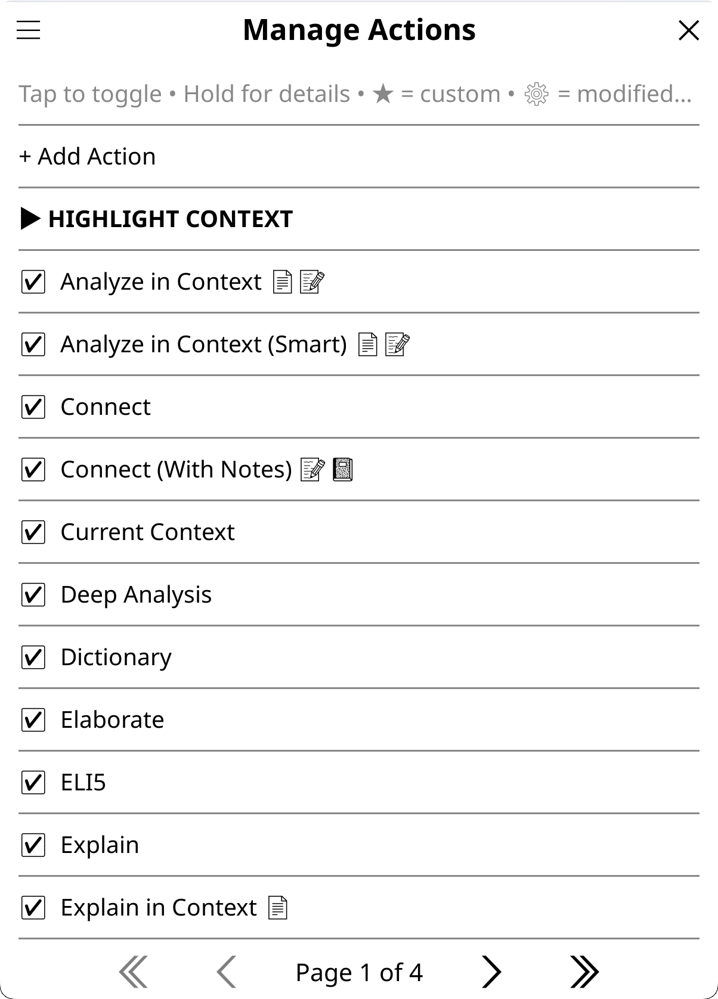</a>

**Settings → Actions & Prompts → Manage Actions**

- Toggle built-in and custom actions on/off
- Create new actions with the wizard
- Edit or delete your custom actions (marked with ★)
- Edit settings for built-in actions (temperature, thinking, provider/model, AI behavior)
- Duplicate/Copy existing Actions to use them as template (e.g. to make a slightly different variant)

**Action indicators:**
- **★** = Custom action (editable)
- **⚙** = Built-in action with modified settings
- **📄🔖📝📓📚📊🌐** = Data access indicators (when [Emoji Data Access Indicators](#display-settings) enabled): 📄 document text, 🔖 highlights only, 📝 annotations (includes highlights), 📓 notebook, 📚 library, 📊 advanced stats, 🌐 web search. These suffixes appear on action names in menus, showing at a glance what sensitive data each action accesses. Visible in action manager, highlight/dictionary menus, Quick Actions, and file browser buttons.
- **(🔍)** = Smart retrieval available (shown when the action has `smart_retrieval = true`, the session is tools-capable, and the Tools chip is on)

**Editing built-in actions:** Long-press any built-in action → "Edit Settings" to customize its advanced settings without creating a new action. Use "Reset to Default" to restore original settings.

**Input dialog actions:** each input dialog has its own action list and order (Book, Closed Book, Highlight, X-Ray Chat, Library, General). Open **Settings → Menus & Buttons → Input dialogs → Input Dialog Actions**, pick the context, then toggle and reorder its actions. The same chooser is reachable from the hamburger menu of every action-ordering manager.

### Tuning Built-in Actions

Don't like how a built-in action behaves? Clone and customize it:

**Common tweaks:**

1. **Action too verbose?**
   - **Example:** Elaborate gives you walls of text
   - **Fix:** Duplicate the action, edit the prompt to add "Keep response under 150 words"
   - **Why clone?** Preserves the original if you want to compare

2. **Want different model for specific action?**
   - **Example:** Quick Define lookups are slow with your main model
   - **Fix:** Edit the action → Settings → **Tier** → pick "Fastest" or a named tier, which keeps your provider and swaps in its faster model (Translate and Quick Define already ship with a fast tier hint). To force a specific model instead, set Provider and Model on the same screen
   - **Why:** Different actions benefit from different models:
     - **Fast/cheap models** for Dictionary, Quick Define, Translate (speed matters, task is simple)
     - **Standard models** for Explain, Summarize, ELI5 (balanced quality and cost)
     - **Reasoning models** for Deep Analysis, Key Arguments, academic tasks (complex thinking)
   - **Examples:** claude-haiku-4-5-20251001/gpt-5.4-nano/llama3.2:3b for lookups; claude-sonnet-5/gpt-5.4-mini/llama3.3 for general use; claude-opus-4-8/gpt-5.5/deepseek-v4-pro for analysis

3. **Want action without domain/language?**
   - **Example:** Translate action giving unexpected results due to your domain
   - **Fix:** Edit action → Settings → **Domain:** → **"None (no domain)"**
   - **Why:** Domain context can alter translation style/register

4. **Compare different approaches?**
   - Duplicate an action multiple times with different prompts
   - Name them "Explain (brief)", "Explain (detailed)", "Explain (ELI5)"
   - Test which works best for your reading style

**Quick workflow:**
1. Long-press any action in Manage Actions
2. Select "Duplicate" or "Edit Settings"
3. Modify prompt/settings/model
4. Test in [web inspector](#testing-your-setup)
5. Use on e-reader when satisfied

**Tip:** Disable built-in actions you don't use (tap to toggle) for cleaner action menus.

### Creating Actions

The action wizard walks through 3 steps:

1. **Name & Context**: Set the button text and choose where the action appears (highlight, book, library, general). For highlight-context actions, you can also tick **Highlight Menu** and/or **Dictionary Popup** here to place it for quick access.
2. **Action Prompt**: The instruction template, with an **Insert** button for adding placeholders (see [Template Variables](#template-variables)).
3. **Settings**: Everything else, laid out two-per-row:
   - *Provider* / *Model*: Force a specific provider/model for this action (or leave Global)
   - *Tier*: A speed hint instead of a hard pin — pick "Fastest" or a named tier (ultrafast / fast / standard) and the action runs on that tier of your current provider (falling back to the current model when the provider has no placement). Explicit Provider/Model pins always win over a tier
   - *Behavior*: Use a preset behavior, a custom one, "None", or the global default
   - *Domain*: Select a specific domain, skip domain, or use the global/per-book default
   - *Temperature* / *Reasoning*: Per-action overrides (see [Reasoning/Thinking](#reasoningthinking))
   - *Web*: Force web search Always / Never, or follow Global
   - *View* (highlight contexts only): How results display — Standard (full chat), Dictionary (full-size with dictionary buttons), Dictionary Compact (compact dialog with language buttons), or Translate (translation-focused UI). Actions registered for the [minimal popup](#minimal-popup) open there first when the answer fits (edit the registry in Settings → Minimal Popup)
   - *Skip language*: Don't send your language preferences (useful when the prompt already specifies a target language)
   - *Include book info*: Send title/author with highlight actions
   - Data-access checkboxes for text extraction, highlights/annotations, notebook, library, advanced stats, etc. (these are the per-action half of [double-gating](#text-extraction-and-double-gating))

### Template Variables

Insert these in your action prompt to reference dynamic values:

| Variable | Context | Description | Privacy Setting |
|----------|---------|-------------|-----------------|
| `{highlighted_text}` | Highlight | The selected text | — |
| `{title}` | Book, Highlight | Book title | — |
| `{author}` | Book, Highlight | Book author | — |
| `{author_clause}` | Book, Highlight | " by Author" or empty | — |
| `{count}` | Library | Number of selected books | — |
| `{books_list}` | Library | Formatted list of selected books (enriched with per-book highlights/annotations/notebook when action declares sidecar flags) | Allow Highlights/Annotation Notes/Notebook (when sidecar flags set) |
| `{library}` | Library, Book | Library catalog content (raw, no label) | Enable Library Scanning + folders |
| `{library_section}` | Library, Book | Library catalog with "My library:" label, or empty | Enable Library Scanning + folders |
| `{deep_reads}` | Library | Books read extensively (complete + significant reading time) | Allow Advanced Stats |
| `{deep_reads_section}` | Library | Same as above with "Books I read extensively:" label, or empty | Allow Advanced Stats |
| `{recently_finished}` | Library | Books recently finished (complete in last 30 days) | Allow Advanced Stats |
| `{recently_finished_section}` | Library | Same as above with "Books I recently finished:" label, or empty | Allow Advanced Stats |
| `{stalled}` | Library | Stalled reads (started but inactive 30+ days) | Allow Advanced Stats |
| `{stalled_section}` | Library | Same as above with "Books I started but haven't returned to:" label, or empty | Allow Advanced Stats |
| `{briefly_started}` | Library | Briefly started books (opened but barely read) | Allow Advanced Stats |
| `{briefly_started_section}` | Library | Same as above with "Books I opened briefly:" label, or empty | Allow Advanced Stats |
| `{previous_results}` | General | This action's own recent results (assistant replies from your last 3 saved general-context chats of this action), raw with no label | — (your own AI output; no privacy gate) |
| `{previous_results_section}` | General | Same as above, wrapped in a labeled "Previous results from earlier runs of this action…" block that includes an avoid-repeating hint, or empty | — (your own AI output; no privacy gate) |
| `{translation_language}` | Any | Target language from settings | — |
| `{dictionary_language}` | Any | Dictionary response language from settings | — |
| `{response_language}` | Any | The effective response language for this request, including a per-book override (defaults to "English") | — |
| `{context}` | Highlight | Surrounding text context (sentence/paragraph/characters) | — |
| `{context_section}` | Highlight | Context with "Word appears in this context:" label | — |
| `{reading_progress}` | Book (reading) | Current reading position (e.g., "42%") | Allow Basic Stats |
| `{progress_decimal}` | Book (reading) | Reading position as decimal (e.g., "0.42") | Allow Basic Stats |
| `{chapter_title}` | Book (reading) | Current chapter name | Allow Basic Stats |
| `{chapters_read}` | Book (reading) | Number of chapters read (e.g., "5 of 12") | Allow Basic Stats |
| `{page_number}` | Book (reading) | EPUB reference page label, e.g. "37" (the print-edition page from the book's page map; empty when the EPUB has none) | Allow Basic Stats |
| `{time_since_last_read}` | Book (reading) | Time since last reading session (e.g., "3 days ago") | Allow Basic Stats |
| `{highlights}` | Book, Highlight (reading) | All highlights from the document | Allow Highlights (or Allow Annotation Notes) |
| `{annotations}` | Book, Highlight (reading) | All highlights with user notes | Allow Annotation Notes |
| `{highlights_section}` | Book, Highlight (reading) | Highlights with "My highlights so far:" label | Allow Highlights (or Allow Annotation Notes) |
| `{annotations_section}` | Book, Highlight (reading) | Annotations with adaptive label: "My annotations:" when full data available, "My highlights so far:" when degraded to highlights-only | Allow Annotation Notes (degrades to Allow Highlights) |
| `{notebook}` | Book, Highlight (reading) | Content from the book's KOAssistant notebook | Allow Notebook |
| `{notebook_section}` | Book, Highlight (reading) | Notebook with "My notebook entries:" label | Allow Notebook |
| `{book_text}` | Book, Highlight (reading) | Extracted book text from start to current position | Allow Text Extraction |
| `{book_text_section}` | Book, Highlight (reading) | Same as above with "Book content so far:" label | Allow Text Extraction |
| `{full_document}` | Book, Highlight (reading) | Entire document text (start to end, regardless of position) | Allow Text Extraction |
| `{full_document_section}` | Book, Highlight (reading) | Same as above with "Full document:" label | Allow Text Extraction |
| `{surrounding_context}` | Highlight (reading) | Text surrounding the highlighted passage | — |
| `{surrounding_context_section}` | Highlight (reading) | Same as above, wrapped in a labeled block that marks the highlighted passage with >>> <<< and tells the AI to answer about the passage only | — |
| `{page_text}` | Book, Highlight (reading) | Text of the current visible page | — |
| `{page_text_section}` | Book, Highlight (reading) | Same as above with "Current page text:" label | — |
| `{xray_cache}` | Book (reading) | Cached X-Ray (if available) | Allow Text Extraction (+ Allow Highlights if cache used them) |
| `{xray_cache_section}` | Book (reading) | Same as above with progress label | Allow Text Extraction (+ Allow Highlights if cache used them) |
| `{analyze_cache}` | Book (reading) | Cached document analysis (if available) | Allow Text Extraction |
| `{analyze_cache_section}` | Book (reading) | Same as above with label | Allow Text Extraction |
| `{summary_cache}` | Book (reading) | Cached document summary (if available) | Allow Text Extraction |
| `{summary_cache_section}` | Book (reading) | Same as above with label | Allow Text Extraction |
| `{document_context_section}` | Book (reading) | Unified source block — resolves to full text, a cached summary, targeted passages (Smart retrieval), or nothing, based on the source you choose when an action has source selection enabled | Allow Text Extraction (for full text/summary) |

**Context notes:**
- **Book** = Available in both reading mode and file browser
- **Highlight** = Always reading mode (you can't highlight without an open book)
- **General** = Standalone chat, not tied to an open book
- **(reading)** = Reading mode only, requires an open book. Book actions using these placeholders are automatically hidden in file browser
- **Privacy Setting** = The setting that must be enabled in Settings → Privacy & Data for this variable to have content. If disabled, the variable returns empty (section placeholders disappear gracefully)

#### Section vs Raw Placeholders

"Section" placeholders automatically include a label and gracefully disappear when empty:
- `{book_text_section}` → "Book content so far:\n[content]" or "" if empty
- `{full_document_section}` → "Full document:\n[content]" or "" if empty
- `{context_section}` → "Word appears in this context: [text]" or "" if empty
- `{highlights_section}` → "My highlights so far:\n[content]" or "" if empty
- `{annotations_section}` → "My annotations:\n[content]" or "My highlights so far:\n[content]" if degraded (annotations off, highlights on), or "" if both off
- `{notebook_section}` → "My notebook entries:\n[content]" or "" if empty
- `{surrounding_context_section}` → "Surrounding context from the document (the highlighted passage is marked with >>> <<<)…\n[content]" or "" if empty
- `{page_text_section}` → "Current page text:\n[content]" or "" if empty
- `{xray_cache_section}` → "Previous X-Ray (as of X%):\n[content]" or "" if empty
- `{analyze_cache_section}` → "Document analysis:\n[content]" or "" if empty
- `{summary_cache_section}` → "Document summary:\n[content]" or "" if empty
- `{previous_results_section}` → "Previous results from earlier runs of this action…:\n[content]" or "" if empty
- `{library_section}` → "My library:\n[content]" or "" if empty
- `{deep_reads_section}` → "Books I read extensively:\n[content]" or "" if empty
- `{recently_finished_section}` → "Books I recently finished:\n[content]" or "" if empty
- `{stalled_section}` → "Books I started but haven't returned to:\n[content]" or "" if empty
- `{briefly_started_section}` → "Books I opened briefly:\n[content]" or "" if empty

"Raw" placeholders (`{book_text}`, `{full_document}`, `{highlights}`, `{annotations}`, `{notebook}`, `{surrounding_context}`, `{page_text}`, `{xray_cache}`, `{analyze_cache}`, `{summary_cache}`, `{previous_results}`, `{library}`, `{deep_reads}`, `{recently_finished}`, `{stalled}`, `{briefly_started}`) give you just the content with no label, useful when you want custom labeling in your prompt.

**Tip:** Use section placeholders in most cases. They prevent dangling references. If you write "Look at my highlights: {highlights}" in your prompt but highlights is empty, the AI sees confusing instructions about nonexistent content. Section placeholders include the label only when content exists.

> **Privacy note:** Section placeholders adapt to [privacy settings](#privacy--data). If a data type is disabled (or not yet enabled), the corresponding placeholder returns empty and section variants disappear gracefully. For example, `{highlights_section}` is empty unless you enable **Allow Highlights** (or **Allow Annotation Notes**, which implies highlights). You don't need to modify actions to match your privacy preferences; they adapt automatically.

> **Double-gating (for custom actions):** When creating custom actions from scratch, sensitive data requires BOTH a global privacy setting AND a per-action permission flag. This prevents accidental data leakage: if you enable "Allow Text Extraction" globally, your new custom actions still need "Allow text extraction" checked to actually use it. Built-in actions already have appropriate flags set, and copied actions inherit them. Document cache placeholders require the same permissions as their source: `{xray_cache}` needs text extraction, plus highlights only if the cache was built with highlights included; `{analyze_cache}` and `{summary_cache}` only need text extraction. See [Text Extraction and Double-gating](#text-extraction-and-double-gating) for the full reference table.

> **Note on `{previous_results_section}`:** This one is *not* privacy-gated because the content is the AI's own earlier output, returning to the provider. It lets a recurring general-context action (e.g. a custom "daily news roundup" cloned from an existing action) see its own last few results so it stops repeating items. It reads the assistant replies from your newest 3 saved general-context chats that ran this same action, so it **requires saved chats** — with **Auto-save All Chats** on (the default) this happens automatically. It is a general-context stopgap; book/library history is not covered.

#### Utility Placeholders

Utility placeholders provide reusable prompt fragments that can be inserted into any action. Currently available:

| Placeholder | Expands To | Behavior |
|-------------|------------|----------|
| `{conciseness_nudge}` | "Be direct and concise. Don't restate or over-elaborate." | Always present |
| `{hallucination_nudge}` | "If you don't recognize this or the content seems unclear, say so rather than guessing." (web-aware variant adds "search the web to verify" when web search is active) | Always present |
| `{text_fallback_nudge}` | "Note: No document text was provided. Use your knowledge of \"{title}\" to provide the best response you can. If you don't recognize this work, say so honestly rather than fabricating details." | **Conditional**: only appears when document text is empty; invisible when text is present |
| `{spoiler_free_nudge}` | "The reader is currently at {reading_progress} of this book. IMPORTANT: Do not reveal..." (with progress) or "The reader has not finished this book. Do not reveal plot twists, endings..." (without progress) | **Conditional**: only appears when spoiler protection is active; invisible otherwise |

**Why use these?**
- **`{conciseness_nudge}`**: Some AI models tend to produce verbose responses. This provides a standard instruction to reduce verbosity without sacrificing quality. Used in around 20 built-in actions including Explain, Summarize, ELI5, and the context-aware analysis actions.
- **`{hallucination_nudge}`**: Prevents AI from fabricating information when it doesn't recognize a book or author. When web search is active, the nudge encourages the AI to search the web to verify before falling back. Used in many built-in actions including About, Find Similar, Connect, Historical Context, and all library actions (Next Read, Discover New, Analyze Library, Suggest from Library, Recommend).
- **`{text_fallback_nudge}`**: Enables graceful degradation for actions that use document text extraction. When text extraction is disabled or yields no content, this nudge appears to guide the AI to use its training knowledge, and to say so honestly if it doesn't recognize the work. When document text IS present, the placeholder expands to nothing (zero overhead). Used in roughly ten built-in actions including Explain in Context, Analyze in Context, Thematic Connection, Recap, Key Arguments, Discussion Questions, Quiz, Extract Key Insights, Reading Guide, and Counterarguments. (Note: "Counterarguments" is a distinct book-level action from the highlight action "Counterpoint," which does not use this nudge.) X-Ray, Document Analysis, and Document Summary block generation without text extraction rather than degrading gracefully. For actions with source selection, the fallback nudge activates when "AI knowledge only" is chosen.
- **`{spoiler_free_nudge}`**: Adds a spoiler prevention instruction when [spoiler protection](#spoiler-protection) is active. When reading progress is available, the nudge tells the AI the reader's exact position and forbids revealing anything beyond it, including anything found in web-search results. When progress is unavailable (e.g., file browser with no saved progress), a generic "has not finished" variant is used; when protection is off, the placeholder expands to nothing. A few built-ins carry it inline (AI Wiki, Reviews, About); for every other covered request the line is added automatically at send time and re-checked on each reply, so you only need this placeholder in custom actions that want to control where the instruction sits in the prompt.

**For custom actions:** Add these placeholders at the end of your prompts where appropriate. The placeholders are replaced with the actual text at runtime, so you can also use the raw text directly if you prefer. `{text_fallback_nudge}` is especially useful in custom actions that use `{full_document_section}` or `{book_text_section}`. It ensures your action produces useful results even when text extraction is disabled.

### Tips for Custom Actions

- **Skip domain** for linguistic tasks: Translation, grammar checking, dictionary lookups work better without domain context influencing the output. Set the wizard's **Domain:** row to **"None (no domain)"** for these, unless you are translating something that would benefit from the context added by a domain.
- **Skip language instruction** when the prompt already specifies a target language (using `{translation_language}` or `{dictionary_language}` placeholders), to avoid conflicting instructions.
- **Put task-specific instructions in the action prompt**, not in behavior. Behavior applies globally; action prompts are specific. Use a standard behavior and detailed action prompts for most custom actions.
- **Temperature matters**: Lower (0.3-0.5) for deterministic tasks (translation, definitions). Higher (0.7-0.9) for creative tasks (elaboration, recommendations).
- **Experiment with domains**: Try running the same action with and without a domain to see what works for your use case. Some actions benefit from domain context (analysis, explanation), others don't (translation, grammar).
- **Test before deploying**: Use the [web inspector](#testing-your-setup) to test your custom actions before using them on your e-reader. You can try different settings combinations and see exactly what's sent to the AI.
- **Reading-mode placeholders**: what hides in File Browser mode is decided by an action's *flags*, not by its placeholders. An action hides when it sets `use_book_text`, `use_page_text`, `use_reading_stats` or `source_selection` — the things that need a live document. `{highlights}`, `{annotations}` and `{notebook}` map to sidecar flags and are read from the book's saved data on disk, so those actions stay available from the file browser on purpose; `{reading_progress}` has a sidecar fallback too. Text extraction is never inferred from a placeholder: if your action uses `{book_text_section}` or `{full_document_section}`, tick **Allow text extraction** in the wizard yourself, or the flag will not be set. The Action Manager shows a `[reading]` marker on the actions that need an open book. Highlight actions are always reading-mode (you can't highlight without an open book).
- **Document caches**: Three cache types are available as placeholders: `{summary_cache_section}`, `{xray_cache_section}`, and `{analyze_cache_section}`. All require `use_book_text = true` since the cached content derives from book text. The **summary cache** is the primary one for custom actions: it's a neutral, comprehensive representation of the document designed to be reused. The **X-Ray cache** can also be useful as supplementary context (structured character/concept reference). The **analyze cache** is more specialized: it's an opinionated analysis, so avoid using it as input for another analysis (you'd be analyzing an analysis, a decaying game of telephone where each layer loses nuance). Cache placeholders disappear when empty, so including them is always safe. Two usage patterns:
  - **Replace**: Use `{summary_cache_section}` INSTEAD of raw book text for token savings on long books. Add `source_selection = true` and `use_summary_cache = true` to let users choose between full text, summary, or AI knowledge at runtime. Or use `{document_context_section}` as a unified placeholder that resolves based on the user's source choice.
  - **Supplement**: Add a cache reference as bonus context alongside other data. For example, append `{xray_cache_section}` to a custom action so the AI has the character/concept reference available if it exists. The placeholder vanishes if no cache exists, so there's no downside.

  > *Tip: The [Attach chip](#managing-the-input-dialog) in the input dialog also lets you attach a notebook, a saved artifact, a chat, a file, or a note to a chat on the fly, so you can pull one book's cached artifact into a chat about another (e.g., comparing an X-Ray across volumes in a series).*
- **Surrounding context**: Use `{surrounding_context_section}` in highlight actions to include text around the highlighted passage. This is live extraction (not cached), hard-capped at 2000 characters. Particularly useful for **custom dictionary-like actions** that need sentence context for single-word lookups; note that the built-in `quick_define`, `dictionary` and `deep` actions do **not** use this placeholder: they set `use_surrounding_context = false` and take their passage from the separate dictionary channel (`{context_section}`), driven by Settings → Dictionary Settings. Copy them only if you want that channel. Uses **Settings → Highlight Settings → Surrounding Context** for the mode (sentence, paragraph, or character count), plus its direction and amount — overridable per book in Book Settings and per chat with the Ctx chip. (Dictionary lookups use their own context setting under Dictionary Settings.)

### File-Based Actions

For more control, create `custom_actions.lua`:

```lua
return {
    {
        text = "Grammar Check",
        context = "highlight",
        behavior_override = "You are a grammar expert. Be precise and analytical.",
        prompt = "Check grammar: {highlighted_text}"
    },
    {
        text = "Discussion Questions",
        context = "book",
        prompt = "Generate 5 discussion questions for '{title}'{author_clause}."
    },
    {
        text = "Series Order",
        context = "library",
        prompt = "What's the reading order for these books?\n\n{books_list}"
    },
}
```

**Optional fields**:
- `behavior_variant`: Use a preset behavior by ID (e.g., "standard", "mini", "full", "gpt_style_standard", "perplexity_style_full", "reader_assistant", "none")
- `behavior_override`: Custom behavior text (overrides variant)
- `provider`: Force specific provider ("anthropic", "openai", etc.)
- `model`: Force specific model for the provider
- `model_tier`: Speed hint ("fastest", or a tier name like "fast"). Uses a faster model of the same provider for this action; explicit provider/model pins win. Set `"none"` to clear the hint on a built-in. The whole mechanism can be turned off with Settings → Advanced → "Faster Models for Quick Actions"
- `temperature`: Override global temperature (0.0-2.0)
- `reasoning_config`: Per-provider reasoning settings (see below)
- `extended_thinking`: Legacy: "off" to disable, "on" to enable (Anthropic only)
- `thinking_budget`: Legacy: Token budget when extended_thinking="on" (1024-32000)
- `enabled`: **ignored in file-based actions.** The loader overwrites it from the Action Manager's own enable/disable state on every load, so a value written here has no effect. Disable the action in Manage Actions instead.
- `requires`: Array of requirement types that block execution if unmet: `{"book_text"}`, `{"highlights"}`, `{"library"}`. Shows user-facing error identifying which gate (per-action or global) is the problem, with optional `blocked_hint` suggestion.
- `description`: Text shown when the action is long-pressed in the managers and menus
- `use_response_caching`: Store the result as a per-action artifact, with the View / Update / Redo popup
- `update_prompt`: The prompt used when an artifact is updated incrementally rather than regenerated
- `api_params`: Raw parameters merged into the request — the only route to `max_tokens`
- `include_book_context`: Send the book identity block with this action
- `compact_view` / `dictionary_view` / `translate_view` / `minimal_buttons`: View mode for the response window
- `blocked_hint`: Suggestion text shown when action is blocked (e.g., `_("Or use X-Ray (Simple) for an overview based on AI knowledge.")`)
- `use_book_text`: Allow text extraction for this action (acts as permission gate; also requires global "Allow Text Extraction" setting enabled). The actual extraction is triggered by placeholders in the prompt: `{book_text_section}` extracts to current position, `{full_document_section}` extracts entire document. Also gates access to analysis cache placeholders.
- `use_highlights`: Include document highlights (text only, no notes). Requires Allow Highlights or Allow Annotation Notes.
- `use_annotations`: Include document annotations (highlights with user notes). Requires Allow Annotation Notes.
- `use_reading_progress`: Include reading position and chapter info (requires Allow Basic Stats)
- `use_reading_stats`: Include chapter info placeholders (`{chapter_title}`, `{chapters_read}`). Requires Allow Basic Stats. Auto-inferred from placeholders.
- `use_advanced_stats`: Include reading engagement groups (`{deep_reads}`, `{stalled}`, `{recently_finished}`, `{briefly_started}` and their section variants) and per-book engagement labels in library output. Double-gated: requires both Allow Advanced Stats (global) and this per-action flag. Used by library scan actions (Next Read, Discover New, Analyze Library).
- `use_notebook`: Include content from the book's KOAssistant notebook
- `use_surrounding_context`: Include surrounding text for highlight actions (auto-inferred from `{surrounding_context}` placeholder)
- `use_page_text`: Include the text of the current visible page (`{page_text_section}`). Single page, so no text-extraction gate; auto-inferred from the placeholder.
- `use_library`: Include the library catalog (`{library_section}`). Requires Enable Library Scanning plus configured scan folders (triple-gated).
- `use_summary_cache` / `use_xray_cache` / `use_analyze_cache`: Allow the matching document-cache placeholder to resolve (double-gated; see [Document caches](#tips-for-custom-actions) above).
- `cache_as_xray`: Save this action's result to the X-Ray cache (for other actions to reference)
- `cache_as_analyze`: Save this action's result to the document analysis cache
- `cache_as_summary`: Save this action's result to the document summary cache
- `source_selection`: Show a scope/source popup so the reader picks what feeds `{document_context_section}` at runtime: full text, a cached summary, AI knowledge, plus scope rows ("Up to current position (NN%)", "From section…", "Pick section range…"; highlight actions get them too). With spoiler protection on, the popup pre-selects "Up to current position" and asks before running a scope that reaches past your position.
- `smart_retrieval`: Has the AI look up only the passages it needs instead of sending the whole document. On **highlight** actions this appears as a "Smart retrieval" row in the source popup — shown greyed with the reason when the session is not tools-capable, and pre-selected when it is. On book or library actions there is no row: the flag makes the action gather passages silently. Used by context-aware actions like Explain in Context and Analyze in Context. See [AI Book Tools](#ai-book-tools-experimental).
- `accept_quick_answer`: Opt this action into the [Quick Answer](#managing-the-input-dialog) posture (brevity nudge, reasoning/web/tools off, plus whatever else the preset includes). Launched from the input dialog it follows the Quick chip; launched directly (highlight menu, dictionary popup, gesture, Quick Actions) it follows your per-book/global Quick Answer default. Never applies to artifact/JSON actions.
- `skip_language_instruction`: Don't include language instruction in system message (default: off; Translate/Dictionary use true since target language is in the prompt)
- `skip_domain`: Don't include domain context in system message (default: off; Translate/Dictionary use true)
- `skip_background`: Whether this action sends the per-book Background note (your standing note about the book). Leave unset to follow `skip_domain`, `true` to never send it, `false` to always send it
- `domain`: Force a specific domain by ID (overrides per-book and global domain selection). Settable via the file (`custom_actions.lua`) or through the wizard/Edit Settings screen's Domain picker (Settings → Actions & Prompts → Manage Actions).
- `enable_web_search`: Override global web search setting (true=force on, false=force off, nil=follow global)

**Per-provider reasoning config.** This is the top reasoning layer — it wins over your global stance and any per-model override (see [Reasoning/Thinking](#reasoningthinking)).
```lua
reasoning_config = {
    anthropic = { effort = "high" },    -- low/medium/high (+ xhigh/max on Opus and Sonnet 5)
    openai = { effort = "medium" },     -- low/medium/high/xhigh
    gemini = { level = "high" },        -- minimal/low/medium/high (Gemini 3)
    deepseek = "off",                   -- binary providers: "on" / "off"
}
-- reasoning_config = "off"                -- force off for all providers
-- reasoning_config = { default = "off" }  -- default for providers not listed above
```
Built-in actions like Translate, Quick Define, Dictionary, and Summarize use `reasoning_config = "off"`.

See `custom_actions.lua.sample` for more examples.

### Highlight Menu Actions

Add frequently-used highlight actions directly to KOReader's highlight popup for faster access.

**Default actions** (included automatically on fresh installs):
1. **Translate**: Instant translation of selected text
2. **Look up in X-Ray**: Local search of cached X-Ray data (only appears when cache exists)
3. **Explain**: Get an explanation of the passage
4. **Quick Explain**: A two-or-three-sentence explanation, usually landing in the minimal popup
5. **Summarize**: Condense the passage to its essential points
6. **Quick Define**: Short definition of the selected word
7. **Dictionary**: Fuller dictionary-style entry
8. **Generate Image**: Illustrate the passage (only appears when an image-capable provider is configured)

Propagation runs one way. A built-in that gains a default placement **is** injected into an existing install's menu at its default position on the next read, unless that install had previously removed it (removals are remembered). A built-in that *loses* its default placement stays where it is; only ids that no longer resolve at all are pruned.

**Other built-in actions you can add**: ELI5, Elaborate, Connect, Connect (With Notes), Fact Check, AI Wiki, Grammar, Counterpoint, Explain in Context, Analyze in Context, Thematic Connection, Current Context, Deep Analysis

**Adding more actions**:
1. Go to **Manage Actions**
2. Hold any highlight-context action
3. Tap **"+ Highlight Menu"**
4. A notification confirms it; the change takes effect the next time the highlight menu opens (no restart needed)

Actions appear as "Explain (KOA)", "Translate (KOA)", etc. in the highlight popup. Long-press any action to see its description.

**Managing actions**:
- Use **Settings → Menus & Buttons → Highlight Menu Actions** to see every highlight action; a ✓ marks the ones currently in the menu (up to 15 shown)
- Tap an action to add it to the menu or remove it; hold it to move it up or down
- Default actions can be removed (they won't auto-reappear)
- Freeform chat is always available via the Send button in the input dialog

**Note**: Changes take effect the next time the highlight menu opens.

> **Prefer a cleaner menu?** You can disable KOAssistant's highlight menu integration entirely via **Settings → Menus & Buttons**. "Show Chat/Action button" (the main button) and "Show quick actions" (shortcuts like Translate, Explain) have separate toggles. There is also "Show Add to Notebook button" (off by default; turn it on to save selected text straight to the book's notebook). Generate Image is an ordinary action now, so add or remove it in Highlight Menu Actions.

---

## Dictionary Integration

With help from contributions to [assistant.koplugin](https://github.com/omer-faruq/assistant.koplugin) by [plateaukao](https://github.com/plateaukao) and others

KOAssistant integrates with KOReader's dictionary system, providing AI-powered word lookups when you select words in a document.

> **Tip:** For best results, duplicate a built-in dictionary action and customize it for your language pair. Set a light model (e.g. Haiku) for speed, and make it your bypass action for one-tap lookups.

> **Don't need dictionary integration?** Disable it entirely via **Settings → Menus & Buttons → Dictionary popup → Show AI buttons**.

> **Want Translate and Copy for text in dictionary results?** Enable **Settings → Menus & Buttons → Text selection in viewers → Enhance text selection** to add action popups (Copy, Dictionary, Translate) when selecting multiple words or long-pressing a single word in KOReader's dictionary, Wikipedia, and other viewers. See [Extend to KOReader Viewers](#extend-to-koreader-viewers).

### How Dictionary Integration Works

When you select a word in a document, KOReader normally shows its dictionary popup. With KOAssistant's dictionary integration, you can:

1. **Add AI actions to the dictionary popup**: Tap "Dictionary (KOA)" or another Action button from KOReader's Dictionary popup
2. **Bypass the dictionary entirely**: Skip KOReader's dictionary and go directly to your selected KOAssistant Dictionary Action for word lookups

**X-Ray entries come first.** If the book has an X-Ray and the word you look up (or the text you select) exactly matches an entity's name or alias, KOAssistant opens that entry instead of the dictionary or the highlight menu — including over any bypass action you set. Anything that does not match falls through to your normal behavior, and a very long press always brings back the plain menus. Exact hits open a compact [entity card](#reading-analysis-actions) first (footnote panel by default, or a floating popup next to the word), with the full entry one tap away; turn the card off to jump straight to the entry. All of it is on by default and configurable globally (Settings → Reading & Library → X-Ray) or per book (Book Settings → X-Ray, or the X-Ray popup's "Marking & lookup…").

**Default dictionary popup actions** (4 AI actions included, plus one conditional local lookup):
1. **Dictionary**: Full entry: definition, etymology, synonyms, usage
2. **Quick Define**: Minimal: brief definition only
3. **Deep Analysis**: Linguistic deep-dive: morphology, word family, cognates
4. **AI Wiki**: Wikipedia-style encyclopedia entry about the word
5. **Look up in X-Ray** (conditional): Appears only when the current book has an X-Ray cache. This is a local lookup (no AI call, works offline) that shows the word's X-Ray entry if it exists.

You can add or substitute other highlight actions to this menu via **Manage Actions → hold action → + Dict. Popup** or manage the actions centrally from **Settings → Menus & Buttons → Dictionary popup → Dictionary Popup Actions**.

### Dictionary Settings

**Settings → Dictionary Settings**

| Setting | Description | Default |
|---------|-------------|---------|
| **Response Language** | Language for definitions. Can follow Translation Language (`↵T`) or be set independently | `↵T` |
| **Context Mode** | Surrounding text sent with lookup: None, Sentence, Paragraph, or Characters. Overridable per book (Book Settings → Chat behavior); while spoiler protection is on, the text after the word is clamped by "Context Under Spoiler Protection" | Sentence (use the popup's **Ctx** button to drop it for a single lookup) |
| **Context Characters** | Character count when using "Characters" mode | 100 |
| **Disable Auto-save for Dictionary** | Don't auto-save dictionary lookups to chat history | On |
| **Copy Content** | What to include when copying in dictionary view (follow global / ask / full / question + response / definition only / everything) | Definition only |
| **Note Content** | What to include when saving a dictionary result to a note (same options as Copy Content) | Definition only |
| **Enable Streaming** | Stream responses in real-time (shows text as it generates) | On |
| **Bypass KOReader Dictionary** | Skip native dictionary, go directly to your selected bypass Action | Off |
| **Bypass Action** | Which action triggers on bypass | Quick Define |
| **Bypass: Follow Vocab Builder Auto-add** | Respect KOReader's Vocabulary Builder auto-add setting during bypass | On |

> **Note:** The dictionary popup visibility toggle (**Show AI buttons**) and the **Dictionary Popup Actions** manager now live under **Settings → Menus & Buttons → Dictionary popup**, alongside the other menu/button placement toggles. The settings above control dictionary *behavior*.

> **Tip:** Test different dictionary actions and context modes in the [web inspector](#testing-your-setup) to find what works best for your reading. Consider creating custom dictionary actions for your specific language pair.

### Dictionary Popup Actions (4 included by default)

When "Show AI buttons" is enabled (**Settings → Menus & Buttons → Dictionary popup**), KOAssistant Dictionary Actions are added to KOReader's dictionary popup. Four built-in AI actions are included by default:

| Action | Purpose | Includes |
|--------|---------|----------|
| **Dictionary** | Standard dictionary entry | Definition, pronunciation, etymology, synonyms, usage examples |
| **Quick Define** | Fast, minimal lookup | Brief definition only, no etymology, no synonyms |
| **Deep Analysis** | Linguistic deep-dive | Morphology (roots, affixes), word family, etymology path, cognates |
| **AI Wiki** | Encyclopedia entry | Wikipedia-style overview: definition, history, key facts, significance |

A fifth entry, **Look up in X-Ray**, appears conditionally when the current book has an X-Ray cache. It is a local, offline lookup (no AI call) that opens the tapped word's X-Ray entry when one exists.

Quick Define is the default action if you turn on Bypass mode (chosen for speed); the full Dictionary action can be picked instead. You can set any action as the **Bypass Action** for instant one-tap lookups.

**Configure this menu:**
1. **Settings → Menus & Buttons → Dictionary popup → Dictionary Popup Actions**
2. Enable/disable actions, reorder them, or add custom actions
3. This manager only toggles and reorders. To point the bypass at a custom lightweight action, use **Settings → Dictionary Settings → Bypass Action** (Quick Define by default)

### Context Mode: When to Use It

Context mode sends surrounding text (sentence/paragraph/characters) with your lookup. The compact view has a **Ctx** button to toggle context on-demand (it re-runs the request with/without the surrounding sentence as context).

**Context OFF**
- Natural, complete dictionary response
- Multiple definitions and homographs included (e.g., "round" as noun, verb, adjective)
- Faster response (less text to process)
- Doesn't know which meaning is intended in your reading

**Context ON (default)**
- Precise, disambiguated definition for THIS usage
- Explains word's role in THIS specific sentence
- May miss other meanings/senses of the word (context disambiguates, so homographs aren't shown)
- Slightly slower (more text to process)

**Best practice:** Context is ON by default, which is what you want while reading. Turn it OFF (via the **Ctx** button) when you want the word's full range of meanings rather than the one the sentence forces.

### Dictionary Language Indicators

The dictionary language setting shows return symbols when following other settings:
- `↵` = Following Primary Language
- `↵T` = Following Translation Language

See [How Language Settings Work Together](#how-language-settings-work-together) for details.

### RTL Language Support

Dictionary, translate, general chat, and artifact viewers have special handling for right-to-left (RTL) languages:

- **Automatic RTL mode**: When your dictionary or translation language is set to an RTL language, results automatically use Plain Text mode for proper font rendering. For general chat and artifact viewers (X-Ray, X-Ray (Simple), Analyze, Summary), the content is checked: if RTL characters outnumber Latin, it switches to RTL mode (right-aligned text + Plain Text). This can be configured via **Settings → Display Settings → Rendering → Text Mode for RTL Dictionary**, **Text Mode for RTL Translate**, and **Auto RTL mode for Chat**.
- **BiDi text alignment**: Entries with RTL content display with correct bidirectional text alignment. Mixed RTL/LTR content (e.g., Arabic headwords with English pronunciation guides) renders in the correct reading order.
- **IPA transcription handling**: Phonetic transcriptions are anchored to display correctly alongside RTL headwords.

> **Note:** For best RTL rendering, Plain Text mode is recommended. The automatic RTL settings handle this for dictionary, translate, general chat, and artifact viewers, while preserving your global Markdown/Plain Text preference when content is not predominantly RTL.

### Custom Dictionary Actions

The built-in dictionary actions use unified prompts that work across many scenarios:
- **Monolingual lookups** (e.g., English word → English definitions)
- **Bilingual lookups** (e.g., French word → English definitions and translations)
- **Context-aware disambiguation** (toggle Ctx ON in compact view)

For the best results, **create custom dictionary actions tailored to your specific use case**:

1. **Settings → Actions & Prompts → Manage Actions**
2. **Hold** "Dictionary" or "Quick Define" and tap **Duplicate** (tapping the row only enables or disables the action)
3. Edit the duplicate with prompts specific to your language pair or learning style
4. **Settings → Menus & Buttons → Dictionary popup → Dictionary Popup Actions**: add your custom action
5. Set it as the **Bypass Action** for one-tap access
6. Consider changing the bypass action to "Quick Define" for faster responses, or to your custom action

**Examples:**
- **"EN→AR Dictionary"**: Explicit Arabic translation with English metalanguage
- **"Monolingual French"**: Definitions only in French, no translations
- **"Etymology Focus"**: Start from Deep Analysis, remove morphology sections
- **"Quick Vocab"**: Minimal definition + example sentence for flashcard creation

**Tips:**
- Use a **lighter model** (e.g., Haiku) for dictionary actions via per-action model override
- **Context ON** (default) disambiguates for the specific usage; **Context OFF** gives complete entries with all senses
- For RTL languages, the compact view automatically uses Plain Text mode

### Dictionary Bypass

When bypass is enabled, selecting a word skips KOReader's dictionary popup entirely and immediately triggers your chosen AI action.

**To enable:**
1. Settings → Dictionary Settings → Bypass KOReader Dictionary → ON
2. Settings → Dictionary Settings → Bypass Action → choose action (default: Quick Define)

**Recommended setup:** Quick Define is the default bypass action because it is fast. Switch to the full "Dictionary" action when you want etymology and synonyms, or point the bypass at a custom lightweight action of your own. Use the full "Dictionary" action when you need etymology and synonyms.

> **Tip:** You can also set the bypass action to **Look up in X-Ray**. In that mode, a tapped word that has an X-Ray entry opens it directly, and any other word falls through to KOReader's normal dictionary.

**Toggle via gesture:** Assign "KOAssistant: Toggle Dictionary Bypass" to a gesture for quick on/off switching. These settings are also available in the recommended Quick Settings panel.

**Note:** Short bypass answers land in the [minimal popup](#minimal-popup) next to the word (Quick Define is a registered minimal-popup action); longer answers, and lookups started from KOReader's own dictionary window, open the compact dictionary view. Deep Analysis uses the full-size dictionary view.

### Dictionary View Modes

Dictionary actions support three view modes, configurable per-action via Action Manager:

**Dictionary Compact** (default for Dictionary, Quick Define): Small 60% height popup optimized for quick lookups. Tap **Expand** to open in the full-size Dictionary view.

**Dictionary** (default for Deep Analysis): Full-size window with the same dictionary-specific buttons. Provides more room for detailed content like morphology and etymology. Has a **→ Chat** button to expand to the standard chat viewer.

**Standard**: Full chat viewer with all buttons (reply, save, tag, pin, export, etc.). No dictionary-specific buttons.

The expansion chain: **Compact → Expand → Dictionary → → Chat → Standard**

Both dictionary view modes share the same button layout:
- **Row 1:** MD ON/TXT ON, Copy, +Note, Wiki, +Vocab
- **Row 2:** Expand or → Chat, Language, Ctx, [Action], Close

**MD ON / TXT ON**: Toggle between Markdown and Plain Text view modes. Shows "MD ON" when Markdown is active, "TXT ON" when Plain Text is active. For RTL languages, this may default to TXT ON automatically based on your settings.

**Copy**: Copies the AI response only (plain text). Unlike the full chat view, dictionary views always copy just the response without metadata or asking for format.

**+Note**: Save the AI response as a note attached to your highlighted word in KOReader's annotation system. The button is greyed out if word position data isn't available (e.g., when launched from certain contexts).

**Wiki**: Look up the word in Wikipedia using KOReader's built-in Wikipedia integration.

**+Vocab**: Add the looked-up word to KOReader's Vocabulary Builder. After adding, the button changes to "Added" (greyed out). See [Vocabulary Builder Integration](#vocabulary-builder-integration).

**Expand** (compact only): Open the response in the full-size dictionary view with the same buttons but more room.

**→ Chat** (dictionary view only): Open in the full standard chat viewer with all options (continue conversation, save, export, etc.).

**Language**: Re-run the lookup in a different language (picks from your configured languages). Closes the current view and opens a new one with the updated result.

**Ctx: ON/OFF**: Toggle surrounding text context. If your lookup was done without context (mode set to "None"), you can turn it on to get a context-aware definition (Sentence by default). If context was included, you can turn it off for a plain definition. Re-runs the lookup with the toggled setting. This setting is not sticky, so context will revert to your main setting on closing the window.

**[Action]**: Shows the name of the current dictionary action. Tap to switch to a different dictionary popup action. If only one other action is available, switches directly; otherwise shows a picker with all available dictionary actions.

**Close**: Close the view.

**RTL-aware rendering**: When viewing dictionary results for RTL languages, both dictionary view modes automatically use Plain Text mode (if enabled in settings) and apply correct bidirectional text alignment for proper display of RTL content.

### Translate View

All translation actions (Highlight Bypass with Translate, Translate Page, highlight menu Translate) use a specialized **Translate View**, a minimal UI focused on translations.

**Button layout:**
- **Row 1:** MD ON/TXT ON (toggle markdown), Copy, Save to Note (when highlighting)
- **Row 2:** → Chat (expand to full chat), Show/Hide Original, Language, Close

**Key features:**
- **Language button** re-runs translation with a different target language (picks from your configured languages)
- **Save to Note button** saves translation directly to a highlight note (closes translate view after save)
- **Auto-save disabled** by default (translations are ephemeral like dictionary lookups)
- **Copy/Note Content** options: choose what to include: full, question + response, or translation only
- **Configurable original text visibility**: follow global setting, always hide, hide long text, or never hide
- **→ Chat button** expands to full chat view with all options (continue conversation, save, etc.)

**Configure:** Settings → Translate Settings

### Vocabulary Builder Integration

When using dictionary lookups in compact view, KOAssistant integrates with KOReader's Vocabulary Builder:

- **Auto-add enabled** (Vocabulary Builder ON in KOReader settings): Words are automatically added to vocab builder when looked up via dictionary bypass. A greyed "Added" button confirms the word was added.
- **Auto-add disabled** (Vocabulary Builder OFF): A "+Vocab" button appears to manually add the looked-up word to the vocabulary builder.

The vocab button appears in compact/minimal buttons view (dictionary bypass and popup actions).

**Bypass: Follow Vocab Builder Auto-add** (Settings → Dictionary Settings): Controls whether dictionary bypass respects KOReader's Vocabulary Builder auto-add setting. Disable this if you use bypass for analyzing words you already know and don't want them added to the vocabulary builder.

### Chat Saving

Dictionary lookups are **not auto-saved** by default (`Disable Auto-save` is on). This prevents cluttering your chat history with individual word lookups.

- **Auto-save disabled** (default): Lookups are not saved automatically. If you expand a compact view chat, the Save button becomes active so you can save manually to the current document.
- **Auto-save enabled** (toggle off): Dictionary chats follow your general chat saving settings (auto-save all or auto-save continued).

---

## Bypass Modes

Bypass modes let you skip menus and immediately trigger AI actions.

**Dictionary bypass** is documented with the rest of the dictionary features: see [Dictionary Bypass](#dictionary-bypass). In short, selecting a word skips KOReader's dictionary popup and runs your chosen AI action instead.

### Highlight Bypass

Skip the highlight menu when selecting text. Useful when you always want the same action (e.g., translate).

**How it works:**
1. Select text by long-pressing and dragging
2. Instead of highlight menu → AI action triggers immediately
3. Response appears in the action's view: short translations land in the [minimal popup](#minimal-popup) next to your selection, longer ones open Translate View, and most other actions use the full standard chat viewer

**Configure:** Settings → Highlight Settings → Enable Highlight Bypass

### Bypass Action Selection

Both bypass modes let you choose which action triggers:

| Bypass Mode | Default Action | Where to Configure |
|-------------|----------------|-------------------|
| Dictionary | Quick Define | Settings → Dictionary Settings → Bypass Action |
| Highlight | Translate | Settings → Highlight Settings → Bypass Action |

You can select any highlight-context action (built-in or custom) as your bypass action. **Recommended:** Set dictionary bypass to "Quick Define" or a custom lightweight action for faster responses.

### Gesture Toggles

Quick toggle bypass modes without entering settings:

- **KOAssistant: Toggle Dictionary Bypass** - Assign to gesture
- **KOAssistant: Toggle Highlight Bypass** - Assign to gesture

Toggling shows a brief notification confirming the new state.

### Custom Action Gestures

You can add any **book** or **general** action to KOReader's gesture menu:

1. Go to **Settings → Actions & Prompts → Manage Actions**
2. Hold any book or general action to see details
3. Tap **"+ Gesture Menu"**
4. **Restart KOReader** for changes to take effect
5. Bind it in **Settings → Menus & Buttons → Gestures → Shortcuts**, which lists every KOAssistant action with its current gesture and applies changes immediately. (KOReader's own gesture screen works too: gear → Taps and gestures → Gesture manager.)

Actions with gestures show a `[gesture]` indicator in the Action Manager list.

**Where gestures appear:**
- **Book actions** → Reader gestures only (requires open book; grayed out in File Browser)
- **General actions** → Available in both contexts (can add to Reader and/or File Browser gestures)

**Why only book and general?** Highlight actions require selected text and cannot be triggered via gestures.

**Note:** Changes require restart because KOReader's gesture system loads available actions at startup. To disable all custom action gestures at once, use **Settings → Menus & Buttons → Gestures → Register gesture actions**. Built-in utility gestures (Quick Settings, Chat History, etc.) are not affected by this toggle.

### Available Gesture Actions

**Reader Only** (require open book; grayed out in File Browser gesture settings):
- KOAssistant: Quick Actions: Reading actions panel
- KOAssistant: Book Chat/Action: Start a chat about current book or access book actions
- KOAssistant: Book Hub: The per-book page with all artifacts, chats, notebook, group, and book settings
- KOAssistant: Translate Page: Translate visible page text

**General** (available in both File Browser and Reader gesture settings):
- KOAssistant: Chat History: Browse all saved chats
- KOAssistant: Continue Last Saved Chat: Resume most recently saved chat
- KOAssistant: Continue Last Chat: Resume most recently viewed chat
- KOAssistant: Settings: Open main settings menu
- KOAssistant: General Chat/Action: Start a new general conversation or run a general action
- KOAssistant: Quick Settings: Two-column settings panel
- KOAssistant: Library Chat/Action: Pick books from reading history for library actions
- KOAssistant: Toggle Dictionary Bypass: Toggle dictionary bypass on/off
- KOAssistant: Toggle Highlight Bypass: Toggle highlight bypass on/off

**Custom Actions:**
- Any book or general action can be added via **+ Gesture Menu** in Action Manager
- Book actions → Reader Only; General actions → Available in both contexts
- Includes artifact actions (X-Ray, Recap, Document Summary, etc.), utility actions, and your own custom actions

#### Translate Page

A special gesture action to translate all visible text on the current page:

**Gesture:** KOAssistant: Translate Page

This extracts all text from the visible page/screen and sends it to the Translate action. Uses [Translate View](#translate-view) for a focused translation experience.

**Works with:** PDF, EPUB, DjVu, and other supported document formats.

> 📖 **Quick Reference: Bypass Mode Use Cases**
>
> - **Dictionary Bypass** → Language learners wanting instant definitions
> - **Highlight Bypass** → Quick translations or instant explanations
> - **Translate Page** → Academic reading, foreign language texts
>
> All bypass modes can be toggled via gestures for quick on/off switching.

---

## Behaviors

Behavior defines the AI's personality, communication style, and response guidelines. It is sent **first** in the system message, before domain context and language instruction. See [How the AI Prompt Works](#how-the-ai-prompt-works) for the full picture.

### What Behavior Controls

- Response tone (conversational, academic, concise)
- Formatting preferences (when to use lists, headers, etc.)
- Communication style (brief vs detailed explanations)

### Built-in Behaviors

23 built-in behaviors are available, organized by provider style. Each style comes in three sizes (Mini ~160-220 tokens, Standard ~400-500 tokens, Full ~1150-1325 tokens):

**Provider-inspired styles (all provider-agnostic, use any style with any provider):**
- **Claude Style** (Mini, Standard, Full): Based on [Anthropic Claude guidelines](https://docs.anthropic.com/en/release-notes/system-prompts). **Claude Style (Standard) is the default.**
- **DeepSeek Style** (Mini, Standard, Full): Analytical and methodical
- **Gemini Style** (Mini, Standard, Full): Clear and adaptable
- **GPT Style** (Mini, Standard, Full): Conversational and helpful
- **Grok Style** (Mini, Standard, Full): Witty with dry humor
- **Perplexity Style** (Mini, Standard, Full): Research-focused with source transparency

**Reading-focused:**
- **Reader Assistant** (~350 tokens): Reading companion persona -- a general reading-focused style, well suited to book actions like X-Ray, Recap, Analyze Notes, and Connect With Notes, though those actions currently just use whichever behavior you have selected globally rather than forcing this one

**General utility:**
- **Concise** (~55 tokens): Brevity-focused, minimal guidance for direct responses

**Specialized (used by specific actions, hidden from quick pickers):**
- **Direct Dictionary** (~30 tokens): Minimal guidance for dictionary lookups (used by Dictionary action)
- **Linguistic Analysis** (~35 tokens): Guidance for detailed linguistic analysis (used by Deep Analysis action)
- **Direct Translator** (~80 tokens): Direct translation without commentary (used by Translate action)

**Changing the default:** Settings → Actions & Prompts → Manage Behaviors, tap to select. Or use Quick Settings (gear icon or gesture) → Behavior.

### Sample Behaviors

The [behaviors.sample/](behaviors.sample/) folder contains additional behaviors beyond the built-ins:

- **Reading-specialized**: Scholarly, Religious/Classical, Creative writing
- **More provider styles**: Additional variations and experimental styles

To use: copy desired files from [behaviors.sample/](behaviors.sample/) to `behaviors/` folder. They'll appear in the behavior selector under "FROM BEHAVIORS/ FOLDER".

### Custom Behaviors

Create your own behaviors via:

1. **Files**: Add `.md` or `.txt` files to `behaviors/` folder
2. **UI**: Settings → Actions & Prompts → Manage Behaviors → Create New

**File format** (same as domains):
- Filename becomes the behavior ID: `concise.md` → ID `concise`
- First `# Heading` becomes the display name
- Rest of file is the behavior text sent to AI

See [behaviors.sample/README.md](behaviors.sample/README.md) for full documentation.

### Per-Action Overrides

Individual actions can override the global behavior:
- Use a different variant (minimal/full/none)
- Provide completely custom behavior text
- Example: The built-in Translate action uses a dedicated "translator_direct" behavior for direct translations

### Relationship to Other Components

- Behavior is the **first** component in the system message, followed by domain and language instruction
- Individual actions can override or disable behavior (see [Actions](#actions) → Creating Actions)
- Behavior controls *how* the AI communicates; for *what* context it applies, see [Domains](#domains)
- There is natural overlap: a "scholarly" behavior and a "critical reader" domain both influence analytical depth, but from different angles (style vs expertise)

> **Remember:** Behavior = HOW the AI speaks | Domain = WHAT it knows
>
> Combine them strategically: Perplexity Style + research domain = source-focused academic analysis. Test combinations in the [web inspector](#testing-your-setup).

---

## Domains

Domains provide **project-like context** for AI conversations. When selected, the domain context is sent **after** behavior in the system message. See [How the AI Prompt Works](#how-the-ai-prompt-works) for the full picture.

### How Domains Work

The domain text is included in the system message after behavior and before language instruction. The AI uses it as background knowledge for the conversation. You can have very small, focused domains, or large, detailed, interdisciplinary ones. Both behavior and domain benefit from prompt caching (50-90% cost reduction on repeated queries, depending on provider).

### Built-in Domain

One domain is built-in: **Synthesis**

This serves as an example of what domains can do. For more options/inspiration, see [domains.sample/](domains.sample/) which includes specialized sample domains.

### Creating Domains

Create domains via:

1. **Files**: Add `.md` or `.txt` files to `domains/` folder
2. **UI**: Settings → Actions & Prompts → Manage Domains → Create New

**File format**:

**Example**: Truncated part of `domains/synthesis.md` (from [domains.sample/](domains.sample/))
```markdown
# Synthesis
<!--
Tokens: ~450
Notes: Interdisciplinary reading across mystical, philosophical, psychological traditions
-->

This conversation engages ideas across traditions—mystical, philosophical,
psychological, scientific—seeking resonances without forcing false equivalences.

...

## Orientation
Approach texts and questions through multiple lenses simultaneously:
- Depth Psychology: Jungian concepts as maps of inner territory
- Contemplative Traditions: Sufism, Taoism, Buddhism, Christian mysticism
- Philosophy: Western and non-Western traditions
- Scientific Cosmology: Modern physics, complexity theory, emergence

...

```

- Filename becomes the domain ID: `my_domain.md` → ID `my_domain`
- First `# Heading` becomes the display name (or derived from filename)
- Metadata in `<!-- -->` comments is optional (for tracking token costs)
- Rest of file is the context sent to AI
- Supported: `.md` and `.txt` files

See [domains.sample/](domains.sample/) for examples including classical language support and interpretive frameworks.

### Selecting Domains

Select a domain via the **Domain chip** in the chat input dialog's session controls row, or through Quick Settings. Tapping the Domain chip opens the **Domain & Research** picker. Once selected, the domain **stays active** for all subsequent chats until you change it or select "None". The same picker also contains the [Research Mode](#research-mode) toggle (see below the domain list).

> **Tip:** The Domain chip is part of the configurable session controls row (Domain, Web, Tools, Quick, Scope, Attach, Spoiler). Choose which chips appear via the input dialog's gear menu → "Toolbar Buttons…". See [Managing the Input Dialog](#managing-the-input-dialog) for the full row.

#### Per-Book Domains

When a book is open (or targeted via file browser/artifacts), the Domain & Research picker shows a **target toggle**: **[For this book | Global]**. This lets you set a domain (and Research Mode) that sticks to a specific book:

- **For this book**: Domain is saved in the book's sidecar (DocSettings). Every time you open this book, its domain is used automatically.
- **Global**: Domain applies to all books that don't have their own domain set.
- **"Follow global (<name>)"**: Resets a book back to following the global domain. The row names the current global value.
- **"None" (book target)**: Explicitly overrides the global domain to *no domain* for this book. Useful when you have a global domain set but don't want it applied to a specific book.

**Resolution order:** Action-level domain override > per-book domain > global domain.

The Domain chip shows the active domain's name (with a 🏛️ icon when emoji icons are enabled); when [Research Mode](#research-mode) resolves on for the book, the chip swaps that icon for a microscope (or prefixes "(research)" in text mode), so you can tell at a glance. Inside the picker, a per-book domain is marked with a `(book)` suffix. General and library contexts use the global domain only.

The target toggle (For this book / Global) is shared between domain selection and Research Mode; both use the same target for the current session.

> The per-book domain is one of several per-book overrides. The full set (domain, background, research mode, spoiler protection, AI Book Tools, web search, quick answer default, book info, Automatic X-Ray and its checkpoint spacing/coverage bound/promotion hold, X-Ray marking and categories, highlight context, dictionary context, privacy overrides, AI title/author, quiz, languages, group membership) lives in the dedicated [Book Settings](#book-settings) screen.

**Note**: Keep the sticky behavior in mind. If you set a global domain for one task, it will apply to all following actions (including quick actions that don't open the input dialog, unless they have been set to Skip Domain) until you clear it. Per-book domains take priority over global when reading that book. You can change the domain through the input dialog, Quick Settings, or gesture actions.

### Browsing by Domain

Chat History → hamburger menu → **View by Domain**

**Note**: Domains are for context, not storage. Chats still save to their book or "General AI Chats", but you can filter by domain in Chat History.

### Tips

- **Domain can be skipped per-action**: Actions like Translate and Dictionary skip domain by default because domain instructions alter their output. You can set the **Domain:** row to "None (no domain)" for any custom action in the action wizard (see [Actions](#actions)).
- **Domain vs Behavior overlap**: Both are sent in the system message. Behavior = communication style, Domain = knowledge context. Sometimes content could fit in either. Rule of thumb: if it's about *how to respond*, put it in behavior. If it's about *what to know*, put it in a domain.
- **Domains affect all actions in a chat**: Once selected, the domain applies to every message in that conversation. If an action doesn't benefit from domain context, set its **Domain:** row to "None (no domain)" in that action's settings.
- **Per-book domains persist**: A domain set "For this book" is saved in the book's metadata and restored every time you open it, even from file browser or artifact views. Set "None" on the book target to explicitly opt a book out of your global domain.
- **Cost considerations**: Large domains increase token usage on every request. Keep domains focused. Most major providers (Anthropic, OpenAI, Gemini, DeepSeek) cache system prompts automatically (50-90% cost reduction on repeated domain context).
- **Preview domain effects**: Use the [web inspector](#testing-your-setup) to see how domains affect request structure and AI responses before using them on your e-reader.

---

## Book Settings

**Book Settings** is a per-book configuration screen. Every setting here applies only to the book it's set on, sticks to that book (stored in its sidecar/DocSettings, restored each time you open it), and overrides the corresponding global default. Settings you don't touch stay on **Follow global**.

**Opening Book Settings** (a book must be in scope, so reader or file browser only):

| Entry point | Where |
|---|---|
| **Quick Actions panel** | The **Book Settings** utility (reader mode). Reorderable/hideable like any panel item. |
| **File browser** | Long-press a book → **Book Settings (KOA)**. |
| **Chat input dialog** | The gear (⚙) menu → **Book Settings** (book/highlight chats). |

> Several of these per-book values are also reachable from the faster pickers on the input dialog's session chips: tap the **Domain** chip for the quick **Domain & Research** picker, hold **Web** for web search (with its Search depth row), hold **Tools** for AI Book Tools (with its Lookup effort row), hold **Spoiler** for spoiler protection, and hold **Ctx** (highlight chats) for highlight context — each of those pickers offers a "For this book / Global" target toggle. Book Settings is the full per-book screen; the chip hold-menus are the fast single-setting switches. Both write the same per-book values. See [Managing the Input Dialog](#managing-the-input-dialog).

### What you can set per book

Each row shows its current value ("Follow global (X)" when unset) and opens a small picker; **Follow global** is always an option inside each. The screen leads with a few **headline rows** (Domain, Background, Research mode, Spoiler protection, Group), followed by **six sub-screens**, each showing its own customized-count badge: **X-Ray**, **Chat behavior**, **Privacy**, **Identity**, **Quiz settings**, **Languages**.

**Headline rows**

| Setting | Options | Notes |
|---|---|---|
| **Domain** | Follow global / None / a specific domain | Same per-book domain as the quick picker. See [Per-Book Domains](#per-book-domains). |
| **Background** | Free text (up to 2000 chars) | A standing note about this book, sent alongside behavior and domain in **every** request for it ("I'm reading this critically — flag questionable claims"). Unlike a chat note, it applies to every action, gesture, and chat automatically. No privacy toggle: writing it is the consent. |
| **Research mode** | Follow global / On / Off | See [Research Mode](#research-mode). "Off" suppresses it even when a DOI is detected. |
| **Spoiler protection** | Follow global / On / Off | See [Spoiler Protection](#spoiler-protection). Research mode or a book marked Finished stands it down automatically (the row says so when active). |
| **Group** | View / manage / "Add to group…" | The book's [group](#book-groups) membership. Tap for the members popup, hold to manage. |

**Chat behavior** (sub-screen)

| Setting | Options | Notes |
|---|---|---|
| **AI Book Tools** | Follow global / On / Off | Per-book override for [AI Book Tools](#ai-book-tools-experimental). Drives the Tools chip's starting state for this book. |
| **Lookup effort** | Follow global / Quick / Standard / Thorough | How much the book tools may look up per question on this book. |
| **Web search** | Follow global / On / Off | Per-book override for [Web Search](#web-search). Layered under the per-chat Web chip. |
| **Search depth** | Follow global / Light / Standard / Thorough | Web-search depth for this book. |
| **Quick answer default** | Follow global / On / Off | Whether the ⚡ **Quick** chip starts *on* for a fresh chat on this book. The session chip still wins once you tap it. |
| **Book info** | Follow global / None / Title only / Title & author / Title, author & position | Controls the generic book-info block KOAssistant attaches to actions and freeform chat (see below). |
| **Highlight context** | Follow global / None / Sentence / Paragraph(s) / Characters | How much surrounding text is attached automatically to highlight chats/actions on this book (ambient surrounding context). |
| **Dictionary context** | Follow global / None / Sentence / Paragraph(s) / Characters | Same, for dictionary lookups on this book (the `{context}` channel). |

**X-Ray** (sub-screen)

| Setting | Options | Notes |
|---|---|---|
| **Automatic X-Ray** | Follow global / On / Off | One switch for background X-Ray upkeep on this book. **On** is self-contained: auto-creates the first X-Ray early in a book, then keeps it updated — regardless of the global setting. **Off** always wins. See [Automatic X-Ray](#x-ray-auto-update). |
| **Build up to** | Whole book / to the end of a section (open book) | The automatic build's coverage bound. |
| **Checkpoint spacing** | Recommended / every 2.5%–50% | How far apart background [checkpoints](#x-ray-version-ladder) land for this book. |
| **X-Ray updates** | Newest first / Follow my position | Whether checkpoint installs may run ahead of your position while spoiler protection is off (the per-book hold). |
| **Marking & lookup** | 7 per-book overrides | Passive marking on/off, density, categories, tap-to-open, upcoming entities, matching selections, and how exact hits open (footnote card / popup card / full entry). |
| **New X-Ray categories** | Follow global / Full / a narrower pick | Category preset (people/places/ideas/terms/events) for future creates and rebuilds of this book's X-Ray. |

**Privacy** (sub-screen): four tri-state overrides of the global sharing toggles — **highlights**, **annotations**, **notebook**, and **text extraction** (Follow global / Allow for this book / Deny for this book). **Deny always wins**, even over trusted providers; Allow satisfies only the global gate (per-action flags still apply); annotations-allow implies highlights-allow, like the globals.

**Identity** (sub-screen)

| Setting | Options | Notes |
|---|---|---|
| **AI title** | Use real metadata / Custom… / Send empty | What the AI is told the book is *called*. |
| **AI author** | Use real metadata / Custom… / Send empty | What the AI is told the *author* is. |

**Quiz settings** and **Languages** are the remaining two sub-screens; see below.

**Book info** decides how much book context is auto-attached:
- **None** — no automatic "Book: …" line. Useful if document metadata clutters your context. Explicit `{title}`/`{author}` placeholders in a custom action still resolve, so artifact actions like X-Ray keep working.
- **Title only** — book title without the author.
- **Title & author** (default) — the usual "Book: *Title* by Author" line.
- **Title, author & position** — also appends reading progress, current chapter, and page (requires **Allow Basic Stats**).

**AI title / AI author** override only what KOAssistant sends to the AI (and shows in its own chat header) — they never touch KOReader's library metadata. The override reaches every action, including X-Ray and other artifacts (via `{title}`/`{author}`). Three states:
- **Use real metadata** — the book's actual title/author (the default).
- **Custom…** — a value you type (fix wrong metadata, give a working title, or use a name the AI will recognize for a poorly-tagged file).
- **Send empty** — send nothing for that field (e.g. anonymize the author, or suppress a junk title).

### Quiz settings (per book)

Overrides for the [chapter-end quiz and the Quiz action](#chapter-quiz) on this book; each defaults to **Follow global**:

- **Chapter-end quiz** — *Follow global* or *Off for this book*. This is **suppress-only**: it can silence the automatic chapter-end prompt for one book, but cannot turn it on when the global "Quiz on Chapter End" is off.
- **Question count**, **Difficulty**, **Multiple choice / Short answer / Discussion** — same options as the global quiz settings.
- **Chapter level** — which single TOC level counts as a chapter for this book's auto-quiz (or follow the global setting).
- **Min chapter length** — skip the chapter-end prompt for chapters shorter than N pages (so short or skimmed chapters don't prompt). *No minimum* / *Follow global* / a page count.

### Languages (per book)

Three per-book language overrides, each **Follow global** by default:

- **AI response language** — the language the AI replies in for **every** action on this book (the "Always respond in X" directive). For example: keep your global responses in English, but set a French novel to get replies in French. The book's language is added to your "understands" list, so the AI still switches if you write in one of your other languages.
- **Translation language** — target language for the Translate action on this book.
- **Dictionary language** — definition language for dictionary lookups on this book.

> AI response language is distinct from translation/dictionary: it changes the AI's *default reply* language for all actions, whereas the other two only affect the Translate and Dictionary actions. All three are also settable globally in [AI Language Settings](#ai-language-settings) / [Translate Settings](#translate-settings) / [Dictionary Settings](#dictionary-settings-reference).

### Resolution and reset

**Resolution order:** an action-level override (where an action declares one) > the per-book value > the global setting. A per-book value of **Follow global** means "no per-book override — use the global."

Because per-book settings are sticky and silent, Book Settings surfaces them:
- The screen title shows **"Book Settings (N customized)"** when this book has overrides.
- A **Reset book settings** button appears (when there's something to reset) to clear every per-book override at once, returning the book to the global defaults. Handy if you set something long ago and a later global change "isn't taking effect" for this book.

---

## Book Groups

Track a series or a multi-book project as a named, **ordered** group of books. Order matters: for a series, reading order is spoiler order, and it decides what may feed what.

**Creating groups** (main menu → **Groups**, or Book Settings → **Group**):
- **New group…** / **New group with this book…** — name it and pick a kind.
- **New group from folder…** — pick a folder; every book in it joins in filename order (the name is prefilled from the folder).
- **Series suggestion** — when a book's metadata carries a series tag, a **"New group from series …"** row creates the group named after the series with the book in it, then offers to find the rest: **Look in a folder…** or **Look in a collection…**. Matches are confirmed before joining, and the group sorts itself by series index.

**Group kinds** tune what carries between books: **Series** (ordered; knowledge flows from earlier volumes into later ones), **Project** (books share a subject; folding picks an explicit target), and **Plain** (just a list; nothing carries). Only **Series** groups are ordered; picking Project or Plain turns the sequencing off, so the ordering-dependent behavior (predecessor seeding, series chains, the "book N of M" labels) stands down with it.

**What groups enable:**
- **Cross-book X-Ray knowledge**: fold an earlier book's X-Ray into the next one, or run the whole chain oldest → newest, from the group screen or the X-Ray popup's merge rows. Merges are mechanically lossless: the target's existing entries survive verbatim, and what the earlier book knew is attached per entry as sourced background.
- **Carried entities**: entities from earlier books that haven't appeared yet wait in a **"Carried from earlier books"** list in the X-Ray browser and wake automatically the moment the later book introduces them. You can also wake, link, promote, or remove them by hand — and rebuilding an X-Ray carries this knowledge forward instead of destroying it.
- **One naming canon**: creating an X-Ray for a later book in a group nudges the model to keep the names its predecessors used, so a recurring character keeps one name across volumes.
- **Navigation**: a **→ Group** row on X-Ray entries, viewers, and the members popup jumps to a member's [Book Hub](#book-hub) or its X-Ray entry for the same entity.
- The library dialog can be launched pre-filled with the whole group for cross-book chats and comparisons.

Groups are stored in KOAssistant's settings folder (not inside the books), survive book moves, and deleting a book never silently edits a group: missing members are marked, and removal is manual.

## Book Hub

One full-screen page per book that gathers everything KOAssistant knows about it:

- Every **artifact** with live status (X-Ray first — an open book without one gets a create route), tap any row to view it.
- 💬 **Chat/Action**, 🔍 **Search in book** (open book; hands off to KOReader's fulltext search), 📖 **Open Book** (on closed-book views), 📜 **Chat History** (with count), 📓 **Notebook** (tap to view, hold to edit), 🗂️ **Group** (tap for members, hold to manage, "Add to group…" when ungrouped), and 📕 **Book Settings** ("N customized").
- Rows refresh in place as you generate things.
- The title-bar menu (☰): **Refresh index**, **Export all artifacts** (to a folder, in your chosen format), **Browse all books** (the cross-book artifact browser), and **Delete all** (with a confirmation naming what's covered).

**Open it from**: a file-browser long-press ("Book Hub (KOA)" — toggleable under Settings → Menus & Buttons → File browser), the main KOAssistant menu (open book), the Quick Actions panel, a gesture ("KOAssistant: Book Hub"), or the **"Book Hub…"** row on every View Artifacts surface.

---

## Managing Conversations

### Auto-Save

By default, all chats are automatically saved. You can disable this in Settings → Chat & Export Settings.

- **Auto-save All Chats**: Save every new conversation
- **Auto-save Continued Chats**: Only save when continuing from history (i.e. from an already saved chat)

### Chat History

**Access**: Tools → KOAssistant → Chat History

**Hamburger menu** (tap ☰ icon):
- **Notebooks** / **Artifacts**: navigate to other browsers
- **View by Domain** / **View by Tag**: group chats by domain or tag
- **Delete all chats**

**Chat organization**: In the document view, chats are sorted as:
1. **Starred**: Virtual folder with all starred chats across all documents (appears when any chats are starred)
2. General AI Chats
3. Library Chats (comparisons and analyses across multiple books)
4. Individual books (alphabetically)

With [Emoji Menu Icons](#display-settings) enabled, each entry gets a type prefix: 💬 general, 📚 library, 📖 book chats. Starred chats show a ★ prefix.

**Document list actions:**
- **Tap** → Opens the chat list for that document
- **Hold** → Options popup: "Open Book" (book documents only), "Delete All Chats", "Cancel"

### Chat Actions

Select any chat to see the options popup:
- **Continue Chat**: Resume the conversation
- **Rename**: Change the chat title
- **Tags**: Add or remove tags
- **Star / Unstar**: Mark the chat as starred for quick access in the Starred virtual folder
- **Pin Last Response as Artifact / Unpin**: Snapshot the last AI response as a named read-only artifact, browsable from the Artifact Browser
- **Export**: Copy to clipboard or save to file
- **Open Book**: Open the book in the reader (book documents only)
- **Delete Chat**: Remove the chat

With [Emoji Menu Icons](#display-settings) enabled, individual chats get a 💬 prefix. Tag browser entries get a 🏷️ prefix.

### Export & Save to File

When you tap Export on a chat, you can choose:
- **Copy to Clipboard**: Copy the formatted chat text
- **Save to File**: Save as a markdown (.md) or text (.txt) file

**Content options** (Settings → Chat & Export Settings → Content Format):
- **Follow Copy Content**: Uses the global Copy Content setting
- **Ask every time**: Shows a picker dialog to choose what to include
- Fixed formats:
  - **Last response only**: Just the most recent AI response
  - **Question + Response**: Highlighted text + question + AI response (minimal context)
  - **Full (metadata + chat)**: Book metadata header + question + response (no context messages)
  - **Everything (debug)**: Book metadata + all context messages + all messages

There are two related settings here: **Save to File Content** (used when you Save to File; default *Follow Copy Content*) and **Chat History Export** (used when you export from the Chat History browser; default *Ask every time*). Both offer the same format list above.

**Directory options** for Save to File (Settings → Chat & Export Settings → Save Location):
- **KOAssistant exports folder** (default): Central `koassistant_exports/` in KOReader data directory
- **Custom folder**: User-specified fixed directory
- **Ask every time**: PathChooser dialog on each save

**Subfolder organization**: Files are automatically sorted into subfolders:
- `book_chats/`: Chats from book context
- `general_chats/`: Standalone AI chats
- `library_chats/`: Chats comparing multiple books

**Save book chats alongside books** (checkbox, default OFF):
When enabled, book chats go to `[book_folder]/chats/` instead of the central folder. General and library chats always use the central location.

**Filename format**: `[book_title]_[chat_title]_[YYYYMMDD_HHMMSS].md`
- Book title truncated to 30 characters (omitted when saving alongside book)
- Chat title (user-editable name or action name) truncated to 25 characters
- Uses chat's original timestamp for saved chats, export time for unsaved chats

The export uses your global Export Style setting (Markdown or Plain Text).

### Notebooks (Per-Book Notes)

Notebooks are persistent markdown files for curating AI insights, personal notes, and reading observations, one per book. Unlike chat history which stores full conversations, notebooks let you build a long-term reference alongside your reading.

You can include notebook content in your custom actions using the `{notebook}` placeholder (see [Template Variables](#template-variables)). This lets actions reference your accumulated notes and insights.

#### Save Locations

Notebooks can be stored in three locations (Settings → Notebook Settings → Save Location):

| Location | Description | Filename |
|----------|-------------|----------|
| **Alongside book** (default) | In the book's sidecar folder (`.sdr/`) | `koassistant_notebook.md` |
| **KOAssistant notebooks folder** | Central `koassistant_notebooks/` folder | `Author — Title.md` |
| **Custom folder** | Any directory (e.g., Obsidian vault) | `Author — Title.md` |

Changing the save location offers to migrate all existing notebooks to the new location.

> **Book deletion:** When stored alongside the book (default), notebooks are deleted with the book, following KOReader's standard behavior for sidecar data. Central and custom folder notebooks survive book deletion — a good choice if you delete books after reading but want to keep your notes.

#### Obsidian / Synced Folder Integration

Point the custom folder to your Obsidian vault (or any synced folder) and notebooks become regular vault files:

- **Named for discovery**: `Author — Title.md` (e.g., `Dostoevsky — Crime and Punishment.md`)
- **YAML frontmatter**: Title, author, book path, creation date, visible in Obsidian's metadata panel
- **Standard markdown**: Works with any markdown editor, Obsidian plugins, or sync service
- **No conflicts**: Uses em dash (` — `) separator vs `obsidian-koreader-highlights`'s hyphen, so different files hold different content

The em dash naming avoids conflicts with the popular `obsidian-koreader-highlights` plugin, which exports KOReader highlights to `Author - Title.md` (hyphen). KOAssistant notebooks and KOReader highlights target different content, so separate files are appropriate.

#### Saving to a Notebook

**From the reader highlight menu**: Select text in the book → tap **Add to notebook (KOA)** in the highlight menu. The selected text is appended straight to this book's notebook (creating it if needed) with a timestamp and page info, no AI call. This button can be toggled in Settings → Menus & Buttons → Highlight menu (**Show Add to Notebook button**, default OFF; changes take effect the next time the menu opens) and takes effect the next time the menu opens — no restart needed.

**From chat viewer**: Tap the **Notebook** button in the toolbar. A popup offers:
- **Add Chat to Notebook**: Append the current AI response (with context) to the notebook
- **Add (choose format)…**: The same, but pick the content format for this one save, overriding the Content Format default
- **View Notebook**: Open notebook in view mode (on top of the chat viewer)
- **Edit Notebook**: Open notebook in text editor (on top of the chat viewer)

If no notebook exists yet, only the two Add rows are shown (the first save creates the notebook automatically); View and Edit appear once it exists.

**From text selection**: Select 2+ words in any book-scoped KOAssistant viewer → tap **Add to Notebook** in the popup. Appends the selected text with a timestamp header. This is available across the chat viewer, the X-Ray browser, the Sources and Reasoning viewers, and — with enhanced text selection — KOReader's own text viewer and dictionary popup. (General and library chats have no single book to target, so the button is hidden there.) A toast names the book it was added to, which matters when the viewer's content belongs to a different book than the one currently open.

**What gets saved** (Settings → Notebook Settings → Content Format):
- **Response only**: Just the AI response
- **Q&A**: Highlighted text + your question + AI response
- **Full Q&A** (recommended, default): Highlighted text + your question + AI response, plus anything you attached with the Attach chip (notes, artifacts, chats, files). Deliberately excludes the generic book-context messages, since notebooks are book-specific already

Each entry includes timestamp, page number, progress percentage, and chapter title.

#### Accessing Notebooks

- **Browse all notebooks**: Settings → Notebook Settings → Browse Notebooks (sorted by last modified)
- **From file browser**: Long-press a book → "Notebook (KOA)" button (if notebook exists)
- **From chat viewer**: Notebook button → View or Edit
- **External editor**: Open the `.md` file directly in any markdown editor or Obsidian

The notebook browser has a **hamburger menu** (☰) for navigating to Chat History or Browse Artifacts.

#### Viewing vs Editing

- **Tap** a notebook in the browser → Options popup: View, Edit, Open Book, Delete Notebook
  - **View** → Opens in Chat Viewer (default) with Copy, Export, MD/TXT toggle, → Chat, Info, Open in Reader, and Edit buttons
  - **Edit** → Opens in text editor for direct editing
  - **Open Book** → Opens the book in the reader
- **Open in Reader** button (in Chat Viewer) → Opens the notebook in KOReader's full reader (markdown rendering, page navigation)

The default viewer can be changed in Settings → Notebook Settings → Viewer Mode (Chat Viewer or KOReader).

#### Key Features

- **Flexible storage**: Alongside book (travels with files), central folder, or custom folder (Obsidian vault)
- **Obsidian-ready**: YAML frontmatter, standard markdown, descriptive filenames
- **Multiple entry points**: Reader highlight menu, chat viewer button, text selection popup, and file browser
- **Cumulative**: New entries append to existing content
- **Portable markdown**: Standard `.md` files editable with any text editor
- **Auto-migration**: Changing save location moves all notebooks with frontmatter add/strip as needed
- **Auto-relink**: If a book is re-added after losing its settings, the plugin detects the existing notebook file by matching the generated filename

**Notebook vs Chat History:**
| Feature | Notebooks | Chat History |
|---------|-----------|--------------|
| Purpose | Curated insights | Full conversation logs |
| Storage | One `.md` file per book | Multiple chats per book |
| Content | Selected responses and notes | Complete back-and-forth |
| Editing | Manual editing allowed | Immutable after save |
| Format | Markdown (Obsidian-compatible) | Structured Lua data |

### Chat Storage & File Moves

**Storage System (v2)**: Chats are organized into three storage locations:

1. **Book chats**: Stored alongside your books in the `.sdr` folder as `koassistant_chats.lua` (the plugin's own file; per-book settings live next to it in `koassistant_book_settings.lua`)
2. **General chats**: Stored in `koassistant_general_chats.lua` (global file)
3. **Library chats**: Stored in `koassistant_library_chats.lua` (global file)

This means:
- **Book chats travel with books** when you move or copy files
- **No data loss** when reorganizing your library
- **Automatic index sync**: When you move, copy, rename, or delete books via KOReader's file manager, all KOAssistant indices automatically stay in sync
- **Library context preserved**: Chats comparing multiple books (Compare, Common Themes) preserve the full list of compared books in metadata and appear in a separate section in Chat History
- **Pinned artifacts travel with books**: Pinned artifacts are stored in the book's sidecar folder (`koassistant_pinned.lua`) and automatically move with the book. General and library pinned artifacts are stored globally.

> **Book deletion:** When you delete a book via KOReader's file manager, all per-book KOAssistant data is deleted with it: chat history, cached artifacts, pinned artifacts, X-Ray aliases, and sidecar notebooks. This follows KOReader's standard behavior where book settings, highlights, and notes are deleted alongside the book. General and library chats/pinned artifacts are unaffected. Notebooks stored in a central or custom folder survive deletion (see [Save Locations](#save-locations)).

**Storage Modes**: KOAssistant supports all three of KOReader's metadata storage modes:
- **"Book folder"** (default): `.sdr` folders alongside book files
- **"KOReader settings folder"**: centralized in KOReader's docsettings directory
- **"Hash-based"**: content-hash based storage

All per-book data (chats, cache, notebook, pinned artifacts, X-Ray aliases) works across all three modes. If you switch storage modes, sidecar files are automatically migrated to the new location on first access.

> **Data indexes:** KOAssistant keeps lightweight indexes that map book paths to their chats, artifacts, and images. If a synced library ever gets out of step (e.g. files copied outside KOReader), indexes are healed automatically when you open an affected book, and a folder-scoped **Rebuild Data Indexes** action is available to re-scan a library folder. See [Backup & Restore](#backup--restore).

**Migration**: If you're upgrading from an older version, your existing chats and per-book settings are moved into the plugin's own sidecar files automatically on the first launch (out of KOReader's `metadata.lua`, which the plugin no longer writes to). Very old installs that still keep chats in hash folders are imported the same way; those old files are backed up to `koassistant_chats.backup/`.

### Tags

Tags are simple labels for organizing chats. Unlike domains:
- No context attached (just labels)
- Can be added/removed anytime
- Multiple tags per chat allowed

**Adding Tags**:
- In chat viewer: Tap the **#** button in the chat viewer
- In chat history: Long-press a chat → Tags

**Browsing by Tag**: Chat History → hamburger menu → View by Tag

### Starring & Pinning

Two complementary features for making important content easily available:

**Star Conversation** - Mark a chat as starred for quick access. Starred chats appear with a ★ prefix and are collected in a virtual "Starred" folder at the top of the Chat History browser. Starring is about the *conversation*: use it when the whole chat is worth revisiting. It stays a regular conversation you can continue any time — starring just makes it easier to find.

**Pin to Artifacts** - Snapshot a chat's last AI response as a named read-only pseudo-artifact. When you pin, a naming dialog appears with a pre-filled name (the action name plus the first line of the AI response, truncated to ~50 characters; or the chat title when pinning from Chat History). Pinned artifacts appear in the Artifact Browser (marked with "(Pinned)") alongside the main artifacts, using your chosen name as the primary label. Pinning is about a specific *response*: use it for non-Artifact actions whose output is still worth keeping as a reference, like if you get a very good response in a chat. Only the most recent response from the AI is included in the artifact. The chat it came from stays as is, and can be continued, starred, deleted, etc., without affecting the artifact. Deleting a pinned artifact has no effect on the chat it came from.

**How to star/pin:**
- **Chat viewer**: Tap the **Pin / ★** button (first row) → popup with "Pin Last Response as Artifact" and "Star Conversation" options. Labels update to reflect current state (Unpin/Unstar when already active).
- **Chat history**: Select a chat → "Star"/"Unstar" and "Pin Last Response as Artifact"/"Unpin" in the options popup
- **Continued chats**: Pin/Star works on both new and reopened chats

**Pin behavior:**
- Captures the **last (most recent) AI response** in the conversation. After a multi-turn chat, the refined final answer is typically more valuable than the initial response. If you send another message and get a new response, the pin button will show "Pin Last Response as Artifact" again (the new response isn't pinned yet).
- Shows a **naming dialog** before pinning, pre-filled with the action name (e.g., "Extract Key Insights") plus the first line of the AI response (truncated to ~50 characters). You can edit the name before confirming.
- Pinned artifacts display your chosen **name** as the primary label in all UIs (artifact browser, viewer title, cross-navigation). You can **rename** existing pins via the hold menu.
- Pinned artifacts are stored per-book (in sidecar), per-general, or per-library context and travel with books when moved.
- Unsaved chats are automatically saved before starring or tagging.

---

## Settings Reference

<a href="screenshots/settingsref.png">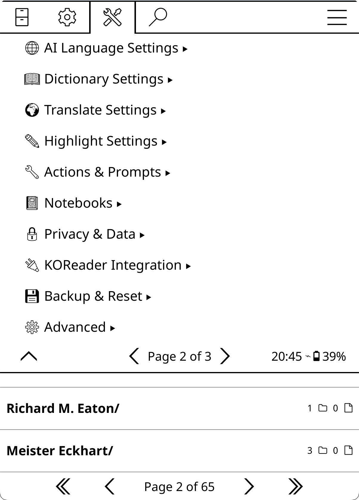</a>

**Tools → KOAssistant → Settings**

> The Settings menu is also reachable as a standalone **"More Settings"** entry from the Reader and FileManager gesture/panel shortcuts, and from the Quick Settings panel.

### Quick Actions
These launch entries sit at the top of the menu:
- **Book Chat/Action**: Start a conversation about the current book or access book actions
- **Book Hub**: Open the current book's hub — artifacts, chats, notebook, group and settings in one view (shown with a book open). See [Book Hub](#book-hub)
- **General Chat/Action**: Start a context-free conversation or run a general action
- **Library Chat/Action**: Open the library dialog with scan-based and selection-based actions. Scan-based actions (Next Read, Discover New, Analyze Library, Challenge My Taste) work immediately when library scanning is enabled. Selection-based actions (Compare, Recommend, etc.) require adding books via presets or history browser
- **Chat History**: Browse saved conversations
- **Browse Notebooks**: Open the Notebook Manager to view all notebooks
- **Browse Artifacts**: Open the Artifact Browser to view all cached artifacts
- **Groups**: Open the Book Groups manager. See [Book Groups](#book-groups)

### Provider & Model
- **Model: <model> (<Provider>)**: one row for both. Tap it to open the provider and model hub (29 built-in providers + custom)
  - Providers unfold into their own model panel. Entering a provider switches nothing; the provider and model change together when you pick a model. The list shows only providers with an API key configured, plus local/no-key providers (Ollama, custom local presets) — set a key in **API Keys & Auth** to make a provider appear
  - Custom providers appear with ★ prefix (see [Adding Custom Providers](#adding-custom-providers))
  - Long-press "Add custom provider..." to create your own
  - Models for the selected provider are listed under it
  - Custom models appear with ★ prefix (see [Adding Custom Models](#adding-custom-models))
  - Long-press any model to set it as your default for that provider (see [Setting Default Models](#setting-default-models))
  - **Fetch models from provider…** and **Test provider…** are available in every provider's model menu: Fetch pulls the live model list from that provider (useful for community providers, whose built-in lists are seed lists); Test sends a small request to confirm your key and connection work
  - **Model tiers…** (same menu) pins which of that provider's models fills each speed tier (ultrafast / fast / standard / flagship / frontier); actions with a speed hint and the Quick Answer preset's tier modes resolve through it. **Settings → Advanced → Tier Models (Global)** can pin a tier to one provider+model for every tier-hinted request
  - **Ollama**: the model menu has a **"Server: …"** row for managing multiple local endpoints (tap to switch, hold to manage), lists only models actually installed on the active server, and has a "Refresh installed models" row

<a id="api-keys"></a>
### API Keys & Auth
- Enter API keys directly via the GUI (no file editing needed)
- Shows status indicators: `[set]` for GUI-entered keys, `(file)` for keys from apikeys.lua, `[N keys]` when several are configured, `[connected]` for OpenAI Subscription
- GUI keys take priority over file-based keys
- Tap a provider to enter its first key. Once a key exists, tapping opens the **key manager** instead

**Multiple keys per provider** -- for example a free Gemini key and a paid one, switchable without editing files:

- The key manager lists every key you have for that provider, masked (`AIz...x3Fq`), each labeled with where it came from (added in app, or apikeys.lua) and which one is currently in use
- **Tap a key to use it.** The switch applies from the next request, everywhere (chat, provider tests, image generation)
- **Hold a key** to rename or delete it (keys from apikeys.lua are changed by editing that file instead)
- **Add API key...** adds another key; give keys names like "free" or "paid" so the list stays readable
- The manager is also reachable from the provider's own model menu (the "API keys..." row)
- In apikeys.lua, multiple keys are written as a list of named entries:

```lua
gemini = {
    { key = "KEY1", alias = "free" },
    { key = "KEY2", alias = "paid" },
},
```

- **OpenAI Subscription** is managed here too, but opens a Connect / Disconnect dialog instead of key entry (device login with your ChatGPT plan). See [Quick Setup, Option C](#2-add-your-api-key)

### Display Settings
- **Window Size**: How much of the screen chat, artifact, translate, dictionary and quiz windows take — **Standard** (default) or **Expanded**, which leaves only a hairline around them (and keeps KOReader's status bar visible while a book is open). Fits more text, less room to tap outside. Also on each window's gear menu; compact dictionary popups are unaffected.

#### Rendering (sub-menu)
- **View Mode**: Choose between Markdown (formatted) or Plain Text display
  - **Markdown**: Full formatting with bold, lists, headers, etc. (default)
  - **Plain Text**: Better font support for Arabic and some other non-Latin scripts
- **Render Math Formulas**: Show LaTeX math from responses as readable formulas in Markdown view (Greek letters, operators, superscripts, vectors, fractions as `a/b`, centered display lines). Display-only: saved chats, copies and exports keep the original notation. Grayed out in Plain Text mode. (default: on)
- **Plain Text Options**: Settings for Plain Text mode
  - **Apply Markdown Stripping**: Convert markdown syntax to readable plain text. Headers use hierarchical symbols with bold text (`▉ **H1**`, `◤ **H2**`, `◆ **H3**`, etc.), `**bold**` renders as actual bold, `*italics*` are preserved as-is, `_italics_` (underscores) become bold, lists become `•`, code becomes `'quoted'`. Includes BiDi support for mixed RTL/LTR content. Disable to show raw markdown. (default: on)
- **Latest Reply on New Page**: Present the newest reply from the top of a fresh page (default: on). Markdown chats get a real page break before it; Plain Text chats align the view so the reply starts the screen. Chat viewer only.
- **Text Mode for Dictionary**: Always use Plain Text mode for dictionary popup, regardless of global view mode setting. Better font support for non-Latin scripts. (default: off)
- **Text Mode for RTL Dictionary**: Automatically use Plain Text mode for dictionary popup when dictionary language is RTL. Grayed out when Text Mode for Dictionary is enabled. (default: on)
- **Text Mode for RTL Translate**: Automatically use Plain Text mode for translate popup when translation language is RTL. (default: on)
- **Open Chats at Latest Exchange**: When you open a saved chat, jump to the newest question and reply instead of the top (default: on). Replies always land on the newest exchange regardless. Independent of New Page per Exchange, which changes the page layout rather than the starting point.
- **Auto RTL mode for Chat**: Automatically detect RTL content and switch to RTL mode (right-aligned text + Plain Text) for general chat and artifact viewers. Activates when the latest response has more RTL than Latin characters. English text referencing Arabic stays in Markdown. Disabling removes all automatic RTL adjustments. Grayed out when markdown is disabled. (default: on)

#### Emoji (sub-menu)
- **Emoji Menu Icons**: Show emoji icons in plugin UI menus and buttons. Off by default. When enabled:
  - **Settings menu**: Descriptive emojis on menu items and section headers (💬 Chat, 🔗 Provider, 🤖 Model, 📖 Reading & Library, 🔒 Privacy, etc.)
  - **Chat history**: Type prefixes on documents (💬 general, 📚 library, 📖 book chats), 💬 on individual chats, 🏷️ on tag browser entries
  - **Notebook browser**: 📓 prefix on entries
  - **Artifact browser**: 📖 prefix on entries
  - **X-Ray browser**: Category icons (👥 Characters, 🌍 Locations, 💭 Themes, 📖 Lexicon, 📅 Timeline, 📍 Current State/Current Position, 🏁 Conclusion). Highly recommended for the X-Ray browser: the visual icons make browsing categories much more intuitive.
  - **Chat viewer**: ↩️ Reply, 🏷️ Tag, 📌/⭐ Pin/Star, 🔍 Web search toggle
  - **Streaming**: 🔍 web search indicator
  - Requires **emoji font support** (see [Emoji Font Setup](#emoji-font-setup) for installation instructions). If icons appear as question marks or blank squares, your device doesn't have a compatible emoji font installed.
- **Emoji Panel Icons**: Show emoji icons on Quick Settings and Quick Actions panel buttons (🔗 Provider, 🎭 Behavior, 📜 Chat History, etc.). Requires emoji font support. (default: off)
- **Emoji Data Access Indicators**: Show emoji suffixes on action names indicating what sensitive data they access. Off by default. Independent from Emoji Menu Icons: you can enable either or both. When enabled:
  - 📄 = document text (book text, X-Ray/Recap/Summary caches)
  - 🔖 = highlights only (no personal notes)
  - 📝 = annotations (highlights with personal notes)
  - 📓 = notebook
  - 📚 = library catalog
  - 📊 = advanced stats (reading engagement groups)
  - 🌐 = web search forced on
  - Visible in: action manager, quick actions, highlight/dictionary menus, file browser buttons
  - Helps you see at a glance which actions send personal data to AI providers. See [Privacy & Data](#privacy--data) for details on what gets shared.
  - Requires **emoji font support** (see [Emoji Font Setup](#emoji-font-setup)).

#### Panel Alignment (sub-menu)
- **Align Quick Settings**: Left-align (instead of center) the button text in the Quick Settings panel (default: on; also reachable from the panel's gear menu).
- **Align Quick Actions**: Left-align (instead of center) the button text in the Quick Actions panel (default: off; also reachable from the panel's gear menu).

#### Highlights (sub-menu)
- **Hide Highlighted Text**: Don't show selection in responses
- **Hide Long Highlights**: Collapse highlights over character threshold
- **Long Highlight Threshold**: Character limit before collapsing (default: 280)

#### Other
- **Plugin UI Language**: Language for plugin menus and dialogs. Does not affect AI responses. Options: Match KOReader (default), English, or one of 26 translations. Use this to switch the plugin UI to a language you're learning without changing KOReader's language, or to force English if you find the translations inaccurate. Requires restart.

### Chat & Export Settings
- **Auto-save All Chats**: Automatically save every new conversation
- **Auto-save Continued Chats**: Only save when continuing from history
- **Spoiler Protection**: Instructs the AI not to reveal events beyond your current reading position in book and highlight chats, and steers X-Ray checkpoint updates to follow your position (default: ON). See [Spoiler Protection](#spoiler-protection). For a per-chat toggle, use the **Spoiler** chip (input dialog's gear menu → Toolbar Buttons; the old "Show Spoiler-free Chat Checkbox" setting was replaced by this chip).
- **Book Info in Chat**: Default book context sent with freeform chats and book-aware actions — None / Title only / Title & author (default) / Title, author & position (adds reading progress, chapter, and page when Basic Stats are on). Overridable per book in Book Settings.

#### Streaming (sub-menu)
- **Enable Streaming**: Show responses as they generate in real-time
- **Auto-scroll Streaming**: Follow new text during streaming (on by default)
- **Keep Reading Position**: If auto-scroll is off or paused and you keep reading while a response streams, the finished chat opens where you were rather than at the newest reply (default: on).
- **Page-based Scroll (e-ink)**: Stream text into empty page space instead of scrolling from the bottom. Reduces full-screen refreshes on e-ink devices. When disabled, falls back to continuous bottom-scrolling. Default: on. Requires Auto-scroll.
- **Large Stream Dialog**: Use full-screen streaming window
- **Stream Poll Interval (ms)**: How often to check for new stream data (default: 125ms, range: 25-1000ms). Lower values are snappier but use more battery.
- **Display Refresh Interval (ms)**: How often to refresh the display during streaming (default: 250ms, range: 100-500ms). Higher values improve performance on slower devices.

#### Quick Answer Preset (sub-menu)
Controls what the **Quick Answer** (⚡) chip applies when you tap it on for a chat. Also editable from the ⚡ chip's hold-menu → "Preset settings…". See [Session Chips](#session-controls-chips).
- **Quick Answer On by Default**: Start new chats with the ⚡ button already on (default: OFF). Still overridable per chat, and per book from Book Settings or the ⚡ menu.
- **Brevity Nudge**: How strongly Quick Answer asks for brevity while it is on: Standard (short, direct reply, no preamble — the default), Ultra-brief (a hard ceiling of about 3 sentences), or Off
- **Turn Reasoning Off**: Disable model reasoning/thinking for Quick Answer chats — models that can't disable it drop to their lowest level (default: ON)
- **Turn Web Search Off**: Disable web search while Quick Answer is on (default: ON). Tapping the Web chip while Quick is on pins that choice against the preset for the chat
- **Turn Book Tools Off**: Disable AI Book Tools while Quick Answer is on (default: ON). Same pinning rule via the Tools chip
- **Skip Domain Lens**: Leave the selected domain out of Quick Answer chats (default: OFF)
- **Skip Book Background**: Leave the per-book Background note out of Quick Answer chats (default: OFF)
- **Behavior**: Optionally change the AI behavior while Quick Answer is on: keep the current one (default), swap to its Mini variant, use the built-in Terse, pin a specific behavior, or send none at all
- **Model override**: Optionally switch models while Quick Answer is on (that chat only; your default model is untouched). Options: Keep current (default), Fastest for provider, a tier of the active provider, or a pinned specific model. Custom providers keep the current model unless you've given them tier placements.

#### Content Format
- **Export Style**: Format for Copy, Note, and Save to File: Markdown (default) or Plain Text
- **Copy Content**: What to include when copying: Ask every time, Full (metadata + chat), Question + Response, Response only, or Everything (debug)
- **Note Content**: What to include when saving to note: Ask every time, Full (metadata + chat), Question + Response (default), Last response only, or Everything (debug)
- **Save to File Content**: What to include when saving a chat to a file: Follow Copy Content, Ask every time, Full, Q+A, Response only, or Everything (debug)
- **Chat History Export**: What to include when exporting from Chat History: Ask every time (default), Follow Copy Content, Full, Q+A, Response only, or Everything (debug)

When "Ask every time" is selected, a picker dialog appears letting you choose what to include before proceeding.

#### Save Location
- **Save Location**: Where to save exported files
  - **KOAssistant exports folder** (default): Central `koassistant_exports/` folder with subfolders for book/general/library chats
  - **Custom folder**: User-specified fixed directory
  - **Ask every time**: PathChooser dialog on each save
- **Save book chats alongside books**: When enabled, book chats go to `[book_folder]/chats/` subfolder (default: OFF)
- Picking **Custom folder** in Save Location opens the folder picker straight away; there is no separate row for it (appears when Custom folder is selected)

### Reading & Library
This top-level section consolidates chapter quiz, background X-Ray, recap reminder, end-of-book, and library scanning settings.

#### Chapter Quiz
- **Quiz on Chapter End**: Offer a comprehension quiz when you finish reading a chapter. Requires a book with a table of contents. (default: OFF)
- **Quiz Chapter Level**: Which TOC level counts as a 'chapter' for end-of-chapter quizzes: Auto-detect (picks the deepest level whose chapters meet the minimum length below), Top level (Level 1), **Level 2 (default)**, Level 3, or All TOC headings (follows KOReader's TOC tick settings)
- **Minimum Chapter Length (pages)**: Skip the chapter-end quiz prompt for chapters shorter than this many pages, so short or skimmed sections don't prompt (0 = no minimum; range 0-30, default: 5). Also sets the threshold 'Auto-detect' uses to pick the chapter level.
- **Minimum Reading Time (minutes)**: Skip the chapter-end quiz unless you spent at least this many minutes reading the chapter (0 = no minimum, default: 3). Catches flipping quickly through a long chapter; uses KOReader's reading statistics, and the quiz is still offered if those are unavailable. Overridable per book in Book Settings.
- **Question Count**: Total number of questions per quiz (3-15, default: 8)
- **Difficulty**: Easy (straightforward recall), Medium (comprehension and application, default), or Hard (analysis and synthesis)
- **Include Multiple Choice**: Auto-graded A/B/C/D questions (default: ON)
- **Include Short Answer**: View model answer, then self-grade (default: ON)
- **Include Discussion**: View key points a good answer should cover, then self-grade (default: ON)

All of these (including a per-book *suppress* of the chapter-end auto-quiz) can be overridden for an individual book in [Book Settings](#book-settings) ▸ Quiz settings.

The **Quiz** action is also available manually from the Quick Actions panel, opening the standard scope picker (full document or specific section). The quiz uses structured JSON output from the AI, parsed into an interactive one-at-a-time viewer with navigation, scoring, and Copy/Export/Notebook on the results screen. Result is saved as an artifact (View/Redo from Quick Actions). If JSON parsing fails, the raw response is shown as a fallback.

#### X-Ray
Background X-Ray settings keep a book's X-Ray current as you read (all off by default; individual books can override either way in [Book Settings](#book-settings) or the X-Ray popup). Background runs extract book text and spend API tokens **without a per-request tap** — text-extraction consent (or a trusted provider) is still required, and instead of the interactive size warnings they use hard guards (an oversized background extraction aborts). See [Automatic X-Ray](#x-ray-auto-update).
- **Automatic X-Ray (all books)**: Build and maintain every book's X-Ray as you read (flowing formats like EPUB only): a spoiler-free introduction first, then [checkpoints](#x-ray-version-ladder) at chapter-sized steps, always keeping the next one ready ahead of you — reaching it installs it instantly and the one after starts building. Per-book On/Off overrides win in both directions. Spend guards: at most one background build per cooldown, WiFi only, text-extraction consent required. (default: OFF)
- **Also Start X-Rays Automatically**: For books following the global setting with no X-Ray yet, let automation make the FIRST build too (introduction plus checkpoints to your position; the first build asks how you want coverage, once per book). Books switched to Automatic individually (per-book On) always build their first one regardless of this. (default: OFF)
- **Offer Automatic X-Ray for New Books**: When you open a book that has no X-Ray, ask once — early in the book — whether to turn Automatic X-Ray on for it. Declining turns it off for that book, so it never asks again. (default: OFF)
- **Cooldown (minutes)**: Minimum time between background attempts (0 = no cooldown).
- **Notify on Background Activity**: Show a brief notification when a background X-Ray update or create starts and completes, and when a checkpoint is silently swapped in. Off = fully silent.
- **Checkpoints at Chapter Ends**: When [building X-Ray checkpoints](#x-ray-version-ladder), place each checkpoint at the nearest chapter end (within a few percent) so versions read as "up to the end of a chapter"; the versions list shows the chapter names. Needs a table of contents. (default: ON)
- **X-Ray Versions to Keep**: Whenever an update or redo overwrites the X-Ray, the outgoing version is archived — browse, view, or restore them via "All versions" in the X-Ray popup and browser menu. Sets how many are kept per book (the versions covering the least of the book are dropped first, oldest first among equally covering ones; 0 stops archiving new versions). Ladder versions are stored separately and are never trimmed by this.
- **First Build for New Books**: What Automatic X-Ray does for a book that has none yet — **Ask each book** (default, a one-time choice per book), **Catch up, then follow** (quietly builds checkpoints to your position and keeps one ahead), or **Build all checkpoints** (the full build with its cost confirmation). Needs the "Also Start X-Rays Automatically" sub-toggle.
- **Connection Buttons per Entry**: How many boxes an entity page may spend on its connections (default 9, range 0-30). Past the cap the last box becomes an "All connections (N)…" overflow row; 0 draws no buttons and lists every connection instead. Repeated links to the same entity are always collapsed.
- **Chapter Appearances Rows**: Row density for the Chapter Appearances tree — **Compact (20 rows per page)** (default) or **Follow KOReader's ToC settings** (its items-per-page and font size).
- **Categories for New X-Rays**: Narrow what a new X-Ray tracks by default: everything, or a pick of people / places / ideas / terms / events. Presets: **Full**, **Light (characters and story arc)** (people + events), and **Character tracking (people only)**, much cheaper on long novels. Individual books can pick their own categories in Book Settings → X-Ray.
- **Passive marking & lookup**: Discreetly underline words on the page that match an X-Ray entity (default: ON), with sub-settings for tap-to-open, **Upcoming Entities** (recognize entities from a checkpoint built ahead of you — identification only, spoiler-guarded), the entity-card landing and its style (footnote panel or floating popup), marking density (every occurrence / once per page / after 10 or 25 unseen pages / once per book), and which families are marked (everything / people / people + places). **Matching selections** opens an exactly-matching entity's entry instead of the dictionary or highlight menu (default: ON). All of these are per-book overridable (Book Settings → X-Ray, or the X-Ray popup's "Marking & lookup…").

#### Recap Reminder
- **Remind to Recap on Book Open**: Show a reminder to run AI Recap when you open a book you haven't read in a while (default: OFF)
- **Days Before Reminder**: Number of days since last reading before the reminder appears (default: 7, range: 1-90)

#### End of Book
- **Suggest Next Read on Finish**: When you reach the end of a book, offer to suggest what to read next from your library (default: ON). Only activates when library scanning is enabled with at least one folder configured.

#### Library
- **Allow Library Scanning**: Enables library actions that analyze your book collection (default: OFF). Add permanent scan folders below, or pick folders on the fly in the input dialog.
- **Permanent Scan Folders**: Folders always scanned for library actions

### AI Language Settings
These settings control what language the AI responds in.

> **Per book:** the AI response language (and the translation/dictionary targets below) can be overridden for an individual book in [Book Settings](#book-settings) ▸ Languages, leaving your global defaults untouched.

**Auto-detection:** KOAssistant automatically detects your language from KOReader's UI language setting. If you haven't configured any languages, the AI will respond in your KOReader language (e.g., if KOReader is set to Français, the AI responds in French). This also applies to translation and dictionary actions. The auto-detected language is shown as "(auto)" in Quick Settings. Once you explicitly set a language, auto-detection is no longer used.

**Existing users:** If you completed the setup wizard before this feature was added and haven't configured languages, KOAssistant will show a one-time prompt offering to use your detected KOReader language (non-English users only).

- **Your Languages**: Languages you speak/understand. Opens a picker with 47 pre-loaded languages displayed in their native scripts (日本語, Français, Español, etc.). Select multiple languages. These are sent to the AI in the system prompt ("The user understands: ...").
- **Primary Language**: Pick which of your languages the AI should respond in by default. Defaults to first in your list.
- **Additional Languages**: Extra languages for translation/dictionary targets without affecting AI response language. These are NOT sent to the AI in the system prompt but appear in translation/dictionary language pickers and the Language button in dictionary/translate views. Use cases: scholarly work (Latin, Sanskrit, Ancient Greek), language learning (translate TO a language you're studying), or occasional use of languages you understand but don't want the AI defaulting to.

**Native script display:** Languages appear in their native scripts in menus and settings (日本語, Français, etc.). System prompts sent to the AI use English names for better language model comprehension. Classical/scholarly languages (Ancient Greek, Biblical Hebrew, Classical Arabic, Latin, Sanskrit) are displayed in English only.

**Custom languages:** Use "Add Custom Language..." at the top of each picker to enter languages not in the pre-loaded list. Custom languages are remembered and appear in future pickers.

**Note:** Translation target language settings are in **Settings → Translate Settings**.

**How language responses work:**
- AI responds in your primary language by default (auto-detected or explicitly set)
- If you type in another language from your list, AI switches to that language
- The AI only auto-switches between Your Languages, and it will never spontaneously respond in an Additional Language, even when working with content in that language. This is because Additional Languages are not included in the system-level language instruction sent to the AI; they exist solely for translation/dictionary targeting.

**Examples:**
- Your Languages: `English` - AI always responds in English
- Your Languages: `Deutsch, English, Français` with Primary: `English` - English by default, switches if you type in German or French
- Additional Languages: `Latin, Sanskrit` - Available in translation/dictionary pickers only; AI won't auto-switch to these languages even when you're reading Latin text

**How it works technically:** Your interaction languages are sent as part of the system message (after behavior and domain). The instruction tells the AI to respond in your primary language and switch if you type in another configured language. Language names in system prompts use English (e.g., "Japanese" not "日本語") for more reliable AI comprehension. See [How the AI Prompt Works](#how-the-ai-prompt-works).

**Built-in actions that skip this:** Translate and Dictionary actions set `skip_language_instruction` because they specify the target language directly in their prompt templates (via `{translation_language}` and `{dictionary_language}` placeholders). This avoids conflicting instructions.

**For custom actions:** If your action prompt already specifies a response language, enable "Skip language instruction" to prevent conflicts. If you want the AI to follow your global language preference, leave it disabled (the default).

#### How Language Settings Work Together

KOAssistant has four language-related settings that work together:

1. **Your Languages**: Languages you speak (sent to AI in system prompt)
2. **Primary Language**: Default response language for all AI interactions (selected from Your Languages)
3. **Translation Language**: Target language for Translate action
   - Can be set to follow Primary (`↵` symbol) or set independently
   - Picker shows both Your Languages and Additional Languages
4. **Dictionary Language**: Response language for dictionary lookups
   - Can follow Primary (`↵`) or Translation (`↵T`) or be set independently
   - Picker shows both Your Languages and Additional Languages

**Return symbols:**
- `↵` = Following another setting
- `↵T` = Following Translation setting specifically

**Example setup:**
- Your Languages: English, Spanish
- Primary: English
- Additional Languages: Latin
- Translation: `↵` (follows Primary → English)
- Dictionary: `↵T` (follows Translation → English)

This setup means: AI knows you understand English and Spanish, responds in English, translates to English, defines words in English. Latin is available in translation/dictionary pickers for scholarly texts.

**Another example:**
- Your Languages: English
- Primary: English
- Additional Languages: Spanish, Latin
- Translation: Spanish
- Dictionary: `↵T` (follows Translation → Spanish)

This setup means: AI responds in English by default, translates to Spanish, defines words in Spanish (useful when reading Spanish texts). Latin available for translation if needed.

<a id="dictionary-settings-reference"></a>
### Dictionary Settings
Behavior settings for AI dictionary lookups. (The **AI buttons in the dictionary popup** and the **Dictionary Popup Actions** manager now live in **[Menus & Buttons](#koreader-integration) → Dictionary popup**.) See [Dictionary Integration](#dictionary-integration) and [Bypass Modes](#bypass-modes) for details.
- **Response Language**: Language for definitions (`↵T` follows Translation Language by default). Can be overridden per book in [Book Settings](#book-settings) ▸ Languages.
- **Context Mode**: Surrounding text to include: None, Sentence (default), Paragraph, or Characters
- **Context Characters**: Character count for Characters mode (default: 100)
- **Disable Auto-save for Dictionary**: Don't auto-save dictionary lookups (default: on)
- **Copy Content**: What to include when copying in compact dictionary view: Follow global setting, Ask every time, Full, Question + Response, or Definition only (default)
- **Note Content**: What to include when saving dictionary results to a note via the +Note button, same options as Copy Content, defaults to Definition only
- **Enable Streaming**: Stream dictionary responses in real-time
- **Bypass KOReader Dictionary**: Skip dictionary popup, go directly to AI
- **Bypass Action**: Which action to trigger when bypass is enabled (default: **Quick Define**, chosen for speed). Pick the full Dictionary action or a custom one instead if you want more detail. With **X-Ray Lookup**, a tapped word that has an X-Ray entry opens it directly; any other word falls through to the normal dictionary.
- **Bypass: Follow Vocab Builder Auto-add**: Follow KOReader's Vocabulary Builder auto-add in bypass mode

> **Tip:** Create custom dictionary actions tailored to your language pair for best results. See [Custom Dictionary Actions](#custom-dictionary-actions).

### Translate Settings
See [Translate View](#translate-view) for details on the specialized translation UI. The translation target can be overridden per book in [Book Settings](#book-settings) ▸ Languages.
- **Translate to Primary Language**: Use your primary language as the translation target (default: on)
- **Translation Target**: Pick from your languages or enter a custom target (when above is disabled)
- **Disable Auto-Save for Translate**: Don't auto-save translations (default: on). Save manually via → Chat button
- **Enable Streaming**: Stream translation responses in real-time (default: on)
- **Include Surrounding Context**: Send the text around the highlight along with translations, so the AI can resolve pronouns, tone, and ambiguous words. Uses the Surrounding Context mode from Highlight Settings (sentence when that is off). Never applies to full-page translation.
- **Copy Content**: What to include when copying in translate view: Follow global setting, Ask every time, Full, Question + Response, or Translation only (default). Replaces the old "Copy Translation Only" toggle.
- **Note Content**: What to include when saving to note in translate view, same options as Copy Content, defaults to Translation only

When "Ask every time" is selected (or inherited from global), a picker dialog appears letting you choose what to include.
- **Original Text**: How to handle original text visibility (Follow Global, Always Hide, Hide Long, Never Hide)
- **Long Text Threshold**: Character count for "Hide Long" mode (default: 280)
- **Hide for Full Page Translate**: Always hide original when translating full page (default: on)

### Minimal Popup Settings
- **Minimal Popup View**: Show responses from the actions below in a small popup anchored next to the highlighted text — just the response, no buttons. **Off** / **When it fits** (default; longer responses open the full window instead) / **Always** (trimmed with an ellipsis). Tap the popup for the full window, tap outside to dismiss. Streaming is skipped for these requests, and full-page translation never uses it.
- **Minimal Popup Actions**: Which highlight actions open this way (Translate, Quick Define and Quick Explain by default). Also reachable from the popup's own quick settings.

### Highlight Settings
Behavior settings for highlight actions. (The highlight-menu **visibility toggles** and the **Highlight Menu Actions** manager now live in **[Menus & Buttons](#koreader-integration) → Highlight menu**.) See [Bypass Modes](#bypass-modes) and [Highlight Menu Actions](#highlight-menu-actions).
- **Surrounding Context**: Automatically send the text around a highlight with highlight questions and actions, so the AI sees the passage in context (None (default), Sentence, Paragraph(s), or Characters). Capped at 2000 characters. Dictionary lookups and actions with their own scope selection are unaffected. Can be overridden per book in Book Settings, and per-chat via the **Scope** chip's highlight facet.
- **Context Paragraphs**: Number of paragraphs to include on each side when Surrounding Context is 'Paragraph(s)' (1 = just the highlight's paragraph; range 1-5)
- **Context Characters**: Number of characters before/after when Surrounding Context is 'Characters' (default: 100)
- **Context Direction**: Which side of the selection context is taken from — **Both sides** (default) or **Before the selection only**. Also applies to dictionary context.
- **Context Under Spoiler Protection**: How far past the selection context may reach while spoiler protection is on — Nothing after the selection / To the end of its sentence / **To the end of its paragraph** (default) / No limit. Since spoiler protection is on by default, this shapes what is sent in the normal case. Also settable per chat from the Ctx chip.
- **Enable Highlight Bypass**: Immediately trigger action when selecting text (skip menu)
- **Bypass Action**: Which action to trigger when bypass is enabled (default: Translate)

<a id="menus--buttons"></a>
<a id="koreader-integration"></a>
### Menus & Buttons
Control where KOAssistant appears in KOReader's menus, panels, and buttons. This submenu (added 2026-07-16) consolidates the placement toggles that used to be scattered across "KOReader Integration", "Highlight Settings", "Dictionary Settings", "Quick Settings", and "Quick Actions". To customize which *actions* appear in each surface, use **Action Manager → hold action** as well.

#### Highlight menu
- **Show Chat/Action button**: Add the main "Chat/Action" button to the highlight menu (takes effect next time the menu opens)
- **Show quick actions**: Add action shortcuts (Explain, Translate, etc.) to the highlight menu
- **Show Add to Notebook button**: Add an "Add to notebook" button that saves the selected text straight to this book's notebook
- **Highlight Menu Actions**: Choose which actions appear in the highlight menu (up to 15 shown; defaults: Translate, Look up in X-Ray, Explain, Quick Explain, Summarize, Quick Define, Dictionary, Generate Image)

#### Dictionary popup
- **Show AI buttons**: Add AI buttons to KOReader's dictionary popup
- **Dictionary Popup Actions**: Configure which actions appear in the AI dictionary menu (reorder, add custom)

#### File browser
Listed in the order the buttons appear in the long-press popup. All eight default to ON.
- **Show KOAssistant actions**: Add KOAssistant buttons to file browser context menus (changes apply the next time the menu opens)
- **Show Chat/Action button**: The main "Chat/Action (KOA)" button
- **Show Notebook button**: Show a "Notebook" button when long-pressing books in the file browser
- **Only for books with notebooks**: Only show the button if a notebook already exists (disable to allow creating notebooks from the file browser)
- **Show Chat History button**: Open that book's saved chats straight from the popup
- **Show View Artifacts button**: Open that book's cached artifacts straight from the popup
- **Show Book Hub button**: Show the "Book Hub (KOA)" button when long-pressing books
- **Show Book Settings button**: Open that book's per-book settings straight from the popup
- **File Browser Items**: Choose which actions appear in the file browser long-press menu (book_info is the only default)

#### Quick panels
- **Panel Actions**: Choose which actions appear on the Quick Actions panel (reader mode). Add new ones via Action Manager → hold action → **+ Quick Actions**. Also reachable from the panel's gear icon.
- **Panel Utilities**: Choose and order the utility buttons on the Quick Actions panel (Translate Page, New Book Chat/Action, Continue Last Chat, General Chat/Action, Chat History, Notebook, View Artifacts, Group, Book Hub, Book Settings, Quick Settings). Also reachable from the panel's gear icon.
- **Quick Settings Items**: Choose and order the tiles on the Quick Settings panel (Provider, Model, Behavior, Domain, Reasoning, Web Search, Book Tools, Quick Answer, Spoiler Protection, Minimal Popup, Language, Translation/Dictionary Language, bypass toggles, Text Extraction, Chat History, Browse Notebooks/Artifacts, Book Groups, Library and General Chat, Continue Last Chat, Manage Actions, Quick Actions, More Settings). Also reachable from the panel's gear icon.

#### Gestures
- **Shortcuts**: See and change the gestures bound to KOAssistant's panels and actions — every action with its current binding, assign or clear from one screen. Assignments apply immediately, no restart needed.
- **Register gesture actions**: Register KOAssistant actions in KOReader's gesture dispatcher (requires restart). Only affects actions added via **+ Gesture Menu** in Action Manager. Built-in gestures (Chat History, Quick Settings, toggles, etc.) are always available.

#### Text selection in viewers
- **Enhance text selection**: Add dictionary lookup and an action popup to text selection in KOReader's own viewers (Dictionary popup, TextViewer, etc.). Single word → dictionary; long-press single word or multi-word → popup with Copy, Dictionary, Translate (default: OFF, requires restart)

#### Input dialogs
- **Input Dialog Actions**: Pick a context (Book, Closed Book, Highlight, X-Ray Chat, Library, General) and toggle/reorder its action buttons
- **Show View Artifacts button** / **Show Group button**: The two utility buttons in the input dialog (both default ON)
- Toolbar chips are configured from the input dialog's own gear menu ("Toolbar Buttons…"). See [Session Chips](#session-controls-chips).

**Note:** Adding an action to the gesture menu (**Register gesture actions**) and Enhance Text Selection both require a KOReader restart, since they are registered at plugin startup. Binding a gesture on the **Shortcuts** screen does not. File browser, highlight menu, and dictionary popup changes take effect the next time the menu opens.

### Actions & Prompts
- **Manage Actions**: See [Actions](#actions) section for full details
- **Manage Behaviors**: Select or create AI behavior styles (see [Behaviors](#behaviors))
- **Manage Domains**: Create and manage knowledge domains (see [Domains](#domains))
- **Domain & Research**: The default domain and research mode for AI requests. Individual books can override both in Book Settings.

### Notebook Settings
- **Browse Notebooks...**: Open the Notebook Manager to view all notebooks
- **Content Format**: What to include when saving to notebook
  - **Response only**: Just the AI response
  - **Q&A**: Highlighted text + question + response
  - **Full Q&A** (recommended, default): Highlighted text + your question + AI response, plus anything you attached with the Attach chip (notes, artifacts, chats, files). Deliberately excludes the generic book-context messages, since notebooks are book-specific already
- **Viewer Mode**: Choose how notebooks open (default: Chat Viewer)
  - **Chat Viewer**: Opens in the plugin's viewer with Copy, Export, MD/TXT toggle, Open in Reader, and Edit buttons
  - **KOReader**: Opens as a full document in KOReader's reader with page navigation
- **Save Location**: Where notebook files are stored
  - **Alongside book** (default): In the book's sidecar folder (`.sdr/koassistant_notebook.md`). Travels with the book automatically.
  - **KOAssistant notebooks folder**: Central `koassistant_notebooks/` folder. Files named `Author — Title.md` with YAML frontmatter.
  - **Custom folder**: User-selected directory (e.g., Obsidian vault folder). Same naming and frontmatter as central. Selecting this opens a path picker; re-selecting reopens the picker.

Changing save location prompts to migrate existing notebooks. Vault/central filenames use `Author — Title.md` pattern with sanitization and collision handling.

> The notebook **entry-point toggles** (Show Add to Notebook button in the highlight menu, Show Notebook button in the file browser, Only for books with notebooks) now live in **[Menus & Buttons](#koreader-integration)**. The **Allow Notebook sharing** privacy toggle (controls whether notebook content is sent to the AI via `{notebook}`) lives in **[Privacy & Data](#privacy--data)**.

### Privacy & Data Settings
See [Privacy & Data](#privacy--data) for background on what gets sent to AI providers and the reasoning behind these defaults.
- **Trusted Providers**: Mark providers (e.g., local Ollama) that bypass all data sharing controls AND text extraction AND the library-scanning toggle (a scan folder is still required) — all data types are available without toggling individual settings
- **Preset: Default**: Recommended balance: progress and chapter info shared, personal content private
- **Preset: Minimal**: Maximum privacy: only question and book metadata sent
- **Preset: Full**: Enable all data sharing for full functionality (does not enable text extraction)
- **Data Sharing Controls** (for non-trusted providers):
  - **Allow Annotation Notes**: Send your personal notes attached to highlights (default: OFF). Auto-enables Allow Highlights.
  - **Allow Highlights**: Send your highlighted text passages without notes (default: OFF). Grayed out when annotations enabled.
  - **Allow Notebook**: Send notebook entries (default: OFF)
  - **Allow Basic Stats**: Send reading progress percentage, chapter title, chapters read count, time since last opened (default: ON)
  - **Allow Library Scanning**: Enables library actions that analyze your book collection (mirrors the toggle in Reading & Library)
  - **Allow Advanced Stats**: Share reading engagement data derived from KOReader's Statistics plugin: curated groups based on reading time and completion patterns (default: OFF)
- **Text Extraction** (submenu): Settings for extracting book content for AI analysis
  - **Allow Text Extraction**: Master toggle for text extraction (off by default). When enabled, actions can extract and send book text to the AI. Used by X-Ray, Recap, Explain in Context, Analyze in Context, AI Book Tools, and actions with text placeholders (`{book_text}`, `{full_document}`, etc.). Enabling shows an informational notice about token costs and a tip about using Hidden Flows to save tokens.
  - **Max Text Characters**: Maximum characters to extract (100,000-10,000,000, default 4,000,000 ~1M tokens). The default covers most books with Gemini's 1M-token context; lower it for smaller models
  - **Max Pages (PDF, DJVU, CBZ…)**: Maximum pages to extract from page-based formats (100-5,000, default 2,000)
  - **Don't warn about truncated extractions**: When unchecked (default), a blocking warning dialog appears before sending requests where extracted text was truncated to fit the character limit. It shows the coverage percentage so you know how much of the document was included. The warning offers Cancel, Continue Anyway, or Don't warn again
  - **Don't warn about large extractions**: When unchecked (default), a warning dialog appears before sending requests with over 500K characters (~125K tokens) of extracted text. Most models except Gemini will struggle at this size. The warning offers Cancel, Continue, or Don't warn again
  - **Delete Book Artifacts**: Delete all saved artifacts (X-Ray, X-Ray (Simple), Recap, Summary, Analysis, About, Analyze Notes, Key Arguments, Counterarguments, Discussion Questions, Quiz, Insights, Reading Guide) for the current book (requires book to be open). To delete just one, use the delete button in the artifact viewer instead.

### Backup & Reset
Backup and restore functionality, index maintenance, plus reset options. See [Backup & Restore](#backup--restore) for full details.
- **Create Backup**: Save settings, API keys, custom content, and chat history
- **Restore from Backup**: Restore from a previous backup
- **View Backups**: Manage existing backups and restore points
- **Validate Data Indexes**: Check chat history, artifact, notebook, and pinned indexes for stale entries (books moved/deleted outside KOReader) and fix count mismatches. Runs automatically per-entry while browsing; run a full pass here if needed.
- **Rebuild Data Indexes**: Find books whose KOAssistant data (artifacts, chats, notebooks, pinned) exists on disk but doesn't show in this device's browsers — e.g. after syncing sidecar files from another device, restoring a backup, or migrating devices. Checks your reading history, KOReader's sidecar locations, and the scan folders below; may take a while on large libraries. See [Index Heal/Rebuild](#data-indexes-validate--rebuild).
- **Index Scan Folders**: Folders to scan during a rebuild — point this at your synced book folders (only these are scanned, and only when a rebuild runs). Note: a settings reset clears this list.
- **Auto-Rebuild on Startup**: Also run the rebuild automatically after KOReader starts, at most once per day, quietly in the background (only when scan folders are configured)
- **Reset Settings**: Re-run Setup Wizard; Quick resets (Settings only, Actions only, Fresh start); Custom reset checklist; Clear all chat history

### Advanced
- **Temperature**: Response creativity (0.0-2.0, Anthropic max 1.0; default 0.7). Moved here from the top level in August 2026 — it sits beside Reasoning as the other model-behavior dial, and a growing share of models ignore it entirely.
- **Reasoning**: Per-model reasoning control. See [Reasoning/Thinking](#reasoningthinking) for the full explanation.
  - **Global stance**: Minimal / Default / Maximum — one dial applied to every model, as far as each allows (default: **Default** = each model's normal behavior). "Minimal" turns reasoning off where the model supports it (otherwise its lowest setting); "Maximum" requests the deepest reasoning.
  - **Per-model reasoning**: Browse a provider's models and override any individual model — Follow global / Off / a specific level. Only configurable models are listed.
  - **Show Indicator in Chat**: Display "*[Reasoning/Thinking was used]*" in chat when reasoning is active (default: on). The full reasoning is always viewable via the "Show Reasoning" button regardless.
  - There is no global reasoning on/off switch — reasoning is per-model. The **Quick Answer** preset turns reasoning off for Quick chats (its "Turn Reasoning Off" component, on by default).
- **Faster Models for Quick Actions**: Let actions carrying a speed hint (Translate, Quick Define) run on a faster model from the same provider (default: on). Turning it off disables the per-action speed-tier mechanism entirely; explicit model pins always win either way.
- **Tier Models (Global)**: Pin a provider+model to a speed tier (ultrafast / fast / standard / flagship) for every tier-hinted request, across providers. Unset tiers fall back to the current provider's own tier ladder.
- **Web Search**: Allow AI to search the web for current information:
  - **Enable Web Search**: Global default (default: off). Supported by Anthropic (all models), Gemini (Search-grounding-capable models), OpenAI and OpenAI Subscription (GPT-5 models via the Responses API), xAI (Grok-4 models via the Responses API), OpenRouter (any model via the `:online` suffix), Z.AI (all models, with a search-engine picker below), Qwen (all models; no source list comes back), and Perplexity (searches by default; turning this off now genuinely disables it). Other providers ignore this. This is a global default — per-request toggles (the input dialog's **Web** chip, the chat viewer) adapt to the active provider, and it can be overridden per book.
  - **Web Search Effort**: How much searching the AI may do per question — Light (fewest searches), Standard (provider defaults), or Thorough (most searches). Applies where the provider offers control: Anthropic (up to 2/5/10 searches), OpenAI and Perplexity (search context size), OpenRouter (3 results on Light, provider default on Standard, 10 on Thorough), Z.AI (result count and snippet size). Gemini and xAI decide automatically. Also settable **per book**: hold the Web chip and use the "Search depth" row.
  - **Show Indicator in Chat**: Display "*[Web search was used]*" in chat when search is used (default: on). Sources (URLs, queries) are viewable via the chat menu's "Show Sources" entry.
- **Image Generation**: Generate images from highlighted text. See [Image Generation](#image-generation).
  - The submenu opens with a note that this generates images from highlighted text via the "Generate Image" highlight-menu button — there is no separate enable toggle here; the button appears when the resolved provider can generate images, and its menu presence is managed like any other action via Highlight Menu Actions.
  - **Provider**: Follow main provider / OpenAI / xAI / Gemini. "Follow main provider" uses your current chat provider when it supports images; picking one explicitly lets image generation work regardless of the active chat provider (using that provider's own API key). The button only appears when the resolved provider has an API key.
  - **Model**: Image model for the chosen provider (from the built-in image-model lists)
  - **Size** (OpenAI): Default / 1024x1024 / 1536x1024 (landscape) / 1024x1536 (portrait)
  - **Quality** (OpenAI): Default / Low / Medium / High (higher is slower and costs more)
  - **Aspect ratio** (xAI): Default / 1:1 / 16:9 / 9:16 / 3:2 / 2:3
  - **Generated images…**: Browse, view, and delete the images generated so far (also opens from the Quick Actions "View Artifacts" and the Artifact Browser). Images are kept in `data_dir/koassistant_images`.
- **Provider Settings**:
  - **Z.AI Region**: Select endpoint (International: api.z.ai / China: open.bigmodel.cn). Same API key works on both.
  - **Z.AI Search Engine**: Which engine Z.AI's web search uses (Jina/Bing international, or Chinese-web engines; default: Jina — the API's own default returns poor sources for non-Chinese queries).
  - **Qwen Region**: Select your Alibaba Cloud region (International: Singapore / China: Beijing / US: Virginia). API keys are region-specific and NOT interchangeable.
  - **Kimi Region**: Select the Kimi (Moonshot) platform your key was issued on (International: api.moonshot.ai / China: api.moonshot.cn). Keys are not interchangeable.
- **AI Book Tools (Experimental)**: Let the AI search and read the open book on demand to ground its answers in the actual text. See [AI Book Tools](#ai-book-tools-experimental). Supported on Gemini, Claude (Anthropic), OpenAI (API or Subscription), OpenRouter (Claude/GPT/Gemini models), plus DeepSeek, Mistral, Groq, xAI, Fireworks, Qwen (`qwen3-max`), Kimi (`kimi-k2.6`), and Ollama; other providers fall back to normal chat. Requires "Allow Text Extraction".
  - **AI Book Tools**: On/Off toggle (default: **off**). Sets whether the **Tools** chip in book chats starts ON; you can flip it per chat regardless, and the AI still decides per question whether to actually search. Predefined actions never use tools unless they explicitly offer smart retrieval. Overridable per book. (Users of the earlier three-way posture are migrated: "auto" becomes on, "manual"/"off" become off.)
  - **Book Tools Mode**: Gather then answer (default; the AI quietly collects passages first, then answers as a normal streamed request with web search available) or Interactive (the original agentic loop; no streaming or web search while tools run).
  - **Book Tools Lookup Effort**: Quick (up to 4 lookups in 2 rounds) / Standard (up to 8 in 4 rounds) / Thorough (up to 16 in 6 rounds, larger passage budget).
  - **AI Book Tools: Show Indicator in Chat**: Include book lookups in the usage indicator line (e.g. "*[Book search (3 lookups) was used]*") when tools ran (default: on). Individual lookups are always viewable via "Show Sources".
  - **AI Book Tools: Show Lookups (debug)**: Append the AI's tool lookups and raw results to each answer, for debugging (default: off). Can include book-text snippets.
- **Console Debug**: Enable terminal/console debug logging. When enabled, also shows token usage (input, output, cache hits) in the terminal after each API response.
- **Show Debug in Chat**: Display debug info in chat viewer
- **Debug Detail Level**: Verbosity (Minimal/Names/Full)
- **Truncate Large Content (debug)**: Truncate long content (book text, cached responses) in debug output — shows the first and last ~1500 characters with a truncation notice
- **Test Connection**: Verify API credentials work

### About
- **About KOAssistant**: Plugin info and gesture tips
- **Auto-check for updates on startup**: Toggle automatic update checking (default: on)
- **Check for Updates**: Manual update check (see [Update Checking](#update-checking) below)

---

## Updating the Plugin

KOAssistant can update itself with one tap. [Implementation](https://github.com/oleasteo/koreader-screenlockpin/blob/main/screenlockpin.koplugin/plugin/updatemanager.lua) in [oleasteo's ScreenLockPin](https://github.com/oleasteo/koreader-screenlockpin) used as template. When a new version is available, the update dialog includes an **"Update Now"** button that downloads, installs, and preserves your configuration automatically. Your API keys, custom actions, behaviors, domains, settings, chat history, notebooks, and caches are all safe.

### Automatic Update (One-Tap)

When KOAssistant detects a new version (automatically on startup, or via a manual check), the release notes dialog includes an **"Update Now"** button. Tap it and the plugin handles everything:

1. Downloads the release zip from GitHub
2. Extracts it to a staging folder and verifies the new version (checks `_meta.lua`/`main.lua` exist and the version matches)
3. Preserves your configuration files (`apikeys.lua`, `configuration.lua`, `custom_actions.lua`, and custom `behaviors/`/`domains/` folders)
4. Swaps the old plugin folder aside and moves the new version into place (if the swap fails, the previous version is automatically restored)
5. Restores your configuration files into the new version
6. Prompts you to restart KOReader

The list of files preserved during an update is **derived from the plugin's storage registry** (a single source of truth for everything KOAssistant owns on disk), the same list that drives backups and resets — so nothing you've created is missed.

The "Update Now" button appears in both the original and translated release notes viewers, so you can read the notes in your language and update from the same dialog.

> **Note:** If you installed KOAssistant by cloning the git repository (developers), the "Update Now" button will not appear. Use `git pull` instead. See [Git Pull](#git-pull-for-developers) below.

### What's Safe During Updates

Your settings and data are **not affected** by updates (automatic or manual):
- **All settings** (provider, model, features, privacy, etc.) are stored outside the plugin folder
- **API keys entered via Settings menu** are stored outside the plugin folder
- **Chat history, notebooks, caches** are all stored in KOReader's settings/sidecar files
- **Backups, exports, and generated images** are stored outside the plugin folder (in `koassistant_backups/`, `koassistant_exports/`, and `koassistant_images/` under KOReader's data directory)

The auto-updater also preserves the optional configuration files that live inside the plugin folder: `apikeys.lua`, `configuration.lua`, `custom_actions.lua`, and custom `behaviors/`/`domains/` folders.

### Manual Update

If you prefer to update manually (or are updating from a version that doesn't have auto-update):

#### Extract Over Existing (Recommended)

New and changed files are overwritten; your configuration files are untouched.

1. Download `koassistant.koplugin.zip` from the [latest release](https://github.com/zeeyado/koassistant.koplugin/releases) → Assets
2. Connect your device via USB (or use a file manager on Android)
3. Extract the zip **directly over** the existing `koassistant.koplugin` folder in your plugins directory:
   ```
   Kobo:         /mnt/onboard/.adds/koreader/plugins/
   Kindle:       /mnt/us/koreader/plugins/
   Android:      /sdcard/koreader/plugins/
   macOS:        ~/Library/Application Support/koreader/plugins/
   Linux:        ~/.config/koreader/plugins/
   ```
   When your OS/file manager asks about existing files, choose **Replace** / **Overwrite** / **Merge**.
4. Safely eject your device (if USB) and restart KOReader

> **Tip (Kobo/Kindle):** On some file managers, "extract here" into the plugins directory will automatically merge into the existing folder. On others, you may need to drag the extracted `koassistant.koplugin` folder over the existing one and confirm the overwrite.

#### Clean Install (If You Have Issues)

If you're having problems after an update, a clean install can help. This deletes the old plugin folder entirely, so back up your configuration files first.

1. **Back up** any files you've created inside the plugin folder:
   - `apikeys.lua` (if you use file-based API keys instead of the Settings menu)
   - `configuration.lua` (if you created one)
   - `custom_actions.lua` (if you created one)
   - `behaviors/` and `domains/` folders (if you added custom files)
2. Delete the existing `koassistant.koplugin` folder
3. Extract the new zip to the plugins directory
4. Copy your backed-up files back into the new `koassistant.koplugin` folder
5. Restart KOReader

> **Note:** If you entered your API keys via the Settings menu (not a file), you don't need to back up `apikeys.lua`. GUI keys are stored separately and will persist.

#### Git Pull (For Developers)

If you cloned the repository:
```bash
cd /path/to/koreader/plugins/koassistant.koplugin
git pull
```

This gives you the latest development version (may include unreleased changes). The auto-updater detects git-based installs (presence of a `.git` folder) and disables itself to avoid overwriting your repository.

---

## Update Checking

KOAssistant includes both automatic and manual update checking to keep you informed about new releases.

### Automatic Update Check

By default, KOAssistant automatically checks for updates **at most once a day**, about 20 seconds after KOReader starts (only when Wi-Fi is on) — deferred so it never competes with opening your book.

**How it works:**
1. Roughly 20 seconds after KOReader starts, KOAssistant checks for updates silently in the background (no notification for auto-checks). If a check already succeeded within the last 24 hours, it's skipped before any network work happens
2. The check runs in a subprocess without blocking your workflow (8-second timeout); if Wi-Fi is off, it's skipped entirely
3. If a new version is available, a dialog appears with:
   - Current version and latest version
   - Full release notes in formatted markdown with clickable links
   - **"Update Now"** button to install the update directly (see [Automatic Update](#automatic-update-one-tap)) — hidden for git-based installs and when no zip asset is attached to the release
   - "Visit Release Page" button to view on GitHub (opens in browser if device supports it)
   - "Translate" button to translate release notes to your language (only shown if you have non-English interaction languages configured)
   - "Later" button to dismiss

If a response is streaming when an update is found, the popup is deferred until streaming finishes.

**What's checked:**
- Compares your installed version against GitHub releases
- Includes both stable releases and pre-releases (alpha/beta)
- Uses semantic versioning (handles version strings like "0.6.0-beta", and strips `v`/`v.` prefixes from tags)
- Picks the highest release by comparing versions (not by list order)
- Checks at most once a day (and once per session); a failed check is retried on the next start (the timestamp is only recorded on success)

**To disable automatic checking:**
- Go to **Settings → Auto-check for updates on startup** and toggle it off (this option lives near the bottom of the Settings menu, alongside "About KOAssistant" and "Check for Updates")
- Or add to your `configuration.lua`:
  ```lua
  features = {
      auto_check_updates = false,
  }
  ```

### Manual Update Check

You can manually check for updates any time via:

**Tools → KOAssistant → Settings → Check for Updates**

Manual checks always show a result (whether an update is available or you're already on the latest version) and use a longer 15-second timeout.

### Version Comparison

The update checker intelligently compares versions:
- **Newer version available** → Shows the release notes dialog
- **Already on latest** → "You are running the latest version" message
- **Development version** (newer than the latest release) → "You are running a development version" message

Pre-release ordering is handled too (alpha < beta < rc < release, and a final release outranks its own pre-releases).

---

## Advanced Configuration

### configuration.lua

Most settings are managed through the **Settings UI** (Tools > KOAssistant > Settings). The main use case for `configuration.lua` is **custom API endpoints** (proxies, regional mirrors) for built-in providers.

Copy `configuration.lua.sample` to `configuration.lua` and uncomment what you need:

```lua
return {
    -- Default provider/model (used until changed in the Settings UI)
    -- provider = "openai",
    -- model = "gpt-5.5",

    -- Custom API endpoints — the main reason to use this file
    -- Override the default URL for any built-in provider
    provider_settings = {
        openai = {
            base_url = "https://your-proxy.example.com/v1/chat/completions",
        },
        anthropic = {
            base_url = "https://your-proxy.example.com/v1/messages",
        },
        gemini = {
            -- Gemini base_url is the prefix; the handler appends /{model}:generateContent
            base_url = "https://your-proxy.example.com/v1beta/models",
        },
    },

    -- Feature defaults (Settings UI values take priority)
    features = {
        enable_streaming = true,
        -- Reasoning is per-model. Optional global stance: "minimal" | "default" | "maximum".
        -- Per-model overrides are keyed "provider/model". Usually set this in the UI instead.
        reasoning_prefs = {
            stance = "default",
            -- models = { ["anthropic/claude-opus-4-8"] = { state = "on", effort = "high" } },
        },
    },
}
```

The sample file (`configuration.lua.sample`) documents additional feature keys you can set here (display, translation, streaming, behavior, web search, debug, and more), but all of them are optional — uncomment only what you need.

**Priority:** Settings UI > configuration.lua > built-in defaults. Once you change a setting in the UI, the UI value takes precedence over configuration.lua.

> ⚠️ **`configuration.lua` is not actively maintained.** Development has moved to the
> Settings UI, and this file has drifted behind it. `provider_settings` (custom endpoints)
> and the documented `features` keys are the supported, exercised path. Beyond those,
> some settings silently do not apply -- a few parts of the plugin read their values
> straight from the saved settings rather than from this file, so a key you set here can
> be accepted without ever taking effect.
>
> One confirmed example: **`features.custom_providers` does not work here.** Defining a
> custom provider in `configuration.lua` has no effect on an existing install (it is only
> picked up on a first run, before any settings have been saved). Add custom providers
> through **Settings → Model: … → Add custom provider** instead.
>
> **If something you set here does not take effect, please
> [open an issue](https://github.com/zeeyado/koassistant.koplugin/issues) describing what you set
> and what happened.** These are fixable one key at a time, and a concrete report is what
> gets it fixed -- there is no audit of the whole file, so unreported gaps stay broken.

> **Proxy services vs. custom providers:** If you use a proxy or relay service that speaks each provider's native API format (e.g., an OpenAI-compatible endpoint for OpenAI, an Anthropic-compatible endpoint for Anthropic), use `provider_settings` to override the `base_url` for each provider. Don't add it as a custom provider. Custom providers (Settings → Model: … → Add custom provider) are for services with their own model catalog that use the OpenAI-compatible API format.

---

## Backup & Restore

KOAssistant includes comprehensive backup and restore functionality to protect your settings, custom content, and optionally API keys and chat history. The lists of what gets backed up, restored, and reset all derive from the plugin's **storage registry** (a single source of truth for every file, folder, and setting the plugin owns), so the three flows stay in sync.

**Access:** Tools → KOAssistant → Settings → Backup & Reset

### What Can Be Backed Up

Backups are selective: choose what to include:

| Category | What's Included | Default |
|----------|----------------|---------|
| **Core Settings** | Provider/model, behaviors, domains, temperature, languages, all toggles, custom providers, custom models, action menu customizations, and general/library pinned artifacts | Always included |
| **API Keys** | Your API keys (encrypted storage planned for future) | ⚠️ Excluded by default |
| **Configuration Files** | configuration.lua, custom_actions.lua (and apikeys.lua only if "Include API Keys" is on), if they exist | Included if files exist |
| **Domains & Behaviors** | Custom domains and behaviors from your folders (`.md`/`.txt` files) | Included |
| **Chat History** | All saved conversations (book, general, and library chats) | Excluded (can be large) |

**Security note:** API keys are stored in plain text in backups. Only enable "Include API Keys" if you control access to your backup files.

### Creating Backups

**Steps:**
1. Settings → Backup & Reset → Create Backup
2. Choose what to include (checkboxes for each category)
3. Tap "Create Backup"
4. Backup saved to `koassistant_backups/` folder with a timestamp

**Backup format:** `.koa` files (KOAssistant Archive) are tar.gz archives containing your settings, content, and a `manifest.json` (records what's included, the plugin version, and item counts).

**When to create backups:**
- Before major plugin updates
- Before experimenting with major settings changes
- To transfer settings between devices (e.g., e-reader ↔ test environment)
- As periodic safety snapshots

### Restoring Backups

**Steps:**
1. Settings → Backup & Reset → Restore from Backup
2. Select a backup from the list (sorted newest first)
3. Preview what the backup contains
4. Choose what to restore (can exclude categories)
5. Choose restore mode:
   - **Replace** (default, safest): Completely replaces current settings
   - **Merge** (advanced): Intelligently merges backup with current settings
6. Tap "Restore Now"

**Automatic restore point:** A restore point is automatically created before every restore operation, so you can undo if needed. If a restore fails midway, KOAssistant automatically rolls back to that restore point.

**After restore:** Restart KOReader for all settings to take full effect.

### Restore Modes

**Replace Mode (recommended):**
- Safest option for most users
- Completely replaces current settings with backup
- Creates automatic restore point first
- What you backed up is exactly what you get

**Merge Mode (advanced):**
- Intelligently combines backup with current settings
- Feature toggles use backup values
- Custom content (providers, models, actions) is taken from the backup **wholesale** — anything you created after the backup was made is removed
- API keys merged by provider (backup takes precedence)
- Domains/behaviors merged by filename

### Managing Backups

**View all backups:** Settings → Backup & Reset → View Backups

**For each backup:**
- **Info**: View manifest details (what's included, version, timestamp)
- **Restore**: Start restore flow
- **Delete**: Remove the backup

**Restore points:** Automatic restore points (created before each restore) are shown separately and auto-delete after 7 days.

**Total size:** Displayed at bottom of backup list.

### Transferring Settings Between Devices

You can export settings from your main device (e.g., e-reader) and import them into another KOReader installation (e.g., desktop for testing):

**Example workflow:**
```bash
# 1. On main device: Create backup via Settings UI
#    (Include: Settings, API Keys, Domains & Behaviors)
#    (Exclude: Chat History to keep backup small)

# 2. Copy backup from device to test machine
scp /mnt/onboard/.adds/koreader/koassistant_backups/koassistant_backup_*.koa \
    ~/test-env/koassistant_backups/

# 3. On test device: Restore via Settings UI

# 4. Restart KOReader
```

This is especially useful for:
- Testing new plugin versions with your actual configuration
- Using the [web inspector](#testing-your-setup) with your real settings
- Sharing configurations across multiple e-readers
- Synchronizing settings between work and personal devices

### Graceful Restore Handling

The restore system validates settings and handles edge cases:

**What's validated:**
- **Custom actions**: Skips actions with missing required fields
- **Action overrides**: Skips overrides for actions that no longer exist or have changed
- **Version compatibility**: Warns if the backup was created with a different plugin version
- **Missing documents**: Chats for books that no longer exist on this device are skipped (rather than restoring dead entries)

**If issues found:** Warnings are shown after restore completes. Invalid items are skipped but valid items are restored successfully.

### Data Indexes (Validate & Rebuild)

KOAssistant's global browsers (artifacts, chats, notebooks, pinned) run on lightweight device-local indexes, while the data itself travels with the book in its `.sdr` sidecar. If you move or delete books outside KOReader, or sync sidecar files between devices, those indexes can drift out of sync with what's actually on disk. Two maintenance tools under **Settings → Backup & Reset** keep them accurate, and a lightweight self-heal runs automatically.

**Automatic self-heal:** Each time you open a book, KOAssistant quietly refreshes that book's entries in all four indexes shortly after the book loads. This means synced or restored sidecar data becomes visible in the browsers simply through normal reading — no manual step needed for books you actually open.

**Validate Data Indexes** — Settings → Backup & Reset → **Validate Data Indexes** checks the chat-history, artifact, notebook, and pinned indexes for **stale** entries (books moved or deleted outside KOReader) and repairs count mismatches. It removes entries whose book file no longer exists. Indexes also self-heal per entry as you browse; run this for a one-pass cleanup of all four at once.

**Rebuild Data Indexes** — Settings → Backup & Reset → **Rebuild Data Indexes** does the reverse: it **finds** books whose KOAssistant data exists on disk but isn't showing in this device's browsers — e.g. after syncing sidecar files from another device, restoring a backup, or migrating devices. It discovers candidate books from your reading history, KOReader's central sidecar locations, and the scan folders you've configured (see below), heals their index entries, and then prunes stale ones — a full add-and-remove pass that never wipes an index. Books on unmounted storage get pruned; run again with the storage mounted to re-add them. This can take a while on large libraries. When it finishes, it reports how many books were checked, how many had KOAssistant data, per-index totals, how many stale entries were removed, and how many synced sidecars couldn't be matched to a local book.

**Index Scan Folders** — Settings → Backup & Reset → **Index Scan Folders** lets you point the rebuild at your synced book folders (add/remove folders here). Only these folders are ever scanned, and only when a rebuild runs; folders that don't exist on this device are skipped. This is a purely local scan (no data leaves the device) and is deliberately separate from the privacy-gated Library scan folders. Note that a settings reset clears this list.

**Auto-Rebuild on Startup** — an optional toggle (Settings → Backup & Reset → **Auto-Rebuild on Startup**, off by default) that also runs the rebuild automatically after KOReader starts: at most once per day, quietly in the background, and only when scan folders are configured.

### Reset Settings

**Access:** Settings → Backup & Reset → Reset Settings...

#### Re-run Setup Wizard

**Re-run Setup Wizard**: Run the initial setup wizard again to reconfigure language, emoji settings, and gesture assignments. The wizard detects your current configuration and only offers to change what's needed.

#### Quick Resets

Three preset options that cover most needs:

**Quick: Settings only**
- Resets ALL settings in the Settings menu to defaults (provider, model, temperature, streaming, display, export, dictionary, translation, reasoning, debug, language preferences)
- Keeps: API keys, all actions, custom behaviors/domains, custom providers/models, gesture registrations, chat history

**Quick: Actions only**
- Resets all action-related settings (custom actions, edits to built-in actions, disabled actions, and all action menus: highlight, dictionary, quick actions, general, file browser, and every input dialog action ordering)
- Keeps: All settings, API keys, custom behaviors/domains, custom providers/models, gesture registrations, chat history

**Quick: Fresh start**
- Resets everything except API keys and chat history (all settings, all actions, custom behaviors/domains, custom providers/models)
- Also clears the setup wizard flag, so the wizard will re-run on next launch to help reconfigure
- Keeps: API keys, gesture registrations, chat history only

#### Custom Reset

Opens a checklist dialog to choose exactly what to reset:
- Settings (all toggles and preferences)
- Custom actions
- Action edits
- Action menus
- Custom providers & models
- Behaviors & domains
- API keys (shows ⚠️ warning)

Tap each item to toggle between "✗ Keep" and "✓ Reset", then tap "Reset Selected".

#### Clear Chat History

Separate option ("Clear all chat history") to delete all saved conversations across all books. This cannot be undone.

#### Action Manager Menu

The Action Manager (Settings → Actions & Prompts → Manage Actions) has a hamburger menu (☰) in the top-left with quick access to action-related resets.

All sorting/ordering managers (Manage Actions, Highlight Menu, Dictionary Popup, File Browser Actions, QA Panel Actions, QA Panel Utilities, QS Panel Items, Input Dialog Actions) have hamburger menus (☰) with cross-navigation links, so you can jump between them without going back to Settings.

**When to reset:** After problematic updates, when experiencing strange behavior, or to start fresh. See [Troubleshooting → Settings Reset](#settings-reset) for details.

---

## Technical Features

### Streaming Responses

<a href="screenshots/streaming.png">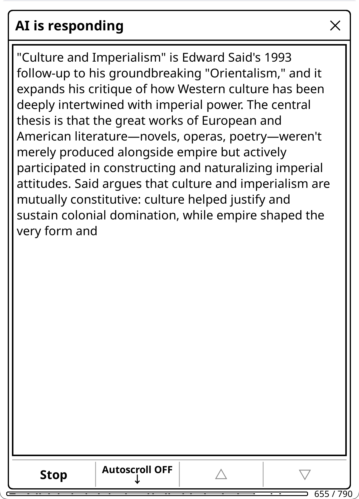</a>

When enabled, responses appear in real-time as the AI generates them.

- **Auto-scroll** (default): Follows new text as it appears. Automatically pauses when you swipe, use page buttons, or tap the scroll controls.
- **Page-based scroll** (default): Text fills the current page top-down, then advances to a blank page when full, minimizing full-screen e-ink refreshes. Disable for continuous bottom-scrolling.
- **Auto-Scroll toggle button**: Tap to stop/start auto-scrolling
- **Keep your place**: if auto-scroll is off or paused and you keep reading while the rest streams in, the finished chat opens at your spot instead of jumping to the newest reply (in Markdown it opens on the page holding your line; in Plain Text your line starts the view)

Works with all providers that support streaming.

### AI Book Tools (Experimental)

When chatting about an open book, the AI can call **local tools to look things up in the book on demand**, instead of answering only from book metadata and its own training knowledge. This grounds answers in what you've actually read, with real page references. Configured via **Settings → Advanced → AI Book Tools**.

- **What it does**: gives the AI three local tools — `search_book` (fuzzy text search), `read_around` (read a specific page range), and `toc` (table of contents) — and lets it call them before answering. The search and extraction run **on your device**; only the AI's own tool requests and the bounded text excerpts it asks for are sent to the provider (far less than dumping the whole book).
- **Two modes** (Settings → Advanced → AI Book Tools → mode):
  - **Gather-then-generate** (default): the AI quietly collects the passages it needs in a first phase (a small status window shows "Consulting book tools…" then "Searching the book…"), then **streams a normal answer** with those passages injected. Web search stays available during the answer. This is the recommended mode — you get grounded answers *and* streaming.
  - **Interactive**: the original agentic loop — the AI narrates as it searches and reads. Responses don't stream during the tool turns and web search is off, so expect a short wait before the answer appears.
- **On or off** (Settings → Advanced → AI Book Tools, default **OFF**): this decides whether the **Tools** chip in a book chat starts ON or OFF. The chip is always there when the session is eligible, so you can flip tools for a single chat with one tap, and the AI still decides per question whether to actually look anything up (a question answerable from knowledge triggers zero lookups). Users of the earlier three-way posture are migrated: "auto" becomes on, "manual" and "off" become off.

  Set it globally in Settings, or **per book** (Book Settings, or hold the Tools chip for a For-this-book / Global picker, which also carries the Lookup effort dial). The per-book value wins over the global one; the Tools chip wins for the current chat once you tap it.
- **Lookup effort dial** (quick / standard / thorough): caps how many lookups the AI may make per question — **quick** (2 turns / 4 calls), **standard** (4 / 8), **thorough** (6 / 16) — and tells the model its remaining budget so it plans its searches (broad → narrow) instead of being cut off mid-search.
- **Providers**: **Gemini**, **Claude (Anthropic)**, **OpenAI** (API or Subscription), and **OpenRouter**, plus **DeepSeek, Mistral, Groq, xAI, Fireworks, Qwen, Kimi** (and **Ollama** locally — a local model's capabilities are derived once from the model menu, e.g. on pick or via "Refresh model capabilities", before the Tools chip lights up) on tool-capable models. Providers/models without tool support automatically fall back to normal chat.
- **Requires** "Allow Text Extraction" — the tools read book text (see [Text Extraction and Double-gating](#text-extraction-and-double-gating)). A trusted provider also satisfies this.
- **Where it applies**: freeform chat and replies about an **open book** (book/highlight context), plus **Smart retrieval** for two context-aware actions (below). Not predefined artifact actions like X-Ray or Summary (those extract their own context and are deliberately kept tools-free, including their follow-up replies), and not general, library, or X-Ray chat.
- **Smart retrieval (as an action source)**: two highlight-context actions — **Explain in Context** and **Analyze in Context** — offer "Smart retrieval (AI searches the book)" as a fourth source in the scope/source popup (alongside full text / summary / AI knowledge). The AI gathers the passages relevant to your highlight and question, then answers from them. It is **preselected** when your session is tools-capable; the row is shown grayed with the reason when it isn't (unsupported provider, extraction consent off, book tools off, or a section/range scope). Picking "Full document" lets the tools read the whole book; picking "Up to current position" clamps them to where you are. Direct entry points (highlight long-press, dictionary) run the same gather silently, with no popup.
- **Spoiler-aware, structurally**: the tools respect your [Spoiler Protection](#spoiler-protection) setting *in code*. When protection is on (the default), they can only read **up to your current page** — the AI physically cannot read ahead. When it's off, they can read the **whole document** (useful for research papers, non-fiction, and finished books, where you *want* forward references).
- **Trust signal**: after tools run you'll see a "Searched the book — N lookups" indicator on the answer (per-message; toggleable, on by default), and the exact searches and page ranges are viewable via **Show Sources** in the chat viewer's gear menu — the same surface as web-search sources (see [Web Search](#web-search)).
- **Experimental**: work in progress; behavior may change. A **"Show Lookups (debug)"** toggle (Settings → Advanced → AI Book Tools) appends the tool lookups, raw tool results, and token usage directly to each answer — off by default; leave it off for clean production answers (the raw results can include book-text snippets).

### Prompt Caching

Prompt caching reduces costs and latency by reusing previously processed prompt prefixes. Most major providers support this automatically.

| Provider | Type | Savings | Notes |
|----------|------|---------|-------|
| Anthropic | Automatic | 90% | Top-level `cache_control`: the API places the breakpoint and advances it as the chat grows, so book text and prior turns cache too |
| OpenAI | Automatic | 90% | Min 1024 tokens |
| Gemini 2.5+ | Automatic | 90% | Min 1024-2048 tokens |
| DeepSeek | Automatic | Up to 90% | Disk-based, min 64 tokens |
| Groq | Automatic | 50% | Select models (Kimi K2, GPT-OSS) |

**What's cached**: The stable prefix of each request, the system message (behavior + domain + language instruction), plus conversation history from prior turns. Providers with automatic prefix caching (Anthropic, OpenAI, Gemini, DeepSeek) also cache the message history, so book text embedded in the first user message is cached on subsequent follow-ups.

**How it helps**: Each follow-up message resends the **entire conversation history** to the AI (system prompt + all prior messages and responses). Without caching, you'd pay full price for the entire payload every turn. With caching, previously seen content is processed at 10-50% of the normal rate.

**Best for**: Multi-turn conversations, especially those that started with large context (book text, summaries). The more stable content at the start of the conversation, the greater the savings.

### Document Artifacts

Thirteen actions produce **document artifacts**: persistent, per-book outputs you can browse anytime without re-running the action. All artifact types are viewable as standalone reference guides. The **Summary** artifact is additionally reusable as a document source. Actions with source selection let you choose the compact summary (~few thousand tokens) instead of full document text (~100K+ tokens).

**Artifact types:**

| Artifact | Generated by | What it contains | Primary use |
|----------|-------------|------------------|-------------|
| **Summary** | Document Summary | Neutral, comprehensive document representation | **Primary artifact for reuse.** Available as a document source in actions with source selection, replacing raw book text with a compact summary. Also useful on its own as a reading reference. |
| **X-Ray** | X-Ray action | Structured JSON. Fiction: characters, locations, themes, lexicon, timeline; non-fiction: key figures, core concepts, arguments, terminology, argument development; academic ([Research Mode](#research-mode)): key concepts, foundations, methodology, findings, referenced works, technical terms, figures & data | **Browsable menu** with categories, search, chapter/book mention analysis, per-item chapter distribution, linkable cross-references, highlight integration. Requires text extraction. Also available as supplementary context in custom actions. |
| **X-Ray (Simple)** | X-Ray (Simple) action | Prose overview: characters, themes, settings, key terms, where things stand | **Text viewer**, prose companion guide from AI knowledge. No text extraction needed. Separate cache from X-Ray; both can coexist. |
| **Recap** | Recap action | "Previously on..." story refresher | **Text viewer**, helps you resume reading where you left off. Supports incremental updates as you read further. |
| **Analysis** | Document Analysis | Opinionated deep analysis of the document | Viewable analytical overview. *Not recommended as input for further analysis*, analyzing an analysis is a decaying game of telephone where each layer loses nuance. |
| **About** | About action | Reader-oriented overview from AI knowledge | **Text viewer**, background, reception, and reading context. No text extraction needed. Uses web search when enabled for current information. |
| **Analyze Notes** | Analyze Notes action | Analysis of your highlights and annotations | **Text viewer**, patterns in what you've been noting, reading engagement analysis. Updates as you add more notes. |
| **Key Arguments** | Key Arguments action | Thesis, evidence, assumptions, counterarguments | **Text viewer**, source selection (full text / summary / AI knowledge). Supports section scope. |
| **Counterarguments** | Counterarguments action | Prosecutes the case against the work: steelmanned opposing positions, the argument's weakest links, what would falsify it, and who disagrees and why | **Text viewer**, source selection (full text / summary / AI knowledge). Supports section scope. The adversarial counterpart to Key Arguments — that one maps the argument, this one argues back. |
| **Discussion Questions** | Discussion Questions action | Comprehension, analytical, interpretive, personal questions | **Text viewer**, source selection. Supports section scope. |
| **Quiz** | Quiz action | Interactive one-at-a-time viewer with scoring | **Quiz viewer**, source selection. Supports section scope. Auto-trigger at chapter ends. |
| **Reading Guide** | Reading Guide action | Spoiler-free guide: threads, patterns, context, approach | **Text viewer**, source selection. Supports section scope. Updates as you read further. |
| **Key Insights** | Extract Key Insights action | Important takeaways, novel perspectives, actionable conclusions | **Text viewer**, source selection. Supports section scope. |

Beyond these thirteen generated artifacts, **AI Wiki** entries (generated from the X-Ray browser or from highlighted text) are also stored as cached artifacts and appear in the Artifact Browser. **Generated images** are indexed per book and surfaced alongside artifacts as a "Generated Images" group. You can also **pin any chat's last response as a named pseudo-artifact** using the Pin / ★ button in the chat viewer. Pinned artifacts appear alongside generated ones in the Artifact Browser and artifact cross-navigation, using your chosen name. See [Starring & Pinning](#starring--pinning) for details.

**Viewing artifacts:**
- **Quick Actions** → Tap any artifact action. If a cache exists, a View/Update/Regenerate popup appears; if not, generation starts directly. "View Artifacts" button appears when any artifacts exist, opening a picker.
- **File Browser** → Long-press a book → "View Artifacts (KOA)" → pick any cached artifact
- **Book Hub** → The book's own page: every artifact it has, plus Chat, Chat History, Notebook, Group, and Book Settings in one full-screen list, with rows refreshing in place as you generate things. See [Book Hub](#book-hub).
- **Artifact Browser** → Browse all documents with cached/pinned artifacts. Access from Chat History or Notebook browser hamburger menus (☰), or the KOAssistant menu → Browse Artifacts.
  - **Top sections**: General Pinned and Library Pinned appear at the top when pinned artifacts exist in those contexts
  - **Per-book entries**: Show combined count of generated artifacts + pinned artifacts (a book with only generated images also appears, via the images index)
  - **Tap** → Artifact selector popup: Summary, X-Ray, etc., plus section groups ("View Section X-Rays (N)", "View Section Summaries (N)", etc.), **"Previous X-Ray Versions (N)"** (archived X-Ray snapshots, shown right under the X-Ray row when history exists — see [X-Ray version history](#reading-analysis-actions)), **"Generated Images (N)"** (opens the gallery filtered to this book), "AI Wiki Entries (N)", and "Pinned Artifacts (N)" when they exist, plus **"Book Hub…"** (the book's full-screen home page) and "Open Book". Group popups (sections, versions, images, AI Wiki, Pinned) layer over the artifact selector; dismiss to return to the selector
  - **Hold** → Options popup: "View", "Delete All", "Cancel"
  - **Hamburger menu** (☰) → Navigate to Chat History or Browse Notebooks
- **Gesture** → Add artifact actions to gesture menu via Action Manager (hold action → **+ Gesture Menu**)
- **Coverage**: The viewer title shows coverage percentage if the document was truncated (e.g., "Summary (78%)")

**Artifact viewer buttons:**
- **Row 1**: Copy, Artifacts (cross-navigate to other cached artifacts for the same book), Export, navigation
- **Row 2**: → Chat, MD/Text toggle, Info, Update/Regenerate (when book is open) or Open Doc (when viewing from file browser), Delete, Close

**→ Chat:** Tapping "→ Chat" opens a reply box on top of the artifact viewer. Type your question and hit Send. The artifact viewer closes and a direct chat opens with the AI, using the artifact content as context. The AI knows this is a previously generated artifact (not the book text itself). The resulting chat saves as a regular book chat with full Reply, Save, and Export capabilities.

X-Ray artifacts open in a **browsable category menu** (see [Reading Analysis Actions](#reading-analysis-actions) for details); all other artifacts open in the text viewer. Legacy markdown X-Rays fall back to the text viewer. Position-relevant artifacts (X-Ray, X-Ray Simple, Recap, Analyze Notes, Reading Guide) show "Update" in the viewer and popup; position-irrelevant artifacts (Summary, Analysis, About, Key Arguments, Counterarguments, etc.) show "Regenerate".

> **Cache source tracking:** Each artifact records metadata about how it was generated: data source (extracted text vs AI training knowledge), model used, generation date, and whether reasoning or web search was used. The Info button in the artifact viewer shows all metadata. Artifacts built without text extraction use the AI's training knowledge. This works well for popular books but may be less accurate for obscure works. You can always regenerate with text extraction enabled for higher quality.

#### Caching

All artifact results are cached per book. X-Ray and Recap additionally support **incremental updates**: as you read further, the AI builds on its previous analysis rather than starting from scratch.

**How incremental caching works (X-Ray):**
1. Run X-Ray at 30% → Full structured JSON analysis generated and cached
2. Continue reading to 50%
3. Tap X-Ray again → A popup shows **View X-Ray (30%, today)** and **Update X-Ray (to 50%)**. If a background checkpoint is already built, the paid update is replaced by a free **"Update to N%, instant"** row; extending to the whole book is a coverage option in the **Extend…** chooser
4. Choose Update → Only the new content (30%→50%) is sent along with an index of existing entities. The AI outputs only new or changed entries.
5. Diff-based merge: new entries are name-matched and merged into existing data (entities update in place, timeline events append, state summaries replace). ~200-500 output tokens vs 2000-4000 for full regeneration.
6. Result: Faster responses, lower token costs, continuity of analysis

**Extending to the whole book** takes an incremental X-Ray to the end of the document on the same incremental track and schema — pick "The whole book" in the **Extend…** chooser. This is *not* a complete X-Ray, it's the incremental track at full coverage. When a completed checkpoint has already been built in the background, a free **"Switch to complete version (100%), instant"** row installs it instead, with no API call.

**Complete X-Ray caching:** Complete (entire document) X-Rays are cached but don't support incremental updates; redoing always generates fresh. The cache is labeled "Complete" instead of a percentage.

**Section X-Ray caching:** Section X-Rays are stored alongside the main X-Ray cache. Each is independent: you can have multiple Section X-Rays per book plus the main X-Ray. Section X-Rays are always complete (no incremental updates) since they analyze a bounded page range. They store XPointers for font-size-independent page reconversion (EPUB only). When you're reading within a section's page range, a quick-access "View" button appears directly in the X-Ray popup. All sections are also browsable via the "View Section X-Rays (N)" group button.

**View/Update popup:** Appears everywhere you can trigger an artifact action: Quick Actions panel, gestures, and the book chat input field action picker. For X-Ray specifically, if no cache exists yet, the popup offers "Create X-Ray…" (coverage and build-style chooser). For non-incremental actions, the popup shows "View" and "Redo" or "Regenerate". Reading Guide shows "Update to X%" when your reading position advances. All action popups also surface in-range section artifacts.

**Keeping the X-Ray current:** there is no nagging popup. The X-Ray popup and the browser's options menu (☰) show what's available right now: a free instant install when a background checkpoint is ready, a paid update to your exact position when it isn't, and the versions list. (The no-results screen of a lookup still hints that updating may find the entry.)

> **Automatic X-Ray upkeep (opt-in):** X-Ray can also **auto-update in the background** as you read (a silent request path that keeps the cache close to your position without prompting) and **auto-create** the first X-Ray early in a book. Prior X-Ray states are archived to a rolling **version history** — browse, restore, or delete earlier versions (with a configurable keep-count), which is handy for re-reads. These are opt-in; see [Reading Analysis Actions](#reading-analysis-actions).

**X-Ray format:** X-Ray results are stored as structured JSON with type-specific categories (fiction, non-fiction, or academic, see [Reading Analysis Actions](#reading-analysis-actions)) plus status sections (Current State/Current Position/Conclusion). The JSON is rendered to readable markdown for chat display and `{xray_cache_section}` placeholders, while the raw JSON powers the browsable menu UI. Legacy markdown X-Rays from older versions are still viewable but will be replaced with JSON on the next run. Academic type is automatically selected when [Research Mode](#research-mode) detects a DOI.

> **X-Ray (Simple) caching:** X-Ray (Simple) results are cached as a separate artifact alongside X-Ray. Unlike X-Ray, it doesn't support incremental updates; every generation is fresh. When your reading position advances, the "View/Update" popup lets you update (regenerate at the new position). Both X-Ray and X-Ray (Simple) can coexist for the same book.

**Cache storage:**
- Stored in the book's sidecar folder (`.sdr/koassistant_cache.lua`)
- Automatically moves with the book if you reorganize your library
- Deleted with the book if you delete it via KOReader's file manager

**Deleting artifacts:**
- **Per-action**: In the artifact viewer, use the Delete button. For X-Ray specifically: options menu → "Delete X-Ray" (or "Delete Section X-Ray" for sections). Deleting the main X-Ray also clears all associated AI Wiki entries.
- **All actions for book**: Settings → Privacy & Data → Text Extraction → Delete Book Artifacts (requires book to be open)
- Either option forces fresh generation on next run (useful if analysis got off track, or to switch between incremental and complete tracks)

**Requirements:**
- Actions requiring text extraction (X-Ray, Document Summary, Document Analysis, Recap) must be run from reading mode (not file browser)
- Sidecar-eligible actions (X-Ray Simple, Analyze Notes, etc.) can be run from file browser; they read highlights, annotations, notebook, and progress from disk
- Progress must advance by at least 1% to trigger an incremental update (incremental track only)
- X-Ray, Document Summary, and Document Analysis require text extraction; Key Arguments, Counterarguments, Discussion Questions, Quiz, Reading Guide, and Extract Key Insights support source selection (full text / summary / AI knowledge); Recap and Analyze Notes work without text extraction

**Limitations:**
- Only X-Ray and Recap support incremental caching (all other artifact actions cache results but regenerate fresh). Reading Guide tracks reading progress ("Update to X%") but regenerates fully each time
- Complete X-Rays and Section X-Rays don't support incremental updates (always fresh generation)
- Section X-Rays require an open book with a TOC (not available from file browser)
- Going backward in progress doesn't use cache (fresh generation)
- X-Ray cannot be duplicated (its JSON output requires the X-Ray browser). All other actions can be duplicated; they work as one-shot chat actions but don't inherit caching or incremental update behavior
- Legacy markdown X-Ray caches are still viewable but will be fully regenerated on the next run, producing the new JSON format
- To switch between incremental and complete tracks, delete the cache and regenerate

#### Summary as Reusable Source

The summary artifact enables a "generate once, use many times" workflow. For medium and long texts, sending full document text (~100K+ tokens) for each action is expensive and sometimes not possible for large documents. The pattern:

1. **Generate a summary once** via Document Summary → saved as a reusable artifact (~2-8K tokens)
2. **Actions with source selection** let you choose the summary as the document source
3. **Result**: Massive token savings AND often better responses for repeated queries

When you trigger an action with source selection, a unified popup lets you choose scope (full document or a specific section) and source (extract text, use summary, or AI knowledge only). Tools-capable sessions add a fourth **Smart retrieval** source for the two context-aware pilot actions (see [AI Book Tools](#ai-book-tools-experimental)). See [Highlight Mode](#highlight-mode) for the full list of actions and details.

**Creating custom actions with source selection:**
Add `source_selection = true` and `use_summary_cache = true` to your action, and use `{document_context_section}` as the unified placeholder. It resolves automatically based on the user's source choice.

**Token savings example:**
- Raw book text: ~100,000 tokens per query
- Cached summary: ~2,000-8,000 tokens per query
- For 10 highlight queries: ~1M tokens saved

**Multi-turn savings:** The difference compounds in conversations. Each follow-up resends the full history, so starting at 100K vs 5K tokens means every subsequent turn is 95K tokens cheaper, even before accounting for provider prompt caching.

**Using artifacts in custom actions:**

Three artifacts can be referenced in custom actions using `{summary_cache_section}`, `{xray_cache_section}`, or `{analyze_cache_section}` placeholders. (X-Ray (Simple) is not available as a placeholder, it's a standalone prose overview, not structured data for reuse.) The **summary** is the recommended choice for most custom actions. The X-Ray and Analyze placeholders are there for advanced users who want to experiment; artifact placeholders disappear when empty, so including them is always safe. See [Tips for Custom Actions](#tips-for-custom-actions) for usage guidance.

**Example: Create a "Questions from X-Ray" action**
1. Enable **Allow Text Extraction** (and optionally **Allow Highlights**) in Settings → Privacy & Data
2. Run **X-Ray** on a book (this populates the artifact)
3. Create a custom action with prompt: `Based on this analysis:\n\n{xray_cache_section}\n\nWhat are the 3 most important questions I should be thinking about?`
4. Check "Allow text extraction" and "Include highlights" in the action's permissions
5. Run your new action, it uses the cached X-Ray without re-analyzing

If you haven't run X-Ray yet, the placeholder renders empty and the action still runs, just without the analysis context. Permission requirements for the placeholder depend on how the X-Ray was built, see [Cache permission inheritance](#text-extraction-and-double-gating) above.

> **Tip**: For documents you'll query multiple times, generate the summary proactively via Document Summary (Quick Actions). The artifacts are also convenient in themselves: browse a book's X-Ray to look up characters (with aliases and connections), tap references to navigate between related items, check who appears in the current chapter, search for any entry, or use "Look up in X-Ray" to instantly search cached data while reading. Review the Analysis for a refresher on key arguments, or skim the Summary before resuming a book you haven't read in a while.

**Text extraction guidelines:**
- ~100 pages ≈ 25,000-40,000 characters (varies by formatting)
- Default limit: 4,000,000 characters (~1M tokens), configurable up to 10,000,000
- Default page limit (PDF, DJVU, CBZ, etc.): 2,000 pages, configurable up to 5,000
- The 4M default handles most books with Gemini's 1M-token context. For smaller models (Claude ~200K tokens, GPT-5.4-mini ~128K tokens), you may want to lower it, or rely on the large extraction warning (see below)
- **The extraction limit is not the bottleneck, your model's context window is.** If the extracted text exceeds what your model can handle, the API will reject the request. A **large extraction warning** dialog appears before sending requests over 500K characters (~125K tokens), giving you a chance to cancel. You can dismiss it permanently via the dialog or in Settings → Privacy & Data → Text Extraction → Don't warn about large extractions
- **Truncation warning:** If extracted text exceeds the character limit and gets truncated, a blocking dialog appears before sending, showing the coverage range (e.g., "covers 0%–85% of the document") with Cancel, Continue Anyway, or Don't warn again. The truncation warning fires before the large extraction warning; each is independent and has its own suppress setting. You can also dismiss it permanently in Settings → Privacy & Data → Text Extraction → Don't warn about truncated extractions
- **Use KOReader's Hidden Flows** to exclude front matter, appendices, endnotes, and other irrelevant content. This reduces token usage and improves AI results without lowering extraction limits. See the [Hidden flows support](#reading-analysis-actions) note above
- **Two extraction types:** `{book_text_section}` extracts from start to current position (spoiler-safe, used by X-Ray/Recap only), `{full_document_section}` extracts the entire document regardless of position (used by all other text extraction actions)

#### Context Windows and Extraction Limits

The max extraction setting is a safety cap, not a target. The default (4M chars) is sized for Gemini's 1M-token context; smaller models will hit their limit well before this. A **large extraction warning** appears at 500K characters (~125K tokens) to alert you before this happens. Here's roughly what each provider supports:

| Provider | Context Window | Max English Text (~4 chars/token) |
|----------|---------------|----------------------------------|
| Gemini 2.5/3 (Pro & Flash) | 1M tokens | ~4M chars — handles any book |
| Claude (Sonnet 5, Sonnet 4.6) | 1M tokens | ~4M chars — handles any book |
| Claude (Haiku 4.5) | 200k tokens | ~800k chars — most novels |
| OpenAI (GPT-5.6 family) | ~1M tokens | ~4M chars |
| OpenAI (GPT-5.5, GPT-5.4) | 400k tokens | ~1.6M chars |
| DeepSeek (V4) | 1M tokens | ~4M chars — handles any book |
| Others (Mistral, Qwen, etc.) | 32k-128k tokens | ~130k-500k chars |

> **CJK/non-Latin text** tokenizes less efficiently (~2 chars/token), roughly halving these estimates.

**Cost per request** (input only, English):

| Model | 250k chars (~60k tok) | 500k chars (~125k tok) | 1M chars (~250k tok) |
|-------|----------------------|----------------------|---------------------|
| Gemini 2.5 Flash | $0.02 | $0.04 | $0.08 |
| DeepSeek V4 | $0.02 | $0.04 | $0.07 |
| Claude Haiku 4.5 | $0.06 | $0.13 | exceeds context |
| GPT-5.4-mini | $0.16 | $0.31 | $0.63 |
| Claude Sonnet 5 / 4.6 | $0.19 | $0.38 | $0.75 |
| Gemini 2.5 Pro | $0.08 | $0.16 | $0.38 |
| Claude Opus 4.8 | $0.31 | $0.63 | $1.25 |
| GPT-5.5 | $0.63 | $1.25 | $2.50 |

> Prompt caching reduces repeated costs by 50-90% on cached portions (see [Prompt Caching](#prompt-caching)). Each follow-up in a conversation resends the full history, but providers cache the stable prefix (system prompt + prior messages), so you pay reduced rates for previously seen content. New content each turn (your latest question + the AI's response from the previous turn) is charged at full rate.

**Tips to avoid exceeding your model's context window:**

- **Use Hidden Flows**, KOReader's Hidden Flows feature lets you exclude front matter, appendices, endnotes, and other irrelevant content from extraction. This saves tokens and improves AI results without lowering extraction limits. Particularly useful for collected works, annotated editions, or books with lengthy apparatus
- **Use response caching**, run X-Ray/Recap early in your reading. Subsequent runs send only new content since the last cached position, not the entire book again. Starting X-Ray at 80% on a long novel sends the whole 80% at once; starting at 10% and running periodically keeps each request small
- **Choose "Document summary" as source**, actions with source selection let you use the cached summary (~2-8K tokens) instead of raw book text (~100K+ tokens). Since each follow-up resends the full conversation history, a smaller initial context leaves much more room for extended discussions and keeps per-turn costs low
- **Use Smart retrieval**, on tools-capable sessions the AI can pull just the passages it needs for a targeted question instead of loading the whole document (see [AI Book Tools](#ai-book-tools-experimental))
- **Lower the extraction limit** if your model is small, Settings → Privacy & Data → Text Extraction → Max Text Characters. Match it to your model's context window rather than leaving it at the default
- **The max limit (10M chars) exists for future large-context models.** The default (4M chars) is sized for Gemini's 1M-token context. Most other models will never need more than 500k-800k chars. The large extraction warning at 500K chars helps you catch oversized requests before they fail
- **Keep conversations focused**, each follow-up adds the AI's previous response and your new message to the history, and the entire history is resent every turn. For actions that used large context (full book text), consider starting a new chat rather than extending a very long conversation. The plugin warns you when conversation context exceeds ~50K tokens

**Output-limit self-heal:** if a provider rejects a request because the requested output length is above what that model allows, and the error states the real limit, the plugin retries once at the stated value instead of failing, and remembers the limit for that model. Context-overflow errors (the input being too long) are also retried once when the provider states how much completion room is left, but that value is never remembered — it depends on this request's prompt length.

### Reasoning/Thinking

For complex questions, many models can "think" through the problem before responding. Reasoning increases latency and token usage but can significantly improve results for complex tasks like X-Ray generation, deep analysis, and nuanced questions.

Reasoning is controlled **per model**, not by a single global switch. Every model has its own reasoning nature — some always reason, some can't, some are off by default, some on — and KOAssistant respects that. You steer it with two controls:

**1. Global stance** (Settings → Advanced → Reasoning, or the Reasoning chip in the Quick Settings panel). One dial applied to every model, *as far as each model allows*:
- **Minimal** — off where the model can be turned off; otherwise its lowest setting.
- **Default** — each model's normal behavior; nothing is forced. This is the default for everyone.
- **Maximum** — the model's deepest reasoning.

Because the stance respects each model's capability, "Minimal" genuinely turns reasoning *off* on models that support it (DeepSeek V4, Gemini 2.5, Claude, GPT-5.4, …) and dials always-on models (Perplexity, GPT-5.5, Grok) down to their lowest effort. It never claims a model is off when it isn't.

**2. Per-model overrides** (Settings → Advanced → Reasoning → Per-model reasoning). Pick a provider, then a model, then set its reasoning explicitly: **Follow global** (the default — defer to the stance), **Model API default** (pin this model to its own natural behavior, regardless of the stance), **Off** (where supported), or a specific level (effort/depth/budget, depending on the model). Only models you can actually configure are listed, and each row shows both your setting and what it resolves to (e.g. `Follow global → High`).

The Reasoning chip in the Quick Settings panel shows the **effective** state for your current model (e.g. "Model default", "Off", "High") and opens a two-tab popup: **Global** (the stance dial alone) and **Current model** (that model's own controls, plus an **"Other models…"** browser to reach any configurable model without leaving the panel).

**Quick Answer and reasoning:** tapping the input dialog's **⚡ Quick** chip applies the Quick Answer preset, which turns reasoning off for that chat by default (its "Turn Reasoning Off" component; Settings → Chat & Export → Quick Answer Preset). This never changes your global stance or per-model settings (see [Managing the Input Dialog](#managing-the-input-dialog)).

**Precedence** (highest wins): per-action setting → the Quick Answer preset's reasoning-off (while Quick is on for the chat) → per-model override → global stance → the model's natural default.

**What each model can do:**

| Model family | Nature | Control |
|---|---|---|
| Claude Sonnet 5, Opus 5 | Adaptive, **on** by default | Off / effort (low…max, incl. xhigh) |
| Claude Fable 5 | Adaptive, always on | Effort (low…max, incl. xhigh); can't be fully disabled |
| Claude Opus 4.8 / 4.7 / 4.6, Sonnet 4.6 | Adaptive, off by default | Off / effort (low…high; Opus adds xhigh, max) |
| Claude Haiku 4.5 | Extended thinking, off by default | Off / budget level (low…max) |
| Gemini 3 (3.7/3.6/3.5-flash, 3.1-pro) | Thinks by default | Effort/depth (minimal…high); can't be fully disabled |
| Gemini 3 flash-lite (3.5, 3.1) | Off by default | Off / effort (minimal…high) |
| Gemini 2.5-flash | Thinks by default | Off / budget (dynamic…max) |
| OpenAI GPT-5.6 family, GPT-5.4 family | Off by default (gated) | Off / effort (low…xhigh) |
| OpenAI GPT-5.5 | Reasons by default | Effort (low/medium/high); can't be fully disabled |
| DeepSeek V4, Z.AI GLM-4.7+, SambaNova DeepSeek-V3.x | Thinks by default | On / Off |
| xAI Grok 4.6 | Reasons by default | Effort (low/medium/high); can't be fully disabled |
| xAI Grok 4.5 / 4.3 / 4.20-reasoning | Reasons by default | Off / effort (low/medium/high) |
| Perplexity Sonar, Groq, Together, Fireworks reasoning models | Always reason | Effort only (low/medium/high) |
| Mistral Magistral | Always reasons, no control | — (thinking is extracted and viewable) |

> Temperature is forced to 1.0 automatically where a model's reasoning requires it (Claude adaptive/extended, Z.AI thinking). Opus 5, Fable 5, Sonnet 5, Opus 4.8, and Opus 4.7 reject sampling parameters entirely; the plugin strips them.

**Viewing reasoning:** When a model returns its thinking (Anthropic, Gemini, DeepSeek, Z.AI, Mistral, and R1-style `<think>`-tag models on Groq/Together/Fireworks/SambaNova/Ollama/Perplexity), it's captured and viewable via the **Show Reasoning** button in the chat viewer gear menu. A "*[Reasoning was used]*" indicator appears in chat when enabled (Settings → Advanced → Reasoning → Show Indicator in Chat).

**Per-action overrides:** Any action can override reasoning for specific providers via Action Manager → hold action → Edit Settings → Advanced → Per-Provider Reasoning. This is the top layer — it wins over the global stance, per-model overrides, and session one-shots. Several built-in actions (e.g. Translate, Quick Define, Dictionary, Summarize) deliberately force reasoning off because the task doesn't benefit from it. See [Tuning Built-in Actions](#tuning-built-in-actions).

### Web Search

Supported providers can search the web to include current information in their responses.

| Provider | Feature | Notes |
|----------|---------|-------|
| **Anthropic** | `web_search_20250305` tool | All models; the effort dial sets max searches (2 / 5 / 10) |
| **OpenAI** | Native web search (Responses API) | GPT-5 models; the effort dial sets search context size |
| **OpenAI Subscription** | Native web search (Responses API via the Codex backend) | Same GPT-5 models and effort mapping as OpenAI |
| **Gemini** | Google Search grounding | Search-grounding-capable models; search count automatic. **Free-tier keys: grounding on Gemini 3.x models is rejected** (instant "quota exceeded" 429 even when plain requests work) -- use a 2.5 model for web search on a free key (only possible on Google accounts old enough to still have 2.5 models), switch provider, or add paid credits (confirmed to lift the limit). The error dialog offers "Try again without web search" |
| **xAI** | Live search (Responses API) | Grok-4 models (search decided automatically) |
| **OpenRouter** | Exa search via `:online` suffix | Works with all models (~$0.02/search); effort sets result count (3 on Light, provider default on Standard, 10 on Thorough) |
| **Z.AI** | `web_search` tool on the chat wire | All models; results come back with links and titles. The search engine is pickable (Settings → Advanced → Provider Settings → Z.AI Search Engine; the API's own default returns poor sources for non-Chinese queries) |
| **Qwen** | DashScope `enable_search` | All models; the provider injects results server-side and reports no sources, so there's nothing to show under Show Sources |
| **Perplexity** | Built-in Sonar web search | On by default (the Web chip starts ON for this provider), but it can be turned off per chat or per book; the effort dial sets search context size |

Providers not listed here currently ignore web search and fall back to normal responses.

**How it works:**
1. Set a global default in Settings → Advanced → Web Search → Enable Web Search, or toggle it per chat with the **Web** chip in the input dialog.
2. When active, the AI can search the web during its response.
3. During streaming, you'll see a "Searching the web..." indicator (with 🔍 prefix when [Emoji Menu Icons](#display-settings) enabled). Any prose the AI writes before searching stays visible, followed by an inline **"*[Searched the web]*"** marker so you can see where the search happened.
4. After completion, "*[Web search was used]*" appears in chat and artifact viewers (if the indicator is enabled), and the actual URLs and search queries are viewable via **Show Sources** in the chat viewer's gear menu.

**Web Search Effort dial** (Settings → Advanced → Web Search): **Light** (fewest searches — fastest, cheapest), **Standard** (provider defaults), or **Thorough** (most searches and context — slower, costlier). It maps to each provider's own control where one exists: Anthropic max searches (2 / 5 / 10), OpenAI (API and Subscription) and Perplexity search context size, OpenRouter result count, Z.AI result count and snippet size. Gemini and xAI decide automatically. You can also set the depth **per book**: hold the **Web** chip and use the "Search depth" row.

**Show Sources / provenance:** when a response used web search, the sources it consulted (page titles + URLs) and the queries it ran are captured and persist with the chat. Open **Show Sources** from the chat viewer's gear menu (the same surface that lists AI Book Tools lookups) — right next to **Show Reasoning**.

**Settings:**
- **Enable Web Search**: Global default (default: OFF)
- **Web Search Effort**: Light / Standard / Thorough (default: Standard)
- **Show Indicator in Chat**: Show "*[Web search was used]*" after responses (default: ON)

**Quick Toggle:**
- **Web chip** (input dialog session chips row): **tap** toggles web search for the current chat only — it no longer flips your persistent global setting. **Hold** opens a For-this-book / Global picker so you can pin web search on or off for a specific book. Action button labels reflect the effective state: forced-on actions show 🌐, actions that follow the effective setting show (🌐).
- **Chat viewer**: the reply window carries the same chips row, including a **Web** chip that overrides web search for that chat without changing your global default (it reads "Web N/A" when the current provider cannot search).

**Per-Action Override:**
Custom actions can override the effective setting:
- `enable_web_search = true` → Force web search on (example: **News Update** built-in action)
- `enable_web_search = false` → Force web search off
- `enable_web_search = nil` → Follow the effective setting (default)

The built-in **News Update** action demonstrates this. It uses `enable_web_search = true` to fetch current news even when web search is otherwise off. See [General Chat](#general-chat) for how to add it to your input dialog.

**Layering** (highest wins): per-action flag → per-chat Web chip → per-book override → global default.

**Research Mode override:** When a DOI is detected ([Research Mode](#research-mode)), actions like X-Ray and Summarize that normally force web search off (`enable_web_search = false`) are changed to follow your web search setting instead. If you have web search enabled, academic papers automatically get web-enriched analysis. See [Research Mode](#research-mode).

**Best for:** Questions about current events, recent developments, fact-checking, research topics.

**Note:** Perplexity searches by default, but the Web toggle can now genuinely turn search off for a chat or a book. For other providers, web search increases token usage and may add latency. Unsupported providers silently ignore this setting.

**Troubleshooting OpenRouter:**
- OpenRouter routes requests to many different backend providers, each with their own streaming behavior
- If you experience choppy streaming or unusual behavior with web search enabled, try turning web search off for that session (Web chip)
- See [Meta-Providers Note](#meta-providers-note) for more details

---

## Supported Providers + Settings

KOAssistant supports **29 built-in AI providers** — a **curated set** the maintainer tests with real keys and automated probes, and a **community set** (marked `*` in the plugin and *Docs-based* below) implemented from provider documentation — plus any number of custom OpenAI-compatible providers you add yourself (OpenAI is listed twice below: once for API keys, once for ChatGPT-subscription login). Please test and give feedback -- fixes are quickly implemented. If you use a Docs-based provider and want it properly verified, you can also send a limited/spending-capped API key to the contact email on the maintainer's GitHub profile -- live probing is exactly what promotes a provider into the tested set

| Provider | Description | Status | Get API Key |
|----------|-------------|--------|-------------|
| **Anthropic** | Claude models (primary focus) | Tested | [console.anthropic.com](https://console.anthropic.com/) |
| **OpenAI** | GPT models | Tested | [platform.openai.com](https://platform.openai.com/) |
| **OpenAI Subscription** | GPT models via your ChatGPT plan's Codex access (device login; no API key, no API credits; unofficial) | Tested | [Quick Setup, Option C](#2-add-your-api-key) |
| **DeepSeek** | Cost-effective reasoning models | Tested | [platform.deepseek.com](https://platform.deepseek.com/) |
| **Gemini** | Google's Gemini models | Tested | [aistudio.google.com](https://aistudio.google.com/) |
| **Ollama** | Local models (no API key needed) | Tested | [ollama.ai](https://ollama.ai/) |
| **Groq** | Extremely fast inference | Docs-based* | [console.groq.com](https://console.groq.com/) |
| **Fireworks** | Fast inference for open models; book tools supported | Tested | [fireworks.ai](https://fireworks.ai/) |
| **SambaNova** | Fastest inference; small free tier (3 models, 20 requests/day) | Docs-based* | [cloud.sambanova.ai](https://cloud.sambanova.ai/) |
| **Together** | 200+ open source models | Docs-based* | [api.together.xyz](https://api.together.xyz/) |
| **Mistral** | European provider, coding models | Tested | [console.mistral.ai](https://console.mistral.ai/) |
| **xAI** | Grok models, up to 1M context | Tested | [console.x.ai](https://console.x.ai/) |
| **OpenRouter** | Meta-provider, 500+ models | Tested | [openrouter.ai](https://openrouter.ai/) |
| **Requesty** | OpenAI-compatible model router | Docs-based* | [requesty.ai](https://requesty.ai/) |
| **Cohere** | Command models | Tested | [dashboard.cohere.com](https://dashboard.cohere.com/) |
| **Qwen** | Alibaba's Qwen models; book tools on `qwen3-max` | Tested | [modelstudio.console.alibabacloud.com](https://modelstudio.console.alibabacloud.com/) (international; CN console differs) |
| **Kimi** | Moonshot models | Tested | [platform.moonshot.ai](https://platform.moonshot.ai/) (international; platform.moonshot.cn for the China region setting) |
| **Doubao** | ByteDance Volcano Engine | Docs-based* | [console.volcengine.com](https://console.volcengine.com/) |
| **Z.AI** | GLM models, free tier available | Tested | [z.ai](https://z.ai/) |
| **Perplexity** | Sonar models, built-in web search with citations | Tested | [perplexity.ai](https://www.perplexity.ai/settings/api) |
| **NVIDIA** | Nemotron family + hosted open models; generous free tier, no card. Book tools on selected models; **no web search** (NVIDIA's API provides none) | Tested | [build.nvidia.com](https://build.nvidia.com/) |
| **Cerebras** | Very fast open-model inference (hosts gpt-oss) | Docs-based* | [cloud.cerebras.ai](https://cloud.cerebras.ai/) |
| **MiniMax** | MiniMax M-series models | Docs-based* | [platform.minimax.io](https://platform.minimax.io/) |
| **DeepInfra** | Many open models, low prices | Docs-based* | [deepinfra.com](https://deepinfra.com/) |
| **Novita AI** | Open-model marketplace | Docs-based* | [novita.ai](https://novita.ai/) |
| **Hyperbolic** | Open-model host | Docs-based* | [app.hyperbolic.xyz](https://app.hyperbolic.xyz/) |
| **Nebius AI Studio** | Open-model host | Docs-based* | [studio.nebius.com](https://studio.nebius.com/) |
| **Chutes** | Decentralized GPU marketplace | Docs-based* | [chutes.ai](https://chutes.ai/) |
| **Featherless** | Huge open-model catalog | Docs-based* | [featherless.ai](https://featherless.ai/) |
| **Vercel AI Gateway** | 200+ models behind one key | Docs-based* | [vercel.com](https://vercel.com/) |

> **\*Tested vs docs-based:** *Tested* providers are covered by the maintainer's own API keys and automated probe/test tooling. *Docs-based* providers are implemented from their official documentation and user reports — they should work the same way, but the maintainer holds no key for them, so regressions can go unnoticed until someone reports them (fixes are quick once reported).
>
> **You can help promote a docs-based provider to tested:**
> - **Test and report** — try it and open an issue with what worked and what didn't (a screenshot of any error message is gold), or
> - **Donate a test key** — send a limited-spend, revocable API key to the contact email on the maintainer's GitHub profile. It only needs a few cents of quota to join the automated probe battery, and you can revoke it anytime.

> **Free & Low-Cost Options**
>
> Several providers offer free tiers perfect for testing or budget-conscious use:
> - **Groq**: nearly all models free, no card (per-model limits, ~30 requests/min)
> - **Gemini**: Flash-class models free, no card (Pro models are paid-only)
> - **Ollama**: completely free (runs locally on your hardware)
> - **Mistral**: free tier covers all its models (~1B tokens/month, phone verification)
> - **OpenRouter**: rotating `:free` models -- 50 requests/day, or 1,000/day after a one-time $10 top-up
> - **Z.AI**: GLM-4.7-Flash is free
> - Already paying for ChatGPT? Use your plan here instead of API credits -- see [Using a Subscription](#using-a-subscription-instead-of-api-credits)
>
> See details below.

> **Tip:** Provider and model pickers only list providers you've actually configured an API key for (plus keyless/local providers like Ollama and any custom provider you marked as not needing a key). Once you've added at least one key, the rest are tucked behind a **"Show all providers"** row so the picker stays short. Add keys in **Settings → API Keys & Auth**.

> **Experimental — AI Book Tools**: **Gemini**, **Claude (Anthropic)**, **OpenAI** (API or Subscription), and **OpenRouter** — plus **DeepSeek**, **Mistral**, **Groq**, **xAI**, **Fireworks**, **Qwen**, **Kimi**, and **Ollama** (local models with derived tool support) — can use local tools to search and read the open book on demand, for grounded, page-referenced answers. Availability is controlled by a per-chat **Tools** chip; the underlying setting is a simple on/off toggle (off by default) for whether the chip starts ON, overridable per book or globally. See [AI Book Tools](#ai-book-tools-experimental).

> **Multiple keys per provider:** you can store more than one API key for the same provider (e.g. a personal key and a spending-capped one) and switch between them from the model menu's **"API keys (N)…"** row or the main **API Keys & Auth** menu — tap a key to use it, hold to rename or remove. See [API Keys](#api-keys).

### Free Tier Providers

Several providers offer free tiers for testing or budget-conscious users. Details below verified mid-August 2026 -- free tiers change often, so treat the numbers as indicative and check the provider's own limits page for the current state:

| Provider | Free Tier Details |
|----------|-------------------|
| **Groq** | Nearly all models free, no card needed. Limits are per model, roughly 30 requests/min and 6-30K tokens/min (up to ~14K requests/day on small models; limits are shared across your whole account). Groq counts the answer budget a request asks for against the per-minute limit before running it; KOAssistant learns your plan's limit from Groq's replies and sizes its requests to fit (v0.22.0+; earlier versions were refused on the free plan), so expect short answers and roughly one request per minute on the 8K-token models. Also hosts OpenAI's open-weight `gpt-oss-120b`/`gpt-oss-20b` on the free tier |
| **OpenAI (ChatGPT account)** | The **OpenAI Subscription** provider works with a **free ChatGPT account** (verified August 2026) -- no API key, no card: sign in with a device code and chat on your account's quota. Experimental/unofficial, and the free-account limits are not documented, so expect them to be modest. Setup: connect via [Quick Setup, Option C](#2-add-your-api-key); device code access must be enabled for your ChatGPT account (the verification page at `auth.openai.com/codex/device` explains how). Models served on a free account: `gpt-5.6-terra` (the default), `gpt-5.6-luna`, `gpt-5.5`, `gpt-5.4-mini`; the rest of the list is refused on free accounts with a clear error (paid plans may serve more) |
| **Gemini** | Flash and Flash-Lite class models free (`gemini-3.7-flash` (the plugin default), `gemini-3.6-flash`, `gemini-3.5-flash`, the flash-lite variants, 2.5-flash family), no card needed; per-model daily limits are LOW on the newest flashes (~20 requests/day observed on 3.x flash) with more room on 2.5 models. Pro models are paid-only (removed from the free tier April 2026). **The 2.5 family is unavailable on new Google accounts** (roughly mid-2026 onward): requests return "no longer available to new users", even with paid credits. **Web search (grounding) does not work on free keys with Gemini 3.x models** -- those requests fail instantly with a "quota exceeded" 429 while plain requests work; use a 2.5 model for web search (older accounts only) or turn it off (the error dialog offers a one-tap retry without it); paid credits lift this limit (verified). Caution: enabling billing on the Google Cloud project removes the free tier for that project -- keep your free key on a project without billing. Going paid is its own maze: new billed projects use prepaid credits bought inside Google AI Studio (minimum $10; Google Cloud trial credits explicitly do NOT apply), and AI Studio access may require age verification in the EEA. If AI Studio cannot create the key itself, create the project in the Cloud Console first, then create the key in AI Studio against that project |
| **NVIDIA** | Joining the free NVIDIA Developer Program needs only an email -- **no credit card, no identity check** -- and grants ~1,000 inference credits (up to 5,000 on request). Hosts NVIDIA's own Nemotron 3 family plus `gpt-oss-120b`/`gpt-oss-20b` and MiniMax M3 (NVIDIA retires hosted models on short notice: a batch incl. Llama 3.1 went end-of-life 2026-08-26). Get a key at [build.nvidia.com](https://build.nvidia.com/) → profile menu → Settings → API Keys. Caveat: NVIDIA's public model catalog lists far more models than it actually serves, so KOAssistant ships a hand-verified list rather than the full catalog -- prefer the listed models over ids fetched via "Fetch models" |
| **Ollama** | Completely free (runs locally on your hardware) |
| **Mistral** | Free tier ("free mode" / Experiment plan) covers **all** La Plateforme models, roughly 1B tokens/month; phone verification required, no card. The catch is a very low request rate (~2 requests/min -- fine for chat, slow for multi-request builds); Mistral no longer publishes exact numbers, check Admin Console → Limits. (Separately, `mistral-small-latest` and `magistral-small-latest` are Apache 2.0 open-weight -- you can also self-host them via Ollama) |
| **OpenRouter** | `:free` model variants (rotating roster -- DeepSeek, Llama, `gpt-oss`, and more): 20 requests/min and 50 requests/day account-wide; a one-time $10 credit purchase permanently raises that to 1,000 requests/day |
| **Z.AI** | GLM-4.7-Flash free (genuinely free, not trial credits); 1 concurrent request, ~1,000 requests/day |
| **SambaNova** | The advertised free tier (3 models at 20 requests/day) no longer works card-free: new accounts get "a payment method is required" on every API call until a card is added (verified August 2026). Treat as paid-with-trial rather than free |

> **Note:** Some providers widely described as "free" online are actually time-limited trials -- e.g. Cerebras offers $5 in credits that expire after 30 days, not a persistent free tier. When in doubt, check whether the allowance renews.

**Best for testing:** Groq (fast free inference, no card), Gemini (free Flash models, no card), Ollama (no API key needed).

### Using a Subscription Instead of API Credits

If you already pay for an AI subscription, you may be able to use it in KOAssistant instead of buying API credits:

- **Available now -- OpenAI Subscription**: sign in with a device code and chat on your ChatGPT account's quota instead of API billing -- works with paid plans AND free ChatGPT accounts (verified August 2026). No API key needed. See [Quick Setup, Option C](#2-add-your-api-key). This is an unofficial integration: KOAssistant identifies itself honestly and it may stop working if OpenAI changes the Codex service.
- **Planned -- coding-plan subscriptions** (Kimi Code, Z.AI GLM Coding Plan, MiniMax Coding Plan): these plans expose standard API endpoints that a subscriber's own plan key can use, so no technical circumvention is involved -- but their terms generally permit only a short list of named coding tools, and KOAssistant is not on those lists. Support is planned as a strictly opt-in feature behind an explicit warning you must acknowledge: it is against the plan's terms of service, it may stop working at any time, and in principle the provider could restrict your account. KOAssistant will always identify itself honestly and will never impersonate an allowlisted client -- if a provider blocks third-party clients, the integration stops working rather than sneaking around it.
- **Not planned -- Claude (Anthropic), Google, GitHub Copilot subscriptions**: these providers ban third-party subscription use and enforce it server-side, so supporting them would require actively impersonating their official clients. That is out of scope permanently (barring a policy change on their side).

### Adding Custom Providers

You can add your own OpenAI-compatible providers for local servers or cloud services not in the built-in list.

**Quick setup for local providers:**

1. Go to **Settings → Model: … → Quick setup: Local provider** (the top settings row, labelled with your current model and provider)
2. Pick your engine. Presets available for:

   | Engine | Default Port | Notes |
   |--------|-------------|-------|
   | LM Studio | 1234 | Popular GUI, drag-and-drop models |
   | llama.cpp | 8080 | Fast CLI server (llama-server) |
   | Jan | 1337 | Desktop app, easy setup |
   | vLLM | 8000 | Production-grade serving |
   | KoboldCpp | 5001 | Optimized for creative writing |
   | LocalAI | 8080 | Drop-in OpenAI replacement |

3. Name and URL are pre-filled, just change `localhost` to your server's IP if it's running on another machine
4. Add a model name, tap **Add**, and you're ready

API key is automatically disabled for preset local providers.

**Community-set model lists (built-in hosted providers):**

The community-set providers above (Cerebras, MiniMax, DeepInfra, Novita AI, Hyperbolic, Nebius AI Studio, Chutes, Featherless, Vercel AI Gateway) are regular built-in providers — pick them in **Settings → Model: …**, add the key in **Settings → API Keys & Auth**. They ship with a tiny *seed* model list, so the intended flow is:

1. In the model menu, tap **Fetch models from provider...** to pull the live model list and tap-to-add the ones you want
2. Tap **Test provider...** to run a quick capability check (streaming, tool calling, reasoning parameter) — recorded capabilities make features like AI Book Tools work where the model supports them

Both of these work for any provider you have a key for, curated or community.

**Manual setup (cloud services or unlisted endpoints):**

1. Go to **Settings → Model: …**
2. Select **"Add custom provider..."**
3. Fill in the details:
   - **Name**: Display name (e.g., "My Service")
   - **Base URL**: Full endpoint URL (e.g., `https://api.example.com/v1/chat/completions`)
   - **Default Model**: Optional model name to use by default

**Managing custom providers:**
- Custom providers appear with ★ prefix in the Provider menu
- Long-press a custom provider to **edit** or **remove** it
- Long-press → **Fetch models from provider...** pulls the live `/models` list into a tap-to-add picker (filter row to narrow; an "Add all" row appears for short lists)
- Long-press to toggle **API key requirement** on/off
- Set API keys for custom providers in **Settings → API Keys & Auth**

**Tips:**
- For Ollama's OpenAI-compatible mode, use `http://localhost:11434/v1/chat/completions` — fetch-models then lists your local models with no key
- The first custom model you add becomes the default automatically

**Regional providers (bring your own access):** some providers can't ship as presets because signup or auth is restricted: **SiliconFlow**, **Baidu Qianfan**, and **iFlytek** require mainland-China phone/business verification; **Tencent Hunyuan** has no clean international self-serve (use a rehost that carries it); **ModelScope**'s free endpoint has reliability issues; **Yandex** has no confirmed international signup, and **Sber GigaChat**'s rotating-token auth doesn't fit the custom-provider slot at all. If you *do* have working access to one of these through an OpenAI-compatible endpoint, the manual setup above works — please share a working config in an issue so others benefit.

### Adding Custom Models

Add models not in the built-in list for any provider (built-in or custom).

**To add a custom model:**

1. Go to **Settings → Model** (or tap Model in any model selection menu)
2. Select **"Add custom model..."**
3. Enter the model ID exactly as your provider expects it

**How custom models work:**
- Custom models are **saved per provider** and persist across sessions
- Custom models appear with ★ prefix in the model menu
- The first custom model added for a provider becomes your default automatically

**To manage custom models:**

1. In the model menu, select **"Manage custom models..."**
2. Tap a model to remove it (with confirmation)

**Tips:**
- Use the exact model ID from your provider's documentation
- Duplicate models are automatically detected and prevented
- Custom models work with all provider features (streaming, reasoning, etc.)

**Advanced: custom_models.lua.** For finer control than the in-app picker gives you, copy `custom_models.lua.sample` to `custom_models.lua` in the plugin folder. It lets you grant or deny capabilities (tools, web search, thinking) for any model by id prefix, declare a reasoning profile for models KOAssistant doesn't already know, set parameter constraints and output caps, and place models into speed tiers — all without waiting for a plugin update. It also covers custom-provider models (target them with the `custom_<name>` provider id) and their reasoning wire type (effort-style vs enable_thinking-style).

### Setting Default Models

Override the system default model for any provider with your preferred choice.

**To set a custom default:**

1. Open the model selection menu (**Settings → Model**)
2. **Long-press** any model (built-in or custom)
3. Select **"Set as default for [provider]"**

**How defaults work:**
- **System default**: First model in the built-in list (no label or shows "(default)")
- **Your default**: Model you've set via long-press (shows "(your default)")
- When switching providers, your custom default is used instead of the system default

**To clear your custom default:**

1. Long-press your current default model
2. Select **"Clear custom default"**

The provider will revert to using the system default.

### Model Speed Tiers

Beyond your single default model, KOAssistant ranks models into five speed/cost tiers — **frontier, flagship, standard, fast, ultrafast** — used by actions with a speed hint (e.g. Translate, Quick Define prefer a fast model of your current provider) and by the Quick Answer preset's "Fastest for provider" mode. **Model tiers…** in any provider's model menu remaps that provider's tiers to your preferred models. For a pin that overrides the tier system everywhere (not just one provider), **Settings → Advanced → Tier Models (Global)** locks a tier to one specific provider+model for every tier-hinted request; an unusable pin (missing key) is ignored automatically. Meta-routers (OpenRouter, Requesty) ship without curated tier placements — a router ladder would hop vendors on a speed hint — but you can add your own via the tier GUI or `custom_models.lua`.

### Current Default Models

The first model in each provider's list is its default. Current defaults (subject to change as providers update — the live source of truth is `koassistant_model_lists.lua`):

| Provider | Default | Notable alternatives |
|----------|---------|----------------------|
| **Anthropic** | `claude-sonnet-5` | `claude-opus-4-8` (most capable / reasoning), `claude-haiku-4-5` (fast), `claude-sonnet-4-6` (1M context) |
| **OpenAI** | `gpt-5.6-terra` | `gpt-5.6-sol` (most capable), `gpt-5.6-luna` (cost-saver), `gpt-5.5`, `gpt-5.4-mini` |
| **DeepSeek** | `deepseek-v4-pro` | `deepseek-v4-flash` (V4, 1M context, thinking on by default) |
| **Gemini** | `gemini-3.7-flash` | `gemini-3.6-flash`, `gemini-3.1-pro-preview` (paid only), `gemini-3.5-flash-lite` (ultrafast), `gemini-2.5-flash/pro` (older accounts only) |
| **Groq** | `openai/gpt-oss-120b` | `openai/gpt-oss-20b` (fast), `groq/compound`, `groq/compound-mini` |
| **Mistral** | `mistral-large-latest` | `mistral-medium-latest`, `mistral-small-latest`, `magistral-medium-latest` (reasoning) |
| **xAI** | `grok-4.6` | `grok-4.5`, `grok-4.3`, `grok-4.20-0309-reasoning`/`-non-reasoning` |
| **Perplexity** | `sonar-pro` | `sonar-reasoning-pro`, `sonar-deep-research`, `sonar` |
| **Z.AI** | `glm-5.2` | `glm-5.1`, `glm-5`, `glm-4.7` (reasoning), `glm-4.7-flash` (free) |
| **Cohere** | `command-a-plus-05-2026` | `command-a-reasoning-08-2025`, `command-r7b-12-2024` (fast) |
| **Kimi** | `kimi-k2.6` | `kimi-k2.6-thinking` (reasoning), `kimi-k2-turbo-preview` (fast) -- these two are China-platform only; the international platform serves `kimi-k2.6` |
| **Qwen** | `qwen3-max` | `qwen3.5-plus`, `qwen3.5-flash`, `qwen-turbo` |
| **Doubao** | `doubao-seed-2.0-pro-32k` | `doubao-seed-2.0-pro-256k`, `doubao-seed-2.0-lite` |
| **Ollama** | `llama4` | `qwen3.5`, `deepseek-v4`, `gemma4`, `mistral`, `phi4`, `tinyllama` |

> **Note:** OpenRouter, Requesty, Together, Fireworks, and SambaNova use provider-prefixed or vendor-specific model IDs (e.g. `anthropic/claude-sonnet-5` on OpenRouter, `deepseek-ai/DeepSeek-V4-Pro` on Together) — see the provider's own catalog for exact strings.

### Provider Quirks

- **Anthropic**: Temperature capped at 1.0; Extended/adaptive thinking forces temp to exactly 1.0; Opus 4.7/4.8 and Sonnet 5 reject all sampling params (temperature is stripped entirely); explicit prompt caching gives up to 90% savings on repeated context
- **OpenAI**: Reasoning models (GPT-5.x) force temp to 1.0; newer models use `max_completion_tokens`; **native web search** rides the Responses API (`/v1/responses`) for capable models — Chat Completions has no native search, so a web-search request on an unsupported model simply runs without it
- **Gemini**: Uses "model" role instead of "assistant"; thinking uses camelCase REST API format; 2.5 models use `thinkingBudget` (0=off, -1=dynamic, 128-24576=specific), 3.x models use `thinkingLevel`; web search uses Google Search grounding; streaming may arrive in larger chunks than other providers (cosmetic)
- **Ollama**: Local only; NDJSON streaming (not SSE); for remote instances, set the endpoint via Settings → Model: … → Quick setup: Local provider, or in `configuration.lua`
- **OpenRouter**: Requires HTTP-Referer header (handled automatically); web search uses OpenRouter's own Exa integration via the `:online` suffix
- **Requesty**: OpenAI-compatible model router; uses `provider/model` naming (e.g. `openai/gpt-4o-mini`); sends optional HTTP-Referer/X-Title headers (handled automatically)
- **Cohere**: Uses v2/chat endpoint with different response format
- **DeepSeek**: V4 supports a `thinking` toggle for both `deepseek-v4-pro` and `deepseek-v4-flash` (on by default); 1M context with up to 384K output; controlled by the reasoning stance / per-model override (see [Reasoning/Thinking](#reasoningthinking))
- **xAI**: Grok models (4.5 = 500K context, 4.3/4.20 = 1M); native **live web search** rides the Responses API (`/v1/responses`) for capable Grok models; reasoning toggle is baked into some slugs (`grok-4.20-...-reasoning` vs `-non-reasoning`)
- **Z.AI**: Regional endpoints; GLM-4.7+ thinking via the `thinking` param (default on — must be explicitly disabled); GLM-5.x is the current flagship generation
- **Perplexity**: Web search is on by default on every Sonar model but is now toggleable (turning it off sends `disable_search` on the wire); web search is reported as used only when results actually came back; `sonar-pro` output is capped at 8K tokens; `sonar-reasoning-pro` emits its reasoning inside `<think>` tags

### Meta-Providers Note

**OpenRouter** is a "meta-provider" that routes requests to 500+ different backend providers (Anthropic, OpenAI, Google, xAI, Perplexity, etc.). This architecture has implications:

**What OpenRouter normalizes (consistent for KOAssistant):**
- **Response format**: Always OpenAI-compatible (`choices[0].message.content`)
- **Web search**: When using `:online` suffix, OpenRouter uses their **own Exa search** integration, not the underlying provider's. Web search detection via `url_citation` annotations works consistently.
- **Error format**: Standardized error responses

**What varies (backend provider differences we can't control):**
- **Streaming behavior**: Different providers send chunks at different rates and sizes. Some stream smoothly, others may appear choppy or "flashing"
- **Response latency**: Backend providers have different speeds
- **Model-specific quirks**: Some models (e.g., Perplexity) return structured data that may need special handling

**Troubleshooting OpenRouter:**
- If streaming appears choppy or unusual, it's likely the backend provider's characteristic, not a KOAssistant bug
- Try a different underlying model (e.g., switch from `x-ai/grok-4.3` to `anthropic/claude-sonnet-5`)
- Disable web search if it causes issues with specific models
- Perplexity models through OpenRouter work but may have different streaming patterns

**Why one handler works:** KOAssistant uses a single OpenRouter handler because the response format is consistent. The streaming variability is cosmetic and doesn't affect the final response.

---

## Tips & Advanced Usage

### Window Resizing & Rotation

KOAssistant automatically resizes windows when you rotate your device, adapting the chat viewer and input dialog to your screen orientation.

### View Modes: Markdown vs Plain Text

KOAssistant offers two view modes for displaying AI responses:

**Markdown View** (default)
- Full formatting: bold, italic, headers, lists, code blocks, tables
- Best for most users with Latin scripts

**Plain Text View**
- Uses KOReader's native text rendering with proper font fallback
- **Recommended for Arabic** and other RTL/non-Latin scripts
- Markdown is intelligently stripped to preserve readability:
  - Headers → hierarchical symbols (`▉ **H1**`, `◤ **H2**`, `◆ **H3**`)
  - **Bold** → renders as actual bold (via PTF)
  - *Italics* (asterisks) → preserved as `*text*` for prose readability
  - _Italics_ (underscores) → bold (for dictionary part of speech)
  - Lists → bullet points (•)
  - Code → `'quoted'`
  - Optimized line spacing for visual density matching Markdown view
- **BiDi support**: Mixed RTL/LTR content (e.g., Arabic headwords with English definitions) displays correctly; RTL-only headers align naturally to the right

**How to switch:**
- **On the fly**: Tap **MD ON / TXT ON** button in chat viewer (bottom row)
- **Permanently**: Settings → Display Settings → Rendering → View Mode

> **Tip:** The chat viewer remembers your text alignment and font size between opens, so you only set them once.

**Math formulas:** in Markdown view, LaTeX math in responses (`$...$`, `$$...$$`, `\(...\)`, `\[...\]`) is shown as readable formulas: Greek letters and operators as real symbols, superscripts and subscripts, vector arrows and hats, roots, fractions as `a/b`, and `$$` blocks on their own centered line. This is display-only: saved chats, copies, exports and notebook entries keep the original LaTeX, which apps like Obsidian render fully. Plain Text view shows the LaTeX as written. Toggle under Settings → Display Settings → Rendering → Render Math Formulas. True typesetting (stacked fractions, matrices) is not possible in the viewer's renderer; those flatten to `a/b` and `(a, b; c, d)`.

**Text alignment:** the chat viewer defaults to **Auto** alignment, which follows the text's own direction (left for LTR, right for RTL) instead of forcing one side. The gear menu's alignment row cycles Auto → Left → Justify → Right. Long-press the Show/Hide Quote button for global quote defaults (hide by default, auto-hide long quotes).

**Minimal Popup:** for short, quick answers (Translate, Quick Define, Quick Explain by default), KOAssistant can show a small chrome-less popup anchored right at your selection instead of opening the full chat viewer; tap it to expand. Configure which actions use it and when (off / when it fits / always) in **Settings → Minimal Popup**. See [Minimal Popup](#minimal-popup).

### Reply Draft Saving

Your chat reply drafts are automatically saved as you type. This means you can:
- Close the input dialog and reopen it later, your draft is preserved
- Switch between the chat viewer and input dialog while composing
- Copy text from the AI's response and paste it into your reply
- Structure your reply over multiple sessions

The draft is cleared when you send the message or start a new chat.

### Adding Extra Instructions to Actions

When using actions from gestures or highlight menus, they trigger immediately with their predefined prompts. To add extra context or focus the AI on specific aspects:

1. Don't use the direct action (gesture/highlight menu button)
2. Instead, open the KOAssistant input dialog (tap "KOAssistant" in highlight menu)
3. Select your action
4. Add your extra instructions in the text field (e.g., "esp. focus on X aspect")
5. Send

Your additional input is combined with the action's prompt template.

### Expanding Dictionary Views to Save

Dictionary lookups use compact view by default (minimal UI). To save a lookup or continue the conversation:

1. Tap **Expand** in compact view → opens the full-size Dictionary view (same buttons, bigger window)
2. Tap **→ Chat** in the Dictionary view → opens the standard chat viewer
3. The **Save** button becomes active and you can continue asking follow-up questions

If the action uses Dictionary view directly (e.g., Deep Analysis), step 1 is skipped.

**Use case:** You looked up a word, got interested, and want to ask deeper questions about etymology or usage patterns.

---

## KOReader Tips

> *More tips coming soon. Contributions welcome!*

### Text Selection

**Shorter tap duration** makes text selection easier. Go to **Settings → Taps and Gestures → Long-press interval** and reduce it (KOReader's default is 500 ms). This makes highlighting text for KOAssistant much more responsive.

### Text Selection in Chat Viewer

Text selection works consistently across all KOAssistant viewers: chat viewer, X-Ray browser, quiz viewer, compact, dictionary, and translate views:

| Selection | Short hold | Long hold |
|-----------|-----------|-----------|
| **1 word** | Auto-dictionary lookup | Action popup |
| **2+ words** | Action popup | Action popup |

**Single word** opens KOReader's built-in offline dictionary. **Long-pressing** a single word shows the action popup instead, giving access to Copy, Translate, etc. The long-hold threshold follows your KOReader setting (Settings → Taps and Gestures → Long-press interval). The current viewer stays open underneath: the dictionary popup opens on top, and you return to your viewer when you close it.

**Multi-word selection popup** (2-column grid layout):

| Button | Action |
|--------|--------|
| **Copy** | Copy to clipboard |
| **Dictionary** | KOReader offline dictionary lookup |
| **Wikipedia** | KOReader's Wikipedia lookup (when the reader offers it) |
| **Translate** | Translate via KOAssistant's Translate action |
| **Look up in X-Ray** | Search the book's X-Ray for the selected text. The only entity lookup available from a chat opened out of the file browser, and the only one that handles multi-word names |
| **Add to Notebook** | Append text with timestamp to the book's notebook (auto-creates if needed) |
| **Add to reply** | Quote the selected text into an open Reply draft (full chat viewer only, when a reply is in progress) |

Buttons are conditional: Dictionary requires an open book with dictionary support, Translate requires the plugin, Add to Notebook requires book context (not available for general/library chats), and Add to reply appears only in the full chat viewer while a reply is being composed. The popup is dismissable by tapping outside.

> **Tip:** Selection, Copy, and Export are also available inside the "Show Sources" and "Show Reasoning" viewers, so you can pull a cited URL or a reasoning excerpt straight out of those panels.

**Highlight clearing**: Selected text highlight clears automatically after any action or when dismissing the popup.

**Chaining lookups**: Look up a word, see an unfamiliar word in the AI response, select it to look that up too. The viewer stays open underneath throughout.

#### Extend to KOReader Viewers

Enable **Settings → Menus & Buttons → Text selection in viewers → Enhance text selection** to bring this same behavior to KOReader's own viewers: dictionary popups, Wikipedia results, bookmark viewer, and any other TextViewer in KOReader. Same rules: single word → dictionary, long-press single word or multi-word → action popup. Off by default; requires restart.

### Document Metadata

**Good metadata improves AI responses.** Use Calibre, Zotero, or similar tools to ensure correct titles and authors. The AI uses this metadata for context in Book Mode and when "Include book info" is enabled for highlight actions.

---

## Troubleshooting

### Features Not Working / Empty Data

If actions like Analyze Notes, Connect with Notes, X-Ray, or Recap seem to ignore your reading data:

**Most reading data is opt-in.** Check **Settings → Privacy & Data** and enable the relevant setting:

| Feature not working | Enable this setting |
|---------------------|---------------------|
| Analyze Notes shows nothing | Allow Annotation Notes |
| Connect with Notes ignores your notes | Allow Annotation Notes + Allow Notebook |
| Recap missing your highlights | Allow Highlights (or Allow Annotation Notes). X-Ray does not use highlights: it reads book text only |
| X-Ray blocked ("requires text extraction") | Allow Text Extraction (in Text Extraction submenu), or use X-Ray (Simple) instead |
| Document Analysis/Summary blocked | Allow Text Extraction (in Text Extraction submenu) |
| Recap uses only book title | Allow Text Extraction (in Text Extraction submenu) |
| Explain/Analyze in Context use only book title | Allow Text Extraction (in Text Extraction submenu) |
| Analyze in Context ignores your highlights | Allow Annotation Notes |
| Custom action with `{highlights}` empty | Allow Highlights (or Allow Annotation Notes) |
| Custom action with `{notebook}` empty | Allow Notebook |
| Custom action with `{book_text}` empty | Allow Text Extraction + action's "Allow text extraction" flag |

**Why this happens:** To protect your privacy, personal data (highlights, annotations, notebook) is not shared with AI providers by default. You must explicitly opt in. See [Privacy & Data](#privacy--data) for the full explanation.

> **Note:** Actions that use document text still work when text extraction is disabled; they don't fail or return errors. Instead, the AI is explicitly guided to use its training knowledge and to be honest about what it doesn't recognize. For well-known books, this often produces reasonable results. For obscure works or research papers, enable text extraction for meaningful output.

> **Tip:** With **AI Book Tools** enabled and a text-extraction-capable provider, some context-aware actions can fetch the passages they need on demand instead of relying on a full extraction. See [AI Book Tools](#ai-book-tools-experimental).

**Quick fix:** Use **Preset: Full** to enable all data sharing at once, then enable **Allow Text Extraction** separately — the preset deliberately leaves it alone, and it is what most of the rows above need.

**See what actions need:** Enable **[Emoji Data Access Indicators](#display-settings)** to see emoji suffixes on action names showing what data each action accesses (📄 🔖 📝 📓 📚 📊 🌐).

### Text Extraction Not Working

If Recap, Explain in Context, Analyze in Context, or custom actions with `{book_text}` / `{full_document}` placeholders return empty or generic responses based only on book title (X-Ray blocks generation entirely without text extraction; use X-Ray (Simple) as an alternative):

**Text extraction is OFF by default.** You must enable it manually:

1. Go to **Settings → Privacy & Data → Text Extraction**
2. Enable **"Allow Text Extraction"** (the master toggle)
3. A notice will appear explaining token costs; this is expected

**For custom actions**, also ensure:
- The action has **"Allow text extraction"** checked (in action settings)
- The action's prompt uses a text placeholder (`{book_text_section}` or `{full_document_section}`)

**Why it's off by default:**
- Text extraction sends actual book content to AI providers
- This significantly increases token usage (and API costs)
- Some users prefer AI to use only its training knowledge
- Content sensitivity: you control what gets shared

**How actions behave without text extraction:** Most actions don't fail; they gracefully degrade. The AI is explicitly told no document text was provided and asked to use its training knowledge of the work (with a guard against fabricating details for unrecognized works). For well-known books, this often produces helpful results. For obscure works or research papers, results will be generic or the AI will honestly say it doesn't recognize the work. **Exception:** X-Ray blocks generation without text extraction; use X-Ray (Simple) for a prose overview from AI knowledge. Document artifacts (Summary, Analysis) are NOT saved from these fallback responses, see [Document Artifacts](#document-artifacts).

**Quick check:** If Recap or context-aware highlight action responses seem to be based only on the book's title/author (generic knowledge), text extraction is not enabled. X-Ray will show a blocking message with instructions.

### Emoji Font Setup

Emoji icons in plugin menus and buttons (Emoji Menu Icons, Emoji Data Access Indicators) require an emoji font installed in KOReader. KOReader does **not** ship with one by default.

> **Note:** Emoji icons only work in **plugin menus and buttons** (settings, action manager, X-Ray browser, chat viewer buttons, etc.). They do **not** render in the Markdown chat viewer, which uses MuPDF's HTML renderer without per-glyph font fallback. This is a KOReader limitation, not a KOAssistant issue.

**Step 1: Install the font**

Download **Noto Emoji** (monochrome, `.ttf`) from [Google Fonts](https://fonts.google.com/noto/specimen/Noto+Emoji). You want `NotoEmoji-Regular.ttf`, **not** Noto Color Emoji, which is incompatible with KOReader's text renderer.

Copy the `.ttf` file to KOReader's fonts directory:

| Platform | Font directory |
|----------|----------------|
| **Kobo** | `/.adds/koreader/fonts/` |
| **Kindle** | `koreader/fonts/` (on USB root) |
| **PocketBook** | `/applications/koreader/fonts/` |
| **Android** | Copy to `/koreader/fonts/` on device storage. Alternatively, you can enable **system fonts** (see below) to use Android's built-in emoji font without copying anything. |

Restart KOReader after installing the font.

**Android shortcut, using system fonts instead:**

Android already has emoji fonts installed. Instead of downloading Noto Emoji, you can tell KOReader to use them: open any book → tap top menu → document icon (📄) → **Font** → **Font Settings** → enable **Enable system fonts** → restart KOReader. This makes all Android system fonts (including emoji) available to KOReader.

**Step 2: Enable as UI fallback font**

Installing the font file alone is not enough; you must add it to KOReader's UI fallback font chain:

1. From any KOReader screen (file browser or reader), tap the top menu → gear icon (⚙) → **Device** → **Additional UI fallback fonts**
2. Check **Noto Emoji** in the list
3. Restart KOReader when prompted

**Step 3: Enable in KOAssistant**

In KOAssistant: Settings → Display Settings → Emoji → enable **Emoji Menu Icons** and/or **Emoji Data Access Indicators**.

**Platform notes:**
- **Android** is the easiest: enable system fonts (see above), then enable Noto Emoji as a UI fallback font
- **Kobo/PocketBook**: download Noto Emoji, copy to fonts directory, then enable as UI fallback
- **Kindle**: limited emoji support. Some glyphs may still render as question marks even with the font installed. If results are poor, disable the emoji options

**Still not working?**
- Verify the font file is `.ttf` format (not `.woff`, `.woff2`, or `.otf`)
- Check that you enabled it in **Additional UI fallback fonts** (Step 2), not just copied the file
- Try restarting KOReader fully (not just closing and reopening a book)
- As a last resort, disable Emoji Menu Icons; the plugin works fine without them

### Font Issues (Arabic/RTL Languages)

If text doesn't render correctly in Markdown view, switch to **Plain Text view**:

- **On the fly**: Tap the **MD ON / TXT ON** button in the chat viewer to toggle
- **Permanently**: Settings → Display Settings → Rendering → View Mode → Plain Text

This is a limitation of KOReader's MuPDF HTML renderer, which lacks per-glyph font fallback. Plain Text mode uses KOReader's native text rendering with proper font support.

**Automatic RTL mode** is enabled by default:
- **Settings → Display Settings → Rendering → Text Mode for RTL Dictionary** / **Text Mode for RTL Translate** / **Auto RTL mode for Chat**
- Dictionary and translate switch to Plain Text when the target language is RTL
- General chat and artifact viewers (X-Ray, X-Ray (Simple), Analyze, Summary) switch to RTL mode (right-aligned + Plain Text) when content is predominantly RTL (more RTL than Latin characters)
- Your global Markdown/Plain Text preference is preserved when content is not predominantly RTL

Plain Text mode includes markdown stripping that preserves readability: headers show with symbols and bold text, **bold** renders as actual bold, lists become bullets (•), and code is quoted. Mixed RTL/LTR content (like Arabic headwords followed by English definitions) displays in the correct order, and RTL-only headers align naturally to the right.

### "API key missing" error
Edit `apikeys.lua` and add your key for the selected provider.

> **Tip:** Provider pickers (inside the **Model: … (Provider)** row) list only providers that actually have an API key configured (plus local/no-key providers such as Ollama). If a provider is missing from the list, add its key in `apikeys.lua` or via Settings → AI Provider & Model.

### No response / timeout
1. Check internet connection
2. Enable Debug Mode to see the actual error
3. Try Test Connection in settings

### Streaming not working
1. Ensure "Enable Streaming" is on in Settings → Chat & Export Settings → Streaming
2. Some providers may have different streaming support

### Wrong model showing
1. Check the **Model: … (Provider)** row at the top of Settings
2. When switching providers, the model resets to that provider's default

> **Tip:** If a chat is using an unexpected model, check the **Model: … (Provider)** row at the top of Settings for the current global default, then check whether a per-action Tier hint, a global tier pin (Settings → Advanced → Tier Models (Global)), or the Quick Answer preset's model mode is redirecting that request to a different model.

### Chats not saving
1. Check Settings → Chat & Export Settings → Auto-save settings
2. Manually save via the Save button in chat

### Bypass or highlight menu actions not working
KOReader has text selection settings that can interfere with KOAssistant features. Check **Settings → Taps and Gestures → Long-press on text** (only visible in reader view):

- **Dictionary on single word selection** must be enabled for dictionary bypass to work. If disabled, single-word selections trigger highlight bypass instead.
- **Highlight action** must be set to "Ask with popup dialog" for highlight menu actions to appear. If set to bypass KOReader's highlight menu, KOAssistant actions won't be accessible.

### Settings Reset

If you're experiencing issues after updating the plugin, or want a fresh start with default settings:

**Access:** Settings → Backup & Reset → Reset Settings

**For targeted fixes:**
- **Settings wrong?** Use "Quick: Settings only" (resets all settings, keeps actions and API keys)
- **Action issues?** Use "Quick: Actions only" (resets all action settings, keeps everything else)
- **Need specific control?** Use "Custom reset..." to choose exactly what to reset

**For broader issues:**
- **Strange behavior after update?** Use "Quick: Settings only" (safest)
- **Many things broken?** Use "Quick: Fresh start" (resets everything except API keys and chats, re-runs setup wizard)
- **Want to reconfigure language/gestures/emoji?** Use "Re-run Setup Wizard"
- **Want full control?** Use "Custom reset..." and check everything you want to reset

See [Reset Settings](#reset-settings) for detailed descriptions of each option.

**Note:** KOAssistant is under active development. If settings are old, a reset can help ensure compatibility with new features. Long-press any reset option to see exactly what it resets and preserves.

### Debug Mode

Enable in **Settings → Advanced → Console Debug**.

**For a bug report, this is the switch that fills `crash.log`.** KOAssistant's own tracing is silent by default; Console Debug turns it on without raising KOReader's global log level, so the log stays readable instead of drowning in core's per-repaint output. KOReader's own verbose logging (gear → Help → Developer options) also turns our tracing on, so a log collected that way includes it — but the request and response dumps below come from Console Debug alone.

Shows:
- Full request body sent to API
- Raw API response
- Configuration details (provider, model, temperature, etc.)
- **Token usage** per request in the terminal: input tokens, output tokens, total, and cache hits (cache_read/cache_write) when applicable. Works for all providers (Anthropic, OpenAI, Gemini, Ollama, Cohere, and compatible). Displayed for both streaming and non-streaming responses.

> **Note:** Debug view and export features (particularly the "Everything (debug)" content level) are under review for consistency improvements. Some metadata may not appear as expected in exports.

---

## Requirements

- KOReader
- Internet connection
- At least one API key — or a ChatGPT plan via **OpenAI Subscription** (device login, no key), or a local, no-key provider such as Ollama, LM Studio, or llama.cpp

---

## Contributing

Contributions welcome! You can:
- Report bugs and issues
- Submit pull requests
- Share feature ideas
- Improve documentation
- [Translate the plugin UI](#contributing-translations) via Weblate

### Community & Feedback

**Discussions** are great for:
- Suggesting prompt improvements or sharing better results
- Reporting findings from custom setups
- Ideas for gestures, quick settings panels, or workflows
- General questions and tips

**Issues** are better for:
- Bug reports with reproducible steps
- Specific feature requests with clear use cases
- Problems that need fixing

[GitHub Discussions](https://github.com/zeeyado/koassistant.koplugin/discussions) | [GitHub Issues](https://github.com/zeeyado/koassistant.koplugin/issues)

### For Developers

A standalone test suite is available in `tests/`. **Note:** Tests are excluded from release zips, so clone from GitHub to access them. See `tests/README.md` for setup and usage:

```bash
lua tests/run_tests.lua --unit   # Fast unit tests (no API calls)
lua tests/run_tests.lua --full   # Comprehensive provider tests
lua tests/inspect.lua anthropic  # Inspect request structure
lua tests/inspect.lua --web      # Interactive web UI
```

### Contributing Translations

KOAssistant supports localization with translations managed via Weblate.

[](https://hosted.weblate.org/engage/koassistant/)
[](https://hosted.weblate.org/engage/koassistant/)

All languages are fully pre-translated by AI (marked "needs editing" on Weblate); human review and improvements are very welcome.

**[Contribute translations on Weblate](https://hosted.weblate.org/engage/koassistant/)**

**Current languages (26):**
- **Western & Northern European:** French, German, Italian, Spanish, Portuguese, Brazilian Portuguese, Dutch, Finnish, Norwegian Bokmål, Swedish
- **Eastern European:** Russian, Polish, Czech, Ukrainian
- **Asian:** Chinese, Japanese, Korean, Vietnamese, Indonesian, Thai
- **South Asian:** Hindi, Bengali, Urdu
- **Middle Eastern:** Arabic, Persian (Farsi), Turkish

**Important:** Most translations are AI-generated and marked as "needs review" (fuzzy). They may contain inaccuracies or awkward phrasing. Human review and corrections are very welcome!

**If you don't like the translations:** You can change the plugin language in Settings → Display Settings → Plugin UI Language → select "English" to always show the original English UI.

**To contribute:**
1. Visit the [KOAssistant Weblate project](https://hosted.weblate.org/engage/koassistant/)
2. Create an account or log in
3. Select a language and start reviewing/translating
4. Translations sync automatically to this repository

**To add a new language:** Open a GitHub issue or request it on Weblate.

**Note:** The plugin is under active development, so some strings may change between versions. Contributions are still valuable and will be maintained.

---

## Credits

### History

This project was originally forked from [ASKGPT by Drew Baumann](https://github.com/drewbaumann/askgpt), renamed to Assistant, and expanded with multi-provider support, custom actions, chat history, and more. Recently renamed to "KOAssistant" due to a naming conflict with [a fork of this project](https://github.com/omer-faruq/assistant.koplugin). Some internal references may still show the old name.

### Acknowledgments

- Drew Baumann - Original ASKGPT plugin
- KOReader community - Excellent plugin framework
- All contributors and testers

### AI Assistance

This plugin was developed with AI assistance using [Claude Code](https://claude.ai) (Anthropic). The well-documented KOReader plugin framework and codebase made it possible for AI tools to understand the existing patterns and contribute meaningfully to development and documentation.

### License

GNU General Public License v3.0 - See [LICENSE](LICENSE)

---

**Questions or Issues?**
- [GitHub Issues](https://github.com/zeeyado/koassistant.koplugin/issues)
- [KOReader Docs](https://koreader.rocks/doc/)
